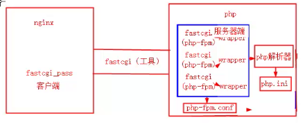
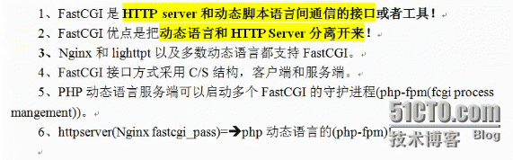

**apache伪静态**

打开apache的配置文件httpd.conf

1.把**#LoadModule rewrite_module modules/mod_rewrite.so**前面的#去掉。

2.找到

#

# AllowOverride controls what directives may be placed in .htaccess files.

# It can be “All”, “None”, or any combination of the keywords:

# Options FileInfo AuthConfig Limit

#

AllowOverride **None**

把 AllowOverride None 改为 AllowOverride All

---

**Discuz伪静态配置文件**

**Apache Web Server(独立主机用户)**

<IfModule mod_rewrite.c>
        RewriteEngine On
        RewriteCond %{QUERY_STRING} ^(.*)$
        RewriteRule ^(.*)/topic-(.+)\.html$ $1/portal.php?mod=topic&topic=$2&%1
        RewriteCond %{QUERY_STRING} ^(.*)$
        RewriteRule ^(.*)/article-([0-9]+)-([0-9]+)\.html$ $1/portal.php?mod=view&aid=$2&page=$3&%1
        RewriteCond %{QUERY_STRING} ^(.*)$
        RewriteRule ^(.*)/forum-(\w+)-([0-9]+)\.html$ $1/forum.php?mod=forumdisplay&fid=$2&page=$3&%1
        RewriteCond %{QUERY_STRING} ^(.*)$
        RewriteRule ^(.*)/thread-([0-9]+)-([0-9]+)-([0-9]+)\.html$ $1/forum.php?mod=viewthread&tid=$2&extra=page\%3D$4&page=$3&%1
        RewriteCond %{QUERY_STRING} ^(.*)$
        RewriteRule ^(.*)/group-([0-9]+)-([0-9]+)\.html$ $1/forum.php?mod=group&fid=$2&page=$3&%1
        RewriteCond %{QUERY_STRING} ^(.*)$
        RewriteRule ^(.*)/space-(username|uid)-(.+)\.html$ $1/home.php?mod=space&$2=$3&%1
        RewriteCond %{QUERY_STRING} ^(.*)$
        RewriteRule ^(.*)/blog-([0-9]+)-([0-9]+)\.html$ $1/home.php?mod=space&uid=$2&do=blog&id=$3&%1
        RewriteCond %{QUERY_STRING} ^(.*)$
        RewriteRule ^(.*)/(fid|tid)-([0-9]+)\.html$ $1/index.php?action=$2&value=$3&%1
        RewriteCond %{QUERY_STRING} ^(.*)$
        RewriteRule ^(.*)/([a-z]+[a-z0-9_]*)-([a-z0-9_\-]+)\.html$ $1/plugin.php?id=$2:$3&%1

</IfModule>

---

正则表达式匹配，其中：

代码如下:

* ~ 为区分大小写匹配

* ~* 为不区分大小写匹配

* !~和!~*分别为区分大小写不匹配及不区分大小写不匹配

文件及目录匹配，其中：

* -f和!-f用来判断是否存在文件

* -d和!-d用来判断是否存在目录

* -e和!-e用来判断是否存在文件或目录

* -x和!-x用来判断文件是否可执行

flag标记有：

* last 相当于Apache里的[L]标记，表示完成rewrite

* break 终止匹配, 不再匹配后面的规则

* redirect 返回302临时重定向 地址栏会显示跳转后的地址

* permanent 返回301永久重定向 地址栏会显示跳转后的地址

---

**Discuz伪静态配置文件**

**Nginx Web Server**

rewrite ^([^\.]*)/topic-(.+)\.html$ $1/portal.php?mod=topic&topic=$2 last;
rewrite ^([^\.]*)/article-([0-9]+)-([0-9]+)\.html$ $1/portal.php?mod=view&aid=$2&page=$3 last;
rewrite ^([^\.]*)/forum-(\w+)-([0-9]+)\.html$ $1/forum.php?mod=forumdisplay&fid=$2&page=$3 last;
rewrite ^([^\.]*)/thread-([0-9]+)-([0-9]+)-([0-9]+)\.html$ $1/forum.php?mod=viewthread&tid=$2&extra=page%3D$4&page=$3 last;
rewrite ^([^\.]*)/group-([0-9]+)-([0-9]+)\.html$ $1/forum.php?mod=group&fid=$2&page=$3 last;
rewrite ^([^\.]*)/space-(username|uid)-(.+)\.html$ $1/home.php?mod=space&$2=$3 last;
rewrite ^([^\.]*)/blog-([0-9]+)-([0-9]+)\.html$ $1/home.php?mod=space&uid=$2&do=blog&id=$3 last;
rewrite ^([^\.]*)/(fid|tid)-([0-9]+)\.html$ $1/index.php?action=$2&value=$3 last;
rewrite ^([^\.]*)/([a-z]+[a-z0-9_]*)-([a-z0-9_\-]+)\.html$ $1/plugin.php?id=$2:$3 last;
if (!-e $request_filename) {
        return 404;

}

---

CDN

---

**php                 php.ini              php-fpm.com-------nginx+fcgi**

**php.ini**

338 safe_mode = **On**                             // 安全模式打开

344 safe_mode_gid = Off

385 **disable_functions** = **system,passthru,exec,shell_exec,popen,p hpinfo                       //关闭危险函数，如果打开的安全模式，就不用了**

**435 expose_php = Off                                 //关闭php版本信息在http头中的泄露**

**703 register_globals = Off                             //默认关闭全局环境变量**

**756 magic_quotes_gpc = On                         //打开    防止SQL注入**

**538 display_errors = Off                                          //错误信息关闭，测试时开启**

**643 error_log = /app/logs/php_errors.log            // 上面打开，下面才可以**

**444 max_execution_time = 30**                         //脚本最大允许执行时间 秒

465 memory_limit = 128M                                  //脚本申请到的最大内存字节数

454 max_input_time = 60                                  //脚本等待输入数据最长时间

891 upload_max_filesize = 2M                             //最大上传文件

894 max_file_uploads = 20                                    //1个请求最大上传文件数量

902 allow_url_fopen = **Off**            //禁止打开远程地址

854 cgi.fix_pathinfo=0                   //防止nginx文件类型错误解析漏洞

1461 session.save_handler = memcache

1490 session.save_path = "**tcp://192.168.10.11:11211**"       //为memcached数据库缓存的ip及端口

---

CGI      公共网关接口

**PastCGI   php-fpm**

**php5.3以上: --enable-fpm**

php5.2    --enable-fastcgi          --enable-fpm   --enalbe-force-cgi

vim /application/php/etc/**php-fpm.conf**

pm = **dynamic**

pid =  /app/logs/php-fpm.pid

error_log = /app/logs/php-fpm.log

log_level = error

rlimit_files = 32768

listen.owner = nginx

listen.group = nginx

pm.max_children = 1024

pm.start_servers = 16

pm.min_spare_servers = 5

pm.max_spare_servers = 20

pm.process_idle_timeout = 15s;

pm.max_requests = 2048

slowlog = /app/logs/$pool.log.slow

request_slowlog_timeout = 10

---

**location ~ .*\.(php|php5)?$ {**

**fastcgi_pass   127.0.0.1:9000;**

**fastcgi_index  index.php;**

**include        fastcgi.conf;**

**}**

