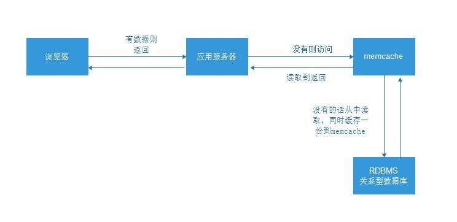

> **内容介绍**
>
> 本文是作者手绘的第一幅架构图，主题为 memcached 的缓存读写流程：浏览器
> 请求应用服务器，缓存命中则直接返回；未命中先查 memcache，仍没有再回源
> RDBMS 关系数据库读取，并把结果写一份回 memcache，即经典的 Cache-Aside
> 旁路缓存模式。全文仅此一幅配图。

> **技术备注**
>
> 图示为 Cache-Aside（旁路缓存）模式，思路至今通用，memcached 与 Redis
> 均适用；memcached 目前仍在维护（1.6.x），生产上常与数据库搭配做前置缓存。

---

第一幅手绘图，内容为 memcached 缓存的工作流程：命中直接返回，未命中回源数据库并写一份回缓存。

