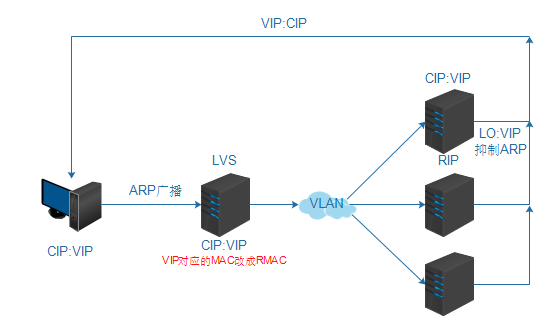

> **内容介绍**
>
> 本文是服务器集群与高可用架构实践,记录了「LVS笔记」的相关内容。主要涉及:集群 一组计算机 利用网络组成一个系统，每个节点都是运行其自己进程的一个独立服务器。 解决高并发 高吞吐 透明性 高性能 高可用性 可伸缩性 可管理性 可编程性…

> **技术备注**
>
> CentOS 6 已于 2020 年 11 月停止维护(EOL),生产环境建议迁移至 Rocky Linux / AlmaLinux / Ubuntu LTS。

---

集群  一组计算机  利用网络组成一个系统，每个节点都是运行其自己进程的一个独立服务器。

解决高并发 高吞吐

透明性  高性能 高可用性  可伸缩性  可管理性   可编程性

- 负载均衡集群    lvs nginx haproxy
- 高可用集群    keepalived

---

Linux  Virtual Server

- 实现调度IPVS
- 管理工具ipvsadm
- keepalived实现管理及高可用

1. CIP Client computer's IP address：公网IP，客户端使用的IP。
2. VIP Virtual IP address：Director用来向客户端提供服务的IP地址
3. RIP Real IP address：集群节点（后台真正提供服务的服务器）所使用的IP地址
4. DIP Director's IP address：Director用来和D/RIP 进行联系的地址

CIP ←→**DIP**←→ **RIP**

VIP


模式: NAT  TUN    **DR**    FULLNAT

DR  直接路由模式

通过改写请求报文的目标MAC地址，将请求发给真实服务器，真实服务器将响应后的处理结果直接返回客户端。

LVS调度器根据各个服务器的负载情况，**动态地选择一台服务器**，不修改也不封装IP报文，而是将**数据帧的MAC地址**改为选出**服务器的MAC地址**，再将修改后的数据帧在与服务器组的局域网上发送。因为数据帧的MAC地址是选出的服务器，所以服务器肯定可以收到这个数据帧，从中可以获得该IP报文。

当服务器发现报文的目标地址VIP是在本地的网络设备上，服务器处理这个报文，然后根据路由表将响应报文**直接返回给客户**。

要求Director Server与Real Server都有一块网卡连在同一物理网段上

---

LVS调度算法   8-10

1. **rr     轮询调度**
2. **wrr  加权轮询调度        wlc  加权最小链接数调度**
3. dh    目的地址哈希调度
4. sh     源地址哈希调度

---

LVS安装

```bash
yum -y install kernel-devel    libnl*    popt*   gcc
ln -s /usr/src/kernels/2.6.32-642.1.1.el6.x86_64/ /usr/src/linux
tar zxvf ipvsadm-1.26.tar.gz
cd ipvsadm-1.26
make  &&   make install
```

```bash
modprobe  ip_vs
lsmod | grep ip_vs
ip_vs                 126897  0
libcrc32c     0000000000000000000000000000000000          1246  1 ip_vs
ipv6                  336282  265 ip_vs
/sbin/ipvsadm
IP Virtual Server version 1.2.1 (size=4096)
Prot LocalAddress:Port Scheduler Flags
  -> RemoteAddress:Port           Forward Weight ActiveConn InActConn
ifconfig eth0:0   192.168.10.40
route add -host 192.168.10.1 dev eth0
route -n
Destination     Gateway         Genmask         Flags Metric Ref    Use Iface
192.168.10.1    0.0.0.0         255.255.255.255 UH    0      0        0 eth0
ipvsadm  -C
ipvsadm  --set 30 5 60
ipvsadm -A -t  192.168.10.40:80  -s rr -p 20             //-D 删除
ipvsadm -a  -t 192.168.10.40:80  -r 192.168.10.11 -g -w 1    //-d  删除
ipvsadm -a  -t 192.168.10.40:80  -r 192.168.10.10 -g -w 1
# ipvsadm -L -n
IP Virtual Server version 1.2.1 (size=4096)
Prot LocalAddress:Port Scheduler Flags
  -> RemoteAddress:Port           Forward Weight ActiveConn InActConn
TCP  192.168.10.40:80 rr persistent 20
  -> 192.168.10.10:80             Route   1      0          0         
  -> 192.168.10.11:80             Route   1      0          0
```

RS端--绑定VIP

```bash
ifconfig  lo:0  192.168.10.40/32  up
route add -host 192.168.10.40 dev lo
```

抑制ARP

```bash
echo "1" >/proc/sys/net/ipv4/conf/lo/arp_ignore
echo "2" >/proc/sys/net/ipv4/conf/lo/arp_announce
echo "1" >/proc/sys/net/ipv4/conf/all/arp_ignore
echo "2" >/proc/sys/net/ipv4/conf/all/arp_announce
```
