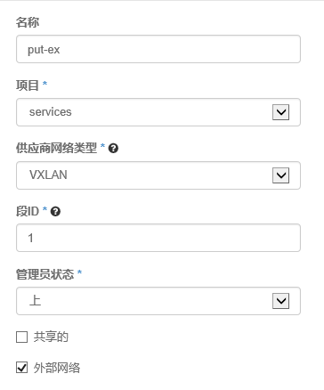
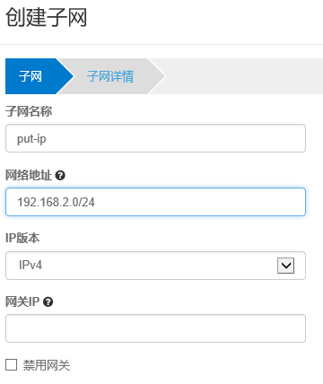
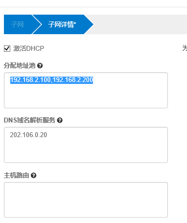
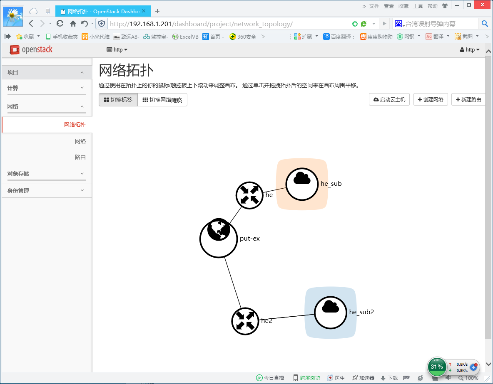

> **内容介绍**
>
> 本文是OpenStack 私有云部署与运维笔记,记录了「openstack学习笔记二 网络设置基础」的相关内容。主要涉及:[http://s3.51cto.com/wyfs02/M00/83/AE/wKioL1d6O8zwMz7xAAAehcos9zE809.png](http:/…

> **技术备注**
>
> CentOS 6 已于 2020 年 11 月停止维护(EOL),生产环境建议迁移至 Rocky Linux / AlmaLinux / Ubuntu LTS。

---


租用这个服务的机构，我们称之"租户/tenant/项目/project"

租户  用户

vxlan划分租户

---

```bash
[root@h1 ~]# ip addr
1: lo: <LOOPBACK,UP,LOWER_UP> mtu 65536 qdisc noqueue state UNKNOWN
    link/loopback 00:00:00:00:00:00 brd 00:00:00:00:00:00
    inet 127.0.0.1/8 scope host lo
       valid_lft forever preferred_lft forever
2: eth0: <BROADCAST,MULTICAST,UP,LOWER_UP> mtu 1500 qdisc mq state UP qlen 1000
    link/ether 00:50:56:a0:b6:6b brd ff:ff:ff:ff:ff:ff
    inet 192.168.1.201/24 brd 192.168.1.255 scope global eth0
       valid_lft forever preferred_lft forever
3: ovs-system: <BROADCAST,MULTICAST> mtu 1500 qdisc noop state DOWN
    link/ether 36:26:25:65:14:9c brd ff:ff:ff:ff:ff:ff
4: br-ex: <BROADCAST,MULTICAST,UP,LOWER_UP> mtu 1500 qdisc noqueue state UNKNOWN
    link/ether de:4c:6d:9c:15:4d brd ff:ff:ff:ff:ff:ff
5: br-int: <BROADCAST,MULTICAST> mtu 1500 qdisc noop state DOWN
    link/ether ce:0b:9b:b5:c1:4d brd ff:ff:ff:ff:ff:ff
6: br-tun: <BROADCAST,MULTICAST> mtu 1500 qdisc noop state DOWN
    link/ether ae:75:26:fb:f8:42 brd ff:ff:ff:ff:ff:ff
```

你想把哪个网络作为数据包的出口，那么你就应该把那个**网卡桥接到 br-ex**

**openvswitch  简称  ovs**

**配置网卡      重点**

```bash
[root@h1 network-scripts]# cat ifcfg-eth0
  DEVICE=eth0
  DEVICETYPE=ovs
  TYPE=OVSPort
  OVS_BRIDGE=br-ex
  ONBOOT=yes
  BOOTPROTO=none
[root@h1 network-scripts]# cat ifcfg-br-ex
DEVICE=br-ex
DEVICETYPE=ovs
TYPE=OVSBridge
ONBOOT=yes
BOOTPROTO=none
IPADDR=192.168.1.201
NETMASK=255.255.255.0
GATEWAY=192.168.1.1
DNS1=202.106.0.20
```

```bash
查看网卡

2: eth0: <BROADCAST,MULTICAST,UP,LOWER_UP> mtu 1500 qdisc mq master ovs-system state UP qlen 1000
    link/ether 00:50:56:a0:b6:6b brd ff:ff:ff:ff:ff:ff
3: ovs-system: <BROADCAST,MULTICAST> mtu 1500 qdisc noop state DOWN
    link/ether d2:18:7d:5e:5e:b9 brd ff:ff:ff:ff:ff:ff
5: br-ex: <BROADCAST,MULTICAST,UP,LOWER_UP> mtu 1500 qdisc noqueue state UNKNOWN
    link/ether 00:50:56:a0:b6:6b brd ff:ff:ff:ff:ff:ff
    inet 192.168.1.201/24 brd 192.168.1.255 scope global br-ex
       valid_lft forever preferred_lft forever
```

**管理员登陆****http://192.168.1.201/dashboard**

**选择系统--网络--创建网络**

创建，点击网络名称put-ex



下一步





---

创建一个项目，创建一个新的用户，新用户关联项目。

用新的用户登录，创建网络

先创建网络，然后创建路由，连到网络上，最后添加端口


