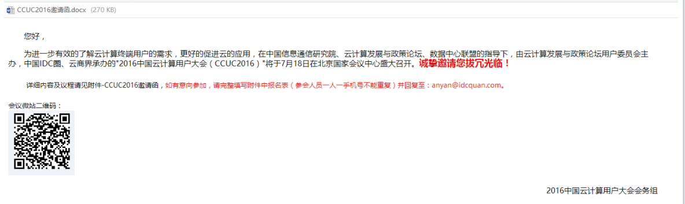

> **内容介绍**
>
> 本文是OpenStack 私有云部署与运维笔记,记录了「7月份 北京有关openstack的会议」的相关内容。主要涉及:这个是微信报名的，自己搜 云计算开源产业联盟成果发布会7.13 ,建议迁移至 Rocky Linux 9 / AlmaLinux 9 或国产 openEuler。

---

这个是微信报名的，自己搜   云计算开源产业联盟成果发布会7.13

下面这个回复邀请函就行，，，详情看附件。。。。。。

姓名   职务邮箱备注

**报名联系人：**陈安燕

**电话：**010-57732814

**邮箱：**anyan@idcquan.com
