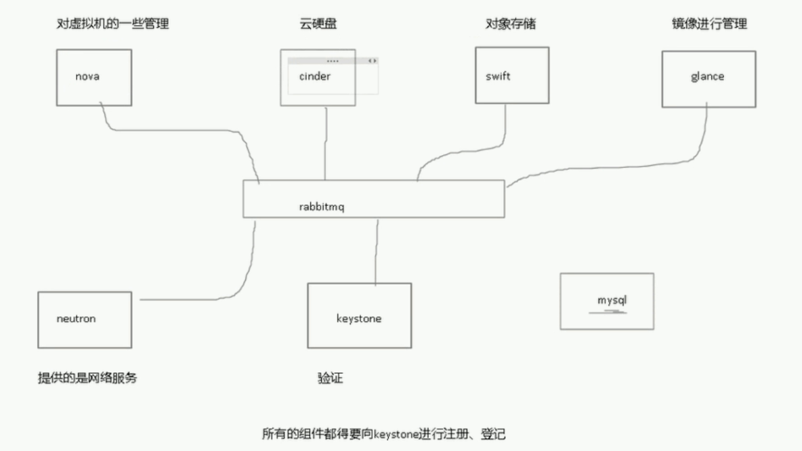
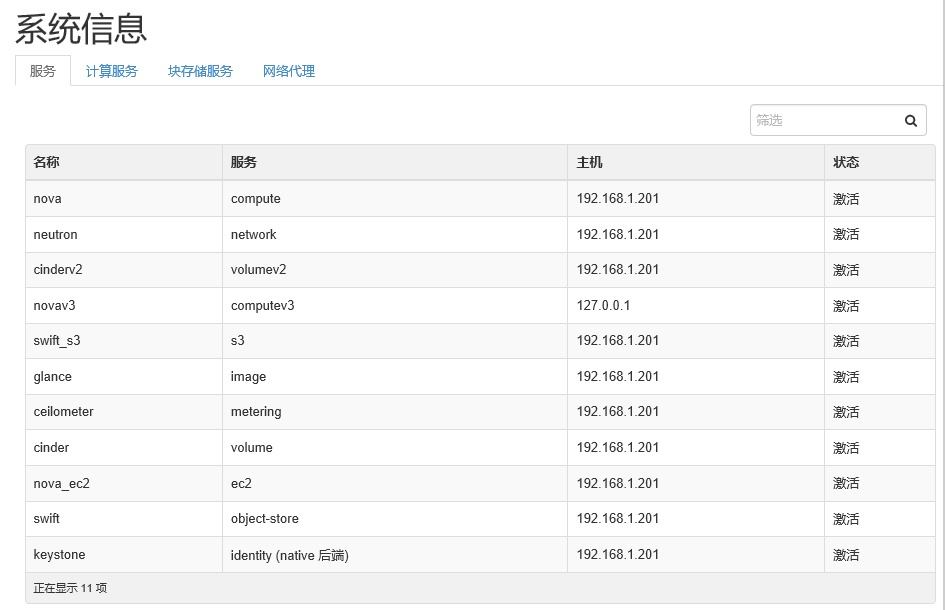
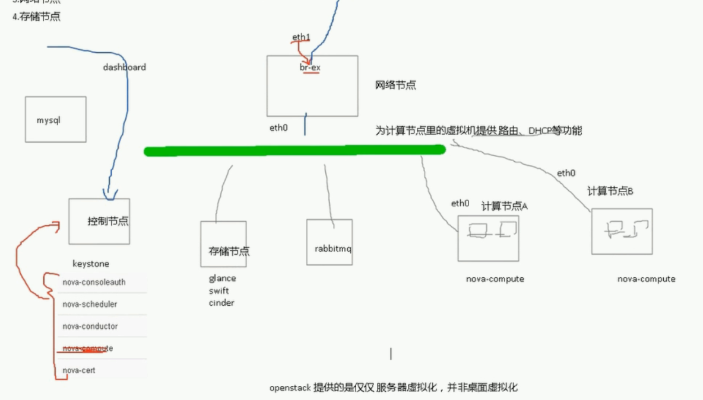

> **内容介绍**
>
> 本文梳理 OpenStack 的核心组件及其分工：nova 管虚拟机、cinder 管云硬盘、swift 提供对象存储、glance 管镜像、neutron 管网络，所有组件都要向 keystone 注册认证，组件之间借助 RabbitMQ 通信，环境依赖 MySQL 存数据。同时给出控制/计算/网络/存储四类节点的框架划分，并用 openstack-status 命令实际查看一套 allinone 环境中各服务的运行状态、keystone 用户、glance 镜像、nova 网络/规格/实例清单。

> **技术备注**
>
> 文中 nova-network、glance-registry、ceilometer、keystone 独立进程等组件在后来的版本中已陆续被移除或合并（nova-network 由 Neutron 取代、Ceilometer 拆分为 Gnocchi/Aodh 等），keystone CLI 也早已并入统一的 openstack CLI。openstack-status 工具在新版本中同样不复存在，改用 `openstack compute service list` 等命令查看。组件职责划分的思想至今不变。

---

## 1. 核心组件及分工



- **nova**：对虚拟机进行管理
- **cinder**：云硬盘
- **swift**：对象存储（容器）
- **glance**：镜像
- **neutron**：网络
- **keystone**：验证，所有的组件都得向 keystone 进行注册、登记

组件之间利用 RabbitMQ 互相通信，环境还需要 MySQL 存放各组件的数据。



## 2. 节点框架划分

1. **控制节点**：跑 keystone、dashboard 等
2. **计算节点**：跑虚拟机的机器
3. **网络节点**：为计算节点里的虚拟机提供路由、DHCP
4. **存储节点**



## 3. 用 openstack-status 查看运行状态

先 source 认证文件，再查看各服务状态：

```shell
[root@h1 ~]# source keystonerc_admin
[root@h1 ~(keystone_admin)]# openstack-status
== Nova services ==
openstack-nova-api:                     active
openstack-nova-compute:                 active
openstack-nova-network:                 inactive  (disabled on boot)
openstack-nova-scheduler:               active
openstack-nova-cert:                    active
openstack-nova-conductor:               active
openstack-nova-console:                 inactive  (disabled on boot)
openstack-nova-consoleauth:             active
openstack-nova-xvpvncproxy:             inactive  (disabled on boot)
== Glance services ==
openstack-glance-api:                   active
openstack-glance-registry:              active
== Keystone service ==
openstack-keystone:                     inactive  (disabled on boot)
== Horizon service ==
openstack-dashboard:                    active
== neutron services ==
neutron-server:                         active
neutron-dhcp-agent:                     active
neutron-l3-agent:                       active
neutron-metadata-agent:                 active
neutron-openvswitch-agent:              active
== Swift services ==
openstack-swift-proxy:                  active
openstack-swift-account:                active
openstack-swift-container:              active
openstack-swift-object:                 active
== Cinder services ==
openstack-cinder-api:                   active
openstack-cinder-scheduler:             active
openstack-cinder-volume:                active
openstack-cinder-backup:                active
== Ceilometer services ==
openstack-ceilometer-api:               active
openstack-ceilometer-central:           active
openstack-ceilometer-compute:           active
openstack-ceilometer-collector:         active
openstack-ceilometer-alarm-notifier:    active
openstack-ceilometer-alarm-evaluator:   active
openstack-ceilometer-notification:      active
== Support services ==
mysqld:                                 active    (disabled on boot)
openvswitch:                            active
dbus:                                   active
target:                                 active
rabbitmq-server:                        active
memcached:                              active
```

keystone 用户列表（输出中的 DeprecationWarning 提示 keystone CLI 已被 python-openstackclient 取代，tenant_name/tenant_id 参数将更名为 project_name/project_id）：

```shell
== Keystone users ==
+----------------------------------+------------+---------+----------------------+
|                id                |    name    | enabled |        email         |
+----------------------------------+------------+---------+----------------------+
| 1627cc3d61c04f9db9608e9703a01371 |   admin    |   True  |    root@localhost    |
| 04247710cdf34914a7f5b315ab166731 | ceilometer |   True  | ceilometer@localhost |
| cb5e12e30a4a4c1dae57255c184b8b30 |   cinder   |   True  |   cinder@localhost   |
| 632fb20205ea4c40988d7d65b2844ff6 |   glance   |   True  |   glance@localhost   |
| 80069f5c8edc454b8038e7f116df4ff5 |   neutron  |   True  |  neutron@localhost   |
| adbcaaf58d09495988b57be8e82b4e6b |    nova    |   True  |    nova@localhost    |
| 4f488ff4859e4973afefea6e7872ed83 |    swift   |   True  |   swift@localhost    |
+----------------------------------+------------+---------+----------------------+
== Glance images ==
+--------------------------------------+-----------+
| ID                                   | Name      |
+--------------------------------------+-----------+
| 2a0db075-f221-4285-9ff9-38b755a322c1 | centos7.2 |
+--------------------------------------+-----------+
== Nova networks ==
+--------------------------------------+---------+------+
| ID                                   | Label   | Cidr |
+--------------------------------------+---------+------+
| bebbc903-5846-4e8d-9c19-f0248cb6e08d | put-ex  | -    |
| 494cbfae-b26d-4e29-859e-35c55f017f19 | he_sub2 | -    |
| 1f8a8d0c-2e32-4aaa-83d6-3ba52a768292 | quan    | -    |
| 67d35cd2-3b95-48a7-96b7-6ba1f0eb7d5d | he_sub  | -    |
+--------------------------------------+---------+------+
== Nova instance flavors ==
+----+-----------+-----------+------+-----------+------+-------+-------------+-----------+
| ID | Name      | Memory_MB | Disk | Ephemeral | Swap | VCPUs | RXTX_Factor | Is_Public |
+----+-----------+-----------+------+-----------+------+-------+-------------+-----------+
| 1  | m1.tiny   | 512       | 1    | 0         |      | 1     | 1.0         | True      |
| 2  | m1.small  | 2048      | 20   | 0         |      | 1     | 1.0         | True      |
| 3  | m1.medium | 4096      | 40   | 0         |      | 2     | 1.0         | True      |
| 4  | m1.large  | 8192      | 80   | 0         |      | 4     | 1.0         | True      |
| 5  | m1.xlarge | 16384     | 160  | 0         |      | 8     | 1.0         | True      |
+----+-----------+-----------+------+-----------+------+-------+-------------+-----------+
== Nova instances ==
+--------------------------------------+------+----------------------------------+--------+-------------+----------------------------+
| ID                                   | Name | Tenant ID                        | Status | Power State | Networks                   |
+--------------------------------------+------+----------------------------------+--------+-------------+----------------------------+
| 95311ed2-6091-4ce7-a2be-caab8e2760ce | 1    | 43986fb013804aa0a04ca277e4d0e69c | ACTIVE | Running     | quan=192.168.10.12,        |
|                                      |      |                                  |        |             | 192.168.2.104              |
+--------------------------------------+------+----------------------------------+--------+-------------+----------------------------+
```
