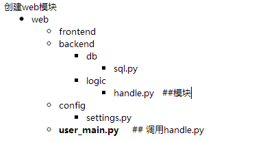

**介绍：**

本文主要是学习python常用模块的记录,后面记录的不是很详细，以后再补。[](http://img.baidu.com/hi/jx2/j_0012.gif)

2016年12月27日

[](http://img.baidu.com/hi/jx2/j_0013.gif)

**目录：**

1. 模块介绍
2. json & pickle
3. time  &   datetime模块 &月历
4. random模块
5. OS
6. SYS
7. shutil
8. shelves
9. xml
10. yaml
11. ConfigParser
12. hashlib
13. subprocess
14. logging

---

**模块**

就是用一堆代码实现某个功能的代码集合。

模块分三种：

- 自定义模块
- 内置标准模块（标准库）
- 开源模块

开源模块网站   ：  pypi.python.org

调用模块

[](http://s2.51cto.com/wyfs02/M01/8C/1E/wKiom1hiSy6xs-UQAAAcrW_IfWM018.png)

调用

from **backend.logic**   import **handle  ##这样导入目录必须是包的状态，也就是包下面 有一个 __init__.py**

handle.home()

sql.py

```python
import sys
import  os.path
base_dir=os.path.dirname(os.path.dirname(os.path.dirname(os.path.abspath(__file__)))) ##获得目录
sys.path.append(base_dir)  ##修改库的目录
from  config    import settings
def  db_auth(configs):
    if  configs.DATABASE["user"]  ==  'root'  and  configs.DATABASE["password"] == "123":
        print("OK")
        return True
    else:
        print("error")
def s(table,column):
    if  db_auth(settings):
        if table == 'user':
            user_info = {
                "001":['hequan',24,'engineer'],
                "002":['he123', 44, 'beijing'],
                "003":['he456', 55, 'hebei'],
        }
            return  user_info
    else:
        print("cuowu.......")
```

handle.py

```python
import sys
import  os.path
base_dir=os.path.dirname(os.path.dirname(os.path.dirname(os.path.abspath(__file__))))
sys.path.append(base_dir)
from back.db.sql  import s
def  home():
    print("welcome to home page")
    q_data = s("user",'xxx')
    print("query res: {}".format(q_data))
def movie():
    print("welcome to movie page")
def  tv():
    print("welcome to tv  page")
```

settings.py

```python
DATABASE ={
    "engine":"mysql",
    "host":"localhost",
    "port":3306,
    "user":"root",
    "password":"123",
}
```

user_main.py

```python
from back.logic  import handle
handle.home()
结果
welcome to home page
OK
query res: {'003': ['he456', 55, 'hebei'], '001': ['hequan', 24, 'engineer'], '002': ['he123', 44, 'beijing']}
```

---

json&pickle  序列化

- json     用于字符串和python数据类型间进行转化                           r   w
- pickle  用于**python特有的类型**和python的数据类型间进行转换      rb  wb   支持更复杂的调用函数

都提供了4个功能:  dumps\dump\loads\load

例子

```python
pickle写入
import  pickle
f =open("user.txt","wb")    ##json  只是w
info={
    "user":"123",
    "hequan":'123'
}
f.write(pickle.dumps(info))
f.close()

读取
import pickle
f= open("user.txt",'rb')  
data =pickle.loads(f.read())
print(data)
dumps 与 dump的 区别
pickle.dump(info,f)    ##写入
data =pickle.load(f)   ##读取
```

---

time

import   time

时间元祖

| 序号 | 字段 | 值 |
| --- | --- | --- |
| 0 | 4位数年    tm_year | 2008 |
| 1 | 月        tm_mon | 1 到 12 |
| 2 | 日         tm_day | 1到31 |
| 3 | 小时      tm_hour | 0到23 |
| 4 | 分钟    tm_min | 0到59 |
| 5 | 秒     tm_sec | 0到61 (60或61 是闰秒) |
| 6 | 一周的第几日     tm_wday | 0到6 (0是周一) |
| 7 | 一年的第几日      tm_yday | 1到366 (儒略历) |
| 8 | 夏令时     tm_isdst | -1, 0, 1, -1是决定是否为夏令时的旗帜 |

获取当前时间

```python
import  time
localtime = time.localtime(time.time())
print(localtime)
time.struct_time(tm_year=2016, tm_mon=12, tm_mday=27, tm_hour=16, tm_min=46, tm_sec=44, tm_wday=1, tm_yday=362, tm_isdst=0)

获取格式化时间
localtime = time.asctime(time.localtime(time.time()))
print(localtime)
Tue Dec 27 16:47:56 2016

格式化日期
print(time.strftime("%Y-%m-%d  %H:%M:%S",time.localtime()))
2016-12-27  16:49:16

月历
import calendar
cat = calendar.month(2017,1)
print(cat)
    January 2017
Mo Tu We Th Fr Sa Su
                   1
 2  3  4  5  6  7  8
 9 10 11 12 13 14 15
16 17 18 19 20 21 22
23 24 25 26 27 28 29
30 31

datetime

import datetime
date = datetime.datetime.now()
print(date)
2016-12-27 16:54:42.472913
```

---

random模块

随机数

random.randint(a, b)，                           用于生成一个指定范围内的整数。其中参数a是下限，参数b是上限，生成的随机数n: a <= n <= b

random.randrange([start], stop[, step])  从指定范围内，按指定基数递增的集合中 获取一个随机数。如：random.randrange(10, 100, 2)，结果相当于从[10, 12, 14, 16, ... 96, 98]序列中获取一个随机数。

---

os模块

os.popen("dir").read()     执行命令，暂时保存到一个地方

`os.getcwd() 获取当前工作目录，即当前python脚本工作的目录路径`

`os.chdir(``"dirname"``)  改变当前脚本工作目录；相当于shell下cd`

`os.curdir  返回当前目录: (``'.'``)`

`os.pardir  获取当前目录的父目录字符串名：(``'..'``)`

`os.makedirs(``'dirname1/dirname2'``)    可生成多层递归目录`

`os.removedirs(``'dirname1'``)    若目录为空，则删除，并递归到上一级目录，如若也为空，则删除，依此类推`

`os.mkdir(``'dirname'``)    生成单级目录；相当于shell中mkdir dirname`

`os.rmdir(``'dirname'``)    删除单级空目录，若目录不为空则无法删除，报错；相当于shell中rmdir dirname`

`os.listdir(``'dirname'``)    列出指定目录下的所有文件和子目录，包括隐藏文件，并以列表方式打印`

`os.remove()  删除一个文件`

`os.rename(``"oldname"``,``"newname"``)  重命名文件``/``目录`

`os.stat(``'path/filename'``)  获取文件``/``目录信息`

`os.sep    输出操作系统特定的路径分隔符，win下为``"\\",Linux下为"``/``"`

`os.linesep    输出当前平台使用的行终止符，win下为``"\t\n"``,Linux下为``"\n"`

`os.pathsep    输出用于分割文件路径的字符串`

`    输出字符串指示当前使用平台。win``-``>``'nt'``; Linux``-``>``'posix'`

`os.system(``"bash command"``)  运行shell命令，直接显示`

`os.environ  获取系统环境变量`

`os.path.abspath(path)  返回path规范化的绝对路径`

`os.path.split(path)  将path分割成目录和文件名二元组返回`

`os.path.dirname(path)  返回path的目录。其实就是os.path.split(path)的第一个元素`

`os.path.basename(path)  返回path最后的文件名。如何path以／或\结尾，那么就会返回空值。即os.path.split(path)的第二个元素`

`os.path.exists(path)  如果path存在，返回``True``；如果path不存在，返回``False`

`os.path.isabs(path)  如果path是绝对路径，返回``True`

`os.path.isfile(path)  如果path是一个存在的文件，返回``True``。否则返回``False`

`os.path.isdir(path)  如果path是一个存在的目录，则返回``True``。否则返回``False`

`os.path.join(path1[, path2[, ...]])  将多个路径组合后返回，第一个绝对路径之前的参数将被忽略`

`os.path.getatime(path)  返回path所指向的文件或者目录的最后存取时间`

`os.path.getmtime(path)  返回path所指向的文件或者目录的最后修改时间`

---

SYS模块

`sys.argv           命令行参数``List``，第一个元素是程序本身路径`

`sys.exit(n)        退出程序，正常退出时exit(``0``)`

`sys.version        获取Python解释程序的版本信息`

`sys.maxint         最大的``Int``值`

`sys.path           返回模块的搜索路径，初始化时使用PYTHONPATH环境变量的值`

`sys.platform       返回操作系统平台名称`

`sys.stdout.write(``'please:'``)`

`val ``=` `sys.stdin.readline()[:``-``1``]`

---

shutil 文件  文件夹 处理模块

**shutil.copyfileobj(fsrc, fdst[, length])**

将文件内容拷贝到另一个文件中，可以部分内容

def copyfileobj(fsrc, fdst, length=16*1024):

"""copy data from file-like object fsrc to file-like object fdst"""

while 1:

buf = fsrc.read(length)

if not buf:

break

fdst.write(buf)

**shutil.copyfile(src, dst)**

拷贝文件

**shutil.copymode(src, dst)**
仅拷贝权限。内容、组、用户均不变

**shutil.copystat(src, dst)**
拷贝状态的信息，包括：mode bits, atime, mtime, flags

**shutil.copy(src, dst)**

拷贝文件和权限

**shutil.copy2(src, dst)**
拷贝文件和状态信息

**shutil.ignore_patterns(*patterns)**
**shutil.copytree(src, dst, symlinks=False, ignore=None)**
递归的去拷贝文件

例如：copytree(source, destination, ignore=ignore_patterns('*.pyc', 'tmp*'))

**shutil.rmtree(path[, ignore_errors[, onerror]])**
递归的去删除文件

**shutil.move(src, dst)**
递归的去移动文件

**shutil.make_archive(base_name, format,...)**

创建压缩包并返回文件路径，例如：zip、tar

- base_name： 压缩包的文件名，也可以是压缩包的路径。只是文件名时，则保存至当前目录，否则保存至指定路径，
如：www                        =>保存至当前路径
如：/Users/wupeiqi/www =>保存至/Users/wupeiqi/
- format： 压缩包种类，“zip”, “tar”, “bztar”，“gztar”
- root_dir： 要压缩的文件夹路径（默认当前目录）
- owner： 用户，默认当前用户
- group： 组，默认当前组
- logger： 用于记录日志，通常是logging.Logger对象

shutil 对压缩包的处理是调用 ZipFile 和 TarFile 两个模块来进行的

---

shelve

是一个简单的k,v 将内存数据通过文件持久化的模块，支持pickle

import shelve

d = shelve.open('shelve_test') #打开一个文件

class Test(object):

def __init__(self,n):

self.n = n

t = Test(123)

t2 = Test(123334)

name = ["alex","rain","test"]

d["test"] = name #持久化列表

d["t1"] = t      #持久化类

d["t2"] = t2

d.close()

---

xml模块

实现不同语言或程序直接进行数据交换   <>

---

yaml

http://pyyaml.org/wiki/PyYAMLDocumentation

---

configparser模块

用于生成和修改常见配置文档。

```python
#!/usr/bin/env python
# -*- coding: utf-8 -*-
import configparser
config = configparser.ConfigParser()
config["DEFAULT"] = {'ServerAliveInterval': '45',
                      'Compression': 'yes',
                     'CompressionLevel': '9'}
config['bitbucket.org'] = {}
config['bitbucket.org']['User'] = 'hg'
config[''] = {}
topsecret = config['']
topsecret['Host Port'] = '50022'     # mutates the parser
topsecret['ForwardX11'] = 'no'  # same here
config['DEFAULT']['ForwardX11'] = 'yes'
with open('example.ini', 'w') as configfile:
   config.write(configfile)
[DEFAULT]
serveraliveinterval = 45
compression = yes
compressionlevel = 9
forwardx11 = yes
[bitbucket.org]
user = hg
[]
host port = 50022
forwardx11 = no
```

---

hashlib模块

加密操作

---

subprocess模块

---

logging

提供了标准的日志接口。

分5个级别

debug() info()  warning()  error()  critical()

```python
import logging
 
logging.warning("user [alex] attempted wrong password more than 3 times")
logging.critical("server is down")
 
#输出
WARNING:root:user [alex] attempted wrong password more than 3 times
CRITICAL:root:server is down

import logging
 
logging.basicConfig(filename='example.log',level=logging.INFO)
logging.debug('This message should go to the log file')
logging.info('So should this')
logging.warning('And this, too')
```
