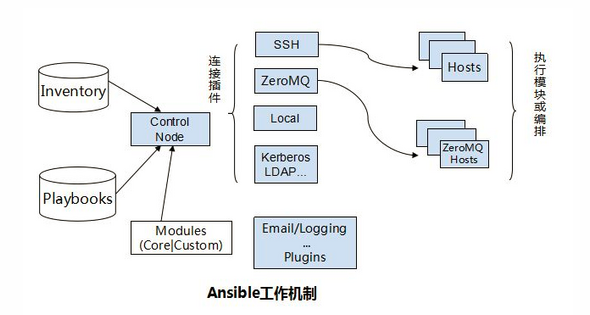

> **内容介绍**
>
> Ansible 入门笔记的上半篇：先给出基于 SSH 推送的架构示意，然后演示 yum 安装、免密登录（ssh-copy-id）、ansible.cfg 关闭 host_key_checking、hosts 分组配置。下半篇逐条讲解常用模块：command、cron、user、copy、file、service、shell、ping、yum、setup、template、synchronize、get_url，每个模块都给出了 ad-hoc 调用示例。

> **技术备注**
>
> 文内 Ansible 为 2.x 早期版本。Ansible 2.9 之后社区版更名为 ansible-core + collections，模块路径由 `ansible.modules` 变为 `ansible.builtin.*`，部分模块（如 synchronize/get_url）已移入 collections；命令行参数与模块行为大体兼容，但建议以 ansible-core 文档为准。

---

**目录：**

**简介安装**

**常用模块**

---

**简介安装：**



```shell
yum -y install ansible
ssh-keygen -t rsa
ssh-copy-id -i .ssh/id_rsa.pub root@192.168.xx.xx
```

```shell
ansible -m  模块  -a 指定向模块传递的参数  -f 并发数 -k 默认基于密钥，使用基于口令认证 -i PATH : 指明使用的host inventory文件路径
```

```ini
# vim ansible.cfg
host_key_checking = False
```

```ini
# cat hosts
[web]
192.168.50.101 ansible_ssh_pass=123456
```

---

**常用模块：**

- command：命令模块（不支持变量和管道）

```shell
ansible web   -m command -a 'date'
```

- cron：周期性任务计划模块

```shell
ansible websrvs -m cron -a 'name="sync time" minute="*/3" job="/usr/sbin/ntpdate  &> /dev/null"'
ansible web   -m cron  -a 'name="sync time" state=absent'   ##删除   present/absent  生成/移除
```

- user：管理用户（常用参数）

  - name
  - state   present / absent
  - force   删除时删除家目录
  - system   创建系统用户
  - uid / shell / home

```shell
openssl passwd -1 -salt `openssl rand -hex 4`   # 生成加密串
ansible web -m user -a 'name=xx password=$1$1ba6487f$gEZ7LEbftHcJo9lNoWY9p/'
ansible web -m user -a 'name=xx state=absent'
```

- copy：复制文件

  - src：本地源文件路径
  - content：表示直接用此处指定的内容生成为目标文件内容
  - dest：远程目标文件路径
  - force：当设置为 yes 时，如果目标主机存在该文件，但内容不同，会强制覆盖。默认为 yes
  - backup：在覆盖之前备份源文件，yes/no

```shell
ansible all -m copy -a 'src=/root/test.ansible dest=/tmp/'
ansible all -m copy -a 'src=/root/test.ansible dest=/tmp/  owner=root group=root mode=644 backup=yes'
```

- file：设定文件属性

  - force：需要在两种情况下强制创建软链接，一种是源文件不存在但之后会建立的情况下；另一种是目标软链接已存在,需要先取消之前的软链，然后创建新的软链，有两个选项：yes|no
  - group：定义文件/目录的属组
  - mode：定义文件/目录的权限
  - owner：定义文件/目录的属主
  - path：必选项，定义文件/目录的路径
  - recurse：递归的设置文件的属性，只对目录有效
  - src：要被链接的源文件的路径，只应用于 state=link 的情况
  - dest：被链接到的路径，只应用于 state=link 的情况
  - state：
    - directory：如果目录不存在，创建目录
    - file：即使文件不存在，也不会被创建
    - link：创建软链接
    - hard：创建硬链接
    - touch：如果文件不存在，则会创建一个新的文件，如果文件或目录已存在，则更新其最后修改时间
    - absent：删除目录、文件或者取消链接文件

```shell
ansible all -m file -a 'src=/tmp/test.ansible path=/tmp/test.link state=link'
```

- service：控制服务的运行状态

  - enabled 是否开机自动启动   true  false
  - state   状态值  started  stopped  restarted  reloaded

```shell
ansible web -m service -a 'name=httpd state=started enabled=true'
```

- shell：将本地脚本复制到远程主机执行

```shell
ansible web -m shell -a 'echo $TERM'
```

- ping：

```shell
ansible all -m ping
```

- yum：

  - name
  - state= present, latest 表示安装;  absent 表示卸载

```shell
ansible all -m yum -a 'name=httpd  state=absent'
```

- setup：收集主机的 facts

```shell
ansible  all -m setup -a 'filter=ansible_eth0'
```

- template：设置变量

```shell
vim /root/httpd.conf
# ...
# ServerName {{ ansible_fqdn }}
ansible websrvs -m template -a 'src=/root/httpd.conf dest=/etc/httpd/conf/httpd.conf'
```

- synchronize：指定目录推送

```shell
ansible all -m synchronize -a 'src=/usr/local/src/ dest=/usr/local/src/ delete=yes compress=yes'
```

- get_url：远程主机上下载 url 到本地

```shell
ansible all -m get_url -a 'url=http://example.com/pub/epel/6/x86_64/epel-release-6-8.noarch.rpm dest=/tmp'
```
