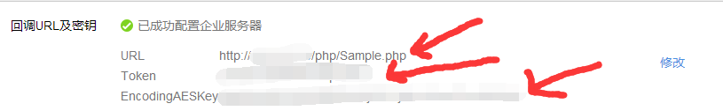

首先选择回头模式，然后生成Tokey   EncodingAESKey。

[](https://s4.51cto.com/wyfs02/M02/8D/B7/wKiom1im70zx_acFAAA0KRxv7m0744.png-wh_500x0-wm_3-wmp_4-s_1258012449.png)

把附件的代码上传到网站目录下。

然后修改 Sample.php  ，最后验证就可以了。

```python
include_once "WXBizMsgCrypt.php";

$encodingAesKey = "xxxxxxxxxxxxxxxxxxxxxxx"; //替换成上面生成的

$token = "xxxxxx"; //替换成上面生成的

$corpId = "xxxxxxxxxxxxxxxx";  //#替换成上面生成自己的corpID
```
