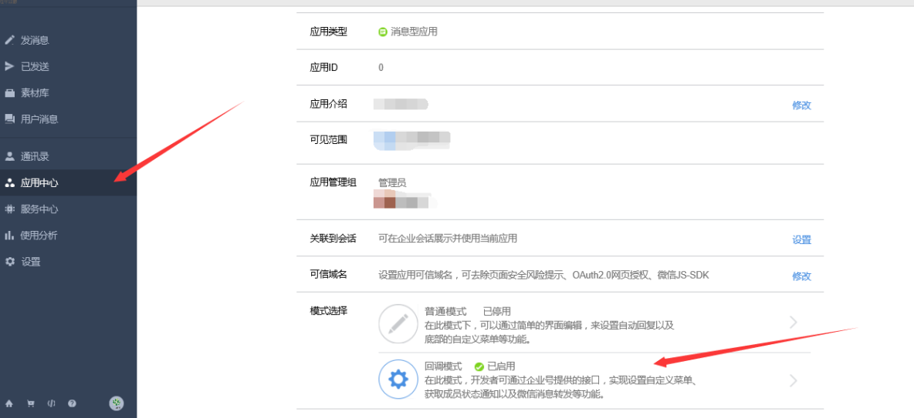
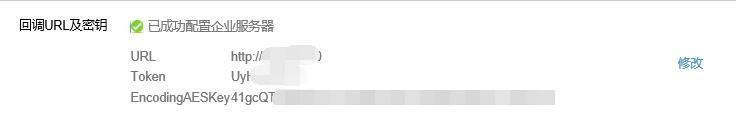
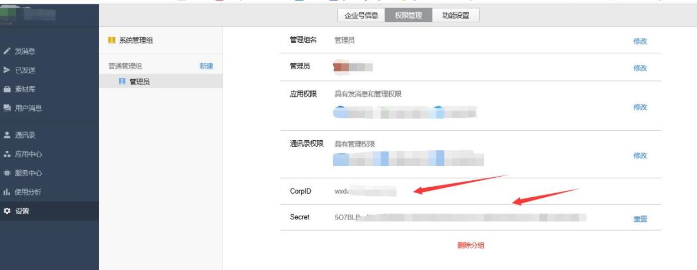

> **内容介绍**
>
> 用 Python3 + itchatmp 框架搭建微信企业号回调服务的最小示例：在后台开启回调模式拿到 Token/EncodingAESKey/CorpID/AppSecret 四要素，写入 itchatmp 配置；注册 TEXT 消息处理器，判断用户发送的内容是否为指定姓名并回复"姓名：xxx"；最后演示如何改端口（8888）以及放行 iptables 防火墙。

> **技术备注**
>
> "微信企业号"已升级为"企业微信"，回调配置与接口参数有变化；itchatmp 框架已多年不维护，生产环境建议改用企业微信官方回调 SDK 或 wechatpy。`iptable` 是笔误，正确命令为 `iptables`。

---

1 注册微信企业号的步骤就省略了。很简单。

选择下面的应用中心，企业小助手，选择回调模式。



选择随机生成token  AESKEY。地址输入你的服务器地址。



选择设置，新建管理组，然后就能看到 CorpID 和 Secret



把上面的4个参数，写到下面的文件里面。

安装依赖（具体可参考 itchatmp 官方文档）：

```shell
python3 -m pip  install  itchatmp    ###python3安装模块
```

```python
# vim main.py

import itchatmp
from itchatmp.content import TEXT
itchatmp.update_config(itchatmp.WechatConfig(
    token='xxxxxxxxxxxx',
    copId = 'xxxxxxxxxxxxx',
    appSecret = 'xxxxxxxxxxxxxxxxxxxxxxxxxxxxxxxxxxxxxxxxxxxxxx',
    encryptMode=itchatmp.content.SAFE,
    encodingAesKey='xxxxxxxxxxxxxxxxxxxxxxxxxxxx',))
    
i='何全'
@itchatmp.msg_register(itchatmp.content.TEXT)
def text_reply(msg):
    if msg['Content'] == i :
         msg['Content'] = '姓名:{}'.format(i)
         return msg['Content']
    else:
         print(23333)
itchatmp.run()
```

```shell
python  main.py  ##运行测试了。。。。
```

修改端口号并放行防火墙：

```python
itchatmp.run(port=8888)
```

```shell
# 记得修改防火墙，这里我就被坑了。微信回调模式支持 x.x.x.x:8888
iptables -A INPUT -p tcp -m tcp --dport 8888 -j ACCEPT
```

结果：

当微信企业号，收到回复何全，返回 姓名：何全
