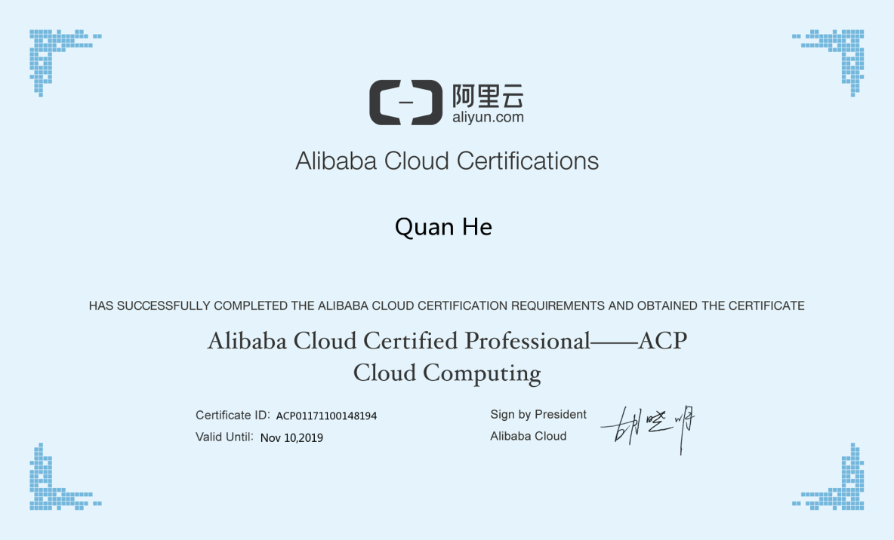

> **内容介绍**
>
> 本文是一篇喜报式短文：作者于 2017 年 11 月顺利通过阿里云云计算专业
> ACP（Alibaba Cloud Professional）考试认证，文中附上阿里云官方颁发的
> 认证证书截图（持证人 Quan He，证书编号 ACP01171100148194，
> 有效期两年至 2019 年 11 月 10 日），未涉及具体考试题目与备考细节。

> **技术备注**
>
> 1. 阿里云 ACP 认证证书自颁发日起有效期为 2 年，到期需重新考试换发。
> 2. 阿里云认证体系历经多次调整，目前 ACP 对应「阿里云ACE/ACP 专业级」
>    系列中的云计算方向，考试大纲（云服务器 ECS、SLB、OSS、VPC、
>    安全组、弹性伸缩等）以官方最新版本为准。

---

