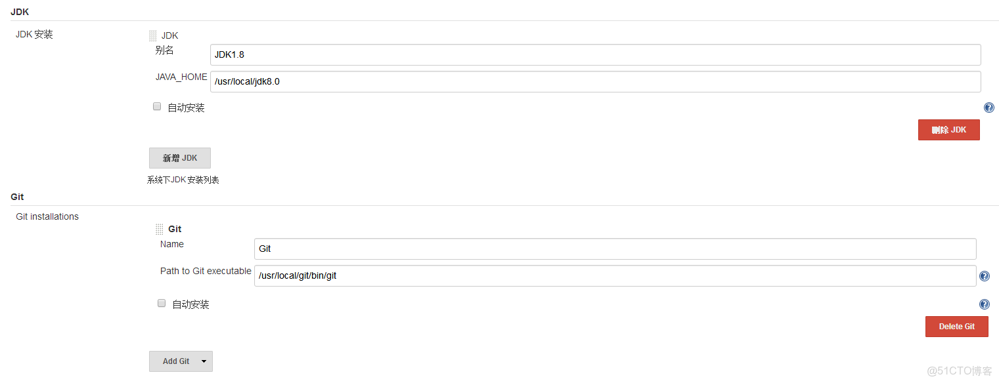
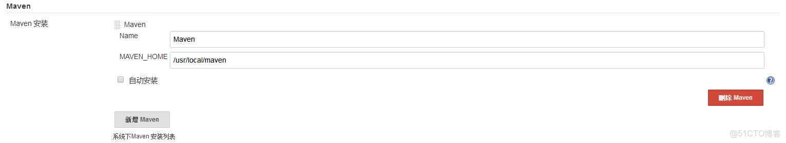
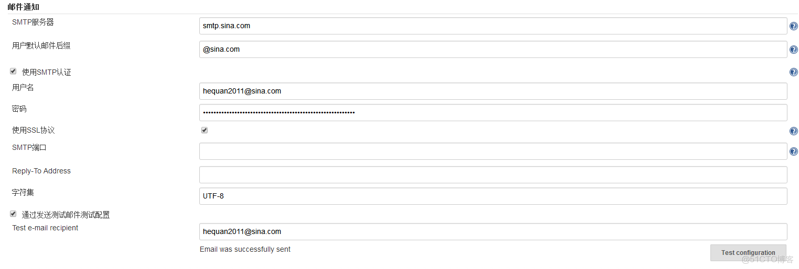

> **内容介绍**
>
> 本文是LNMP/LAMP Web 服务架构与优化,记录了「jenkins 2.73.3 安装 、 配置git 、maven」的相关内容。主要涉及:jenkins安装 --- 配置好tomcat JAVA…

> **技术备注**
>
> 本文写于较早年代,文中软件版本与命令在新系统上可能有差异,执行前请核对当前环境。

---

jenkins安装

---

配置好tomcat JAVA

```shellwget
https://mirrors.tuna.tsinghua.edu.cn/jenkins/war-stable/2.73.3/jenkins.war
cp jenkins.war  /usr/local/tomcat/webapps/
```shel
l

登陆 0.0.0.0:8080/jenkins 开始安装

cat    /root/.jenkins/secrets/initialAdminPassword       ##安装密码和登陆密码 是在这。
选择安装基本插件

---

代码仓库git  代码编译Maven 代码环境 Tomcat

---

安装git

```shellyum
install curl-devel expat-devel gettext-devel openssl-devel zlib-devel gcc perl-ExtUtils-MakeMaker

wget https:///git/git/archive/v2.15.0.tar.gz

tar zxvf v2.15.0.tar.gz
cd git-2.15.0

make configure
./configure --prefix=/usr/local/git --with-iconv=/usr/local/libiconv
make all doc
make install install-doc install-html

vim /etc/profile
export PATH=/usr/local/git/bin:$PATH

source /etc/profile
git --version
```

Maven

```shellwget
http:///apache/maven/maven-3/3.5.2/binaries/apache-maven-3.5.2-bin.tar.gz
tar zxvf apache-maven-3.5.2-bin.tar.gz
mv apache-maven-3.5.2  /usr/local/maven

vim /etc/profile
export M2_HOME=/usr/local/maven
export M2=$M2_HOME/bin
export PATH=$M2:$PATH

source /etc/profile
mvn -version

Apache Maven 3.5.2 (138edd61fd100ec658bfa2d307c43b76940a5d7d; 2017-10-18T15:58:13+08:00)
Maven home: /usr/local/maven
Java version: 1.8.0_151, vendor: Oracle Corporation
Java home: /usr/local/jdk8.0/jre
Default locale: en_US, platform encoding: UTF-8
OS name: "linux", version: "3.10.0-327.el7.x86_64", arch: "amd64", family: "unix"
```

选择  系统管理 --Global Tool Configuration





选择系统管理--插件管理--可选插件，安装如下插件

```shell
Maven Integration plugin
Deploy to container Plugin
GitHub Authentication plugin
SSH plugin
```

邮箱设置


选择系统管理--系统配置--Jenkins Location 输入邮箱
