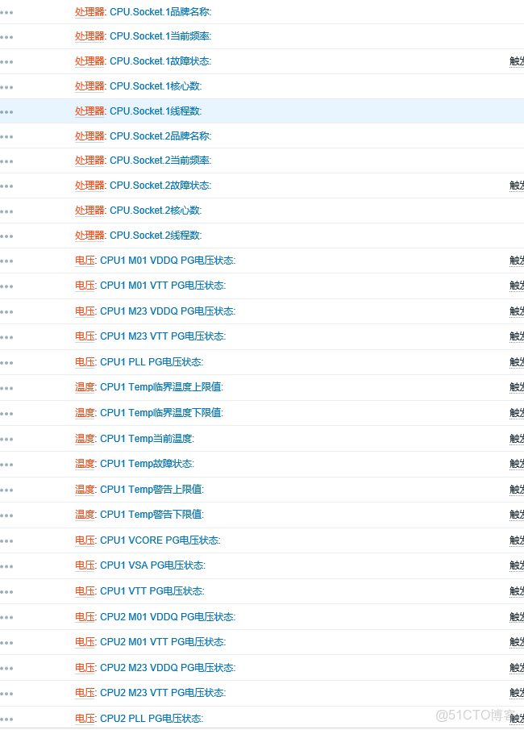

> **内容介绍**
>
> 本文是Linux 系统运维笔记,记录了「zabbix3.4  监控 DELL 硬件模板  | 中文汉化」的相关内容。主要涉及:`Template Dell iDrac SNMPV2.xml` 是通过 硬件管理卡 SNMP方式采集的，DELL 硬件信息。 中文汉化。…

> **技术备注**
>
> Zabbix 2.x/3.x 已停止维护,建议升级至 Zabbix 6.0 LTS 或 7.0 LTS。

---

```shell
https:///hequan2017/zabbix-models
```

`Template Dell iDrac SNMPV2.xml`

是通过 硬件管理卡     SNMP方式采集的，DELL 硬件信息。 中文汉化。


