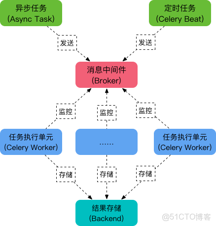
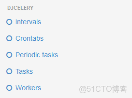
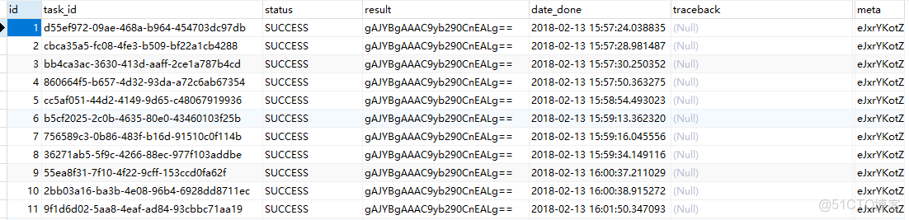

> **内容介绍**
>
> 在 Django 2.0 项目中集成 Celery 3 + django-celery（Redis 作 Broker、数据库作结果后端）的完整案例：settings 配置、tasks.py 中异步任务与定时任务的写法、Django 后台配置定时任务、djcelery 生成的数据库表说明，以及 worker / beat / celerycam 三个进程的启动命令。任务中还演示了在 Celery worker 里修补 `multiprocessing._config` 以便调用 ansible API 的技巧。

> **技术备注**
>
> Celery 3.x 与 django-celery 均已停止维护多年，Celery 4/5 起 djcelery 被移除，定时任务改用 `django-celery-beat`，配置项也全部改为小写（如 `broker_url`、`result_backend`）。Python 3.6 与 Django 2.0 均已 EOL，新项目请用 Python 3.10+、Django 4/5 LTS + Celery 5。文中 `C_FORCE_ROOT` 仅为演示，生产环境应以普通用户运行 worker。

---

### Celery介绍

Celery 是一个 基于python开发的分布式异步消息任务队列，通过它可以轻松的实现任务的异步处理， 如果你的业务场景中需要用到异步任务，就可以考虑使用celery。

#### 软件架构



### Django案例

#### 环境

```shell
* python3.6.4
* django 2.0
* django-celery==3.2.1
* django-kombu==0.9.4
* celery-with-redis==3.0
* celery==3.1.25
```

##### 目录结构

```text
autoops/settings
tasks/tasks.py
```

#### settings

```python
import djcelery

INSTALLED_APPS = [
    'djcelery',
    'kombu',
]

djcelery.setup_loader()
BROKER_URL = 'redis://127.0.0.1:6379/0'  #消息存储数据存储在仓库0

CELERY_RESULT_BACKEND = 'djcelery.backends.database:DatabaseBackend' # 指定 Backend
CELERY_ACCEPT_CONTENT = ['application/json']
CELERY_TASK_SERIALIZER = 'json'
CELERY_RESULT_SERIALIZER = 'json'

CELERY_TIMEZONE = 'Asia/Shanghai'

#CELERY_ALWAYS_EAGER = True   # 如果开启，Celery便以eager模式运行, 则task便不需要加delay运行

CELERY_IMPORTS = ('tasks.tasks',)
CELERYBEAT_SCHEDULER = 'djcelery.schedulers.DatabaseScheduler'  #这是使用了django-celery默认的数据库调度模型,任务执行周期都被存在你指定的orm数据库中
```

#### tasks.py

```python
from celery import Celery, platforms

platforms.C_FORCE_ROOT = True

app = Celery('my_task')
app.config_from_object('django.conf:settings',)
app.autodiscover_tasks(lambda: settings.INSTALLED_APPS)

@app.task()
def  ansbile():   ##如果想异步调用 ansible api,请在任务前面添加如下

    from multiprocessing import current_process
    # try:
    #     current_process()._config
    # except AttributeError:
    current_process()._config = {'semprefix': '/mp'}

@app.task()
def  cmd_job(host,cmd):   ## 执行命令
    i = asset.objects.get(network_ip=host)
    ret = ssh(ip=i.network_ip, port=i.port, username=i.username, password=i.password, cmd=cmd)
    return  ret['data']

def test():  ##  下面是异步调用 celery 的例子

    from tasks.tasks import cmd_job

    aa = cmd_job.apply_async(args=('43.241.238.109', 'pwd'))
    print("id",aa.task_id,"返回值",aa.get() ,aa.result, "状态",aa.state)

    from  djcelery.models import TaskMeta
    b = TaskMeta.objects.get(task_id=aa).result
    print("返回值",b)
```

#### Django 后台

##### 以下是定时执行，直接后台操作即可。很简单。



#### 数据库结构

```shell
* | celery_taskmeta                   ##异步任务，会将结果写入到这个表内
* | celery_tasksetmeta
* | djcelery_crontabschedule
* | djcelery_intervalschedule
* | djcelery_periodictask
* | djcelery_periodictasks
* | djcelery_taskstate               ##django后台执行的定时任务，会将结果写到这个表里
* | djcelery_workerstate
```

```python
from djcelery.models import TaskMeta, TaskState          ##这样获取表
```



**在数据库里看 result 内容是乱码，但是 通过orm获取的时候，显示是正常的。请知悉。**

#### 启动命令

```shell
#实际执行任务的程序
/usr/bin/python   /opt/autoops/manage.py   celery worker  -c  4        --loglevel=info

#任务调度, 根据配置文件发布定时任务
/usr/bin/python   /opt/autoops/manage.py celery beat --schedule=/tmp/celerybeat-schedule --pidfile=/tmp/django_celerybeat.pid --loglevel=INFO

# Django 检查  workers  是否在线
/usr/bin/python   /opt/autoops/manage.py   celerycam --frequency=10.0
```
