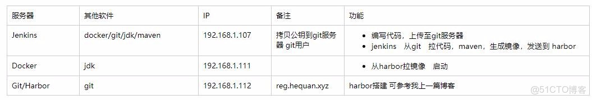
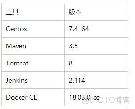

> **内容介绍**
>
> 本文是Kubernetes 云原生容器编排实践,记录了「Solo博客系统--Jenkins/docker自动化构建发布系统」的相关内容。主要涉及:### 部署 #### git服务器 #### docker…

> **技术备注**
>
> Docker 与 Kubernetes 生态演进较快,新版 K8s 默认运行时为 containerd,请注意适配。

---




### 部署

#### git服务器

```shell
yum install git
useradd git
passwd git

创建仓库
su - git
mkdir  solo.git
git --bare  init  ##初始化仓库
```

#### docker

```shell
cat >> /etc/docker/daemon.json　<< EOF
{
"insecure-registries":[":5000"]
}
EOF
```

#### Jenkins服务器

```shell
wget https://codeload.github.com/b3log/solo/zip/master
unzip master

##用来让 jenkins 免密钥 拉代码
ssh-keygen    -t rsa
ssh-copy-id   git@

git clone git@:/home/git/solo.git
cp -rf solo-master/* solo/
cd solo

 # docker服务器 ip  和 监听端口
vim   src/main/resources/latke.properties
serverHost=192.168.1.111
serverPort=80

#上传代码
git add .
git commit  -m "all"
git push origin  master
```dockerfile

#### 生成一个基本镜像

```shell
cat >>  Dockerfile << EOF

FROM jenkins

USER root
RUN echo '' > /etc/apt/sources.list.d/jessie-backports.list && \
    wget http://mirrors.163.com/.help/sources.list.jessie -O /etc/apt/sources.list

RUN apt-get update && apt-get install -y git libltdl-dev

EOF

docker  build   -t  jenkins:v1  .
```

#### 启动jenkins

```shell
docker run -d \
--name jenkins \
-p 8080:8080 \
-v /var/jenkins_home/:/var/jenkins_home \
-v /usr/local/apache-maven-3.5.0:/usr/local/maven \
-v /usr/local/jdk1.8.0_45:/usr/local/jdk \
-v /var/run/docker.sock:/var/run/docker.sock \
-v $(which docker):/usr/bin/docker \
-v ~/.ssh:/root/.ssh \
jenkins:v1
```

#### tomcat 上传到harbor服务器

```shell
FROM centos:7
MAINTAINER   hequan

RUN yum install unzip iproute -y

ENV JAVA_HOME /usr/local/jdk

ADD apache-tomcat-8.0.46.tar.gz /usr/local
RUN mv /usr/local/apache-tomcat-8.0.46 /usr/local/tomcat

WORKDIR /usr/local/tomcat
EXPOSE 8080
ENTRYPOINT ["./bin/", "run"]

docker  build  -t  /test/tomcat:v1  .
docker  login -u hequan -p  123456
docker  push  /test/tomcat:v1
```

---

```shell
启动 设置jdk,git,maven

插件-高级    http:///jenkins/updates/update-center.json
```

```shell
配置 Credentials -- (global) -- Add Credentials
SSH Username with private key
root
From the Jenkins master ~/.ssh
配置　　免密登录 docker 服务器系统管理--系统设置--
SSH remote
hosts
192.168.1.111 22root(docker)
```

### 创建任务

#### git

```shell
git@192.168.1.112:/home/git/solo.git
```

#### Poll SCM

```shell
* * * * *
```

#### Build

`clean install -Dmaven.test.skip=true`

#### Post Steps

##### Execute shell

```shell
cd $WORKSPACE
cat > Dockerfile <<EOF
FROM  /test/tomcat:v1

COPY  target/solo.war  /tmp/ROOT.war

RUN  rm -rf /usr/local/tomcat/webapps/*  && \
     unzip   /tmp/ROOT.war  -d  /usr/local/tomcat/webapps/ROOT  && \
     rm -f /tmp/ROOT.war

WORKDIR /usr/local/tomcat
EXPOSE 8080
ENTRYPOINT  ["./bin/","run"]
EOF

docker  build  -t  /test/solo:v1  .
docker  login -u hequan -p  123456
docker  push  /test/solo:v1
```

##### Execute shell script on remote host  using ssh

```shell
docker rm -f    solol  | true
docker  rmi -f   /test/solo:v1  |  true

docker  login -u hequan  -p  123456
docker  run   -itd   --name solol    -p 80:8080  -v /usr/local/jdk1.8.0_45/:/usr/local/jdk  /test/solo:v1
```

---

### 构建
