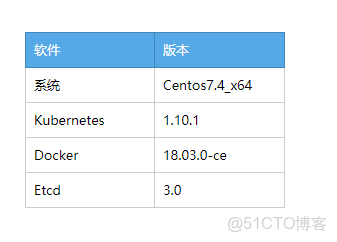
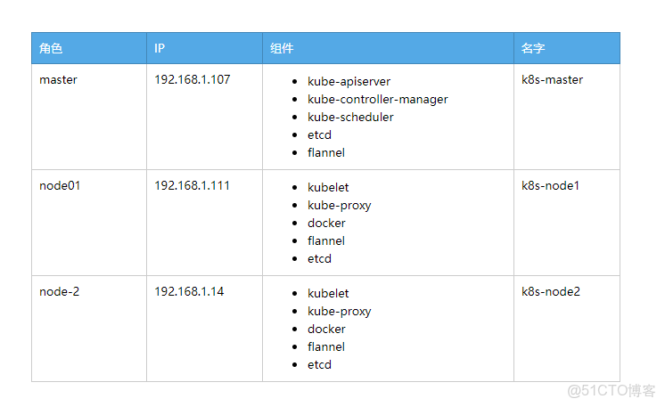
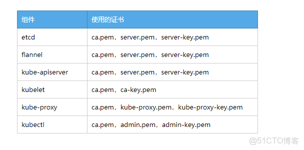

> **内容介绍**
>
> 本文是Kubernetes 云原生容器编排实践,记录了「kubernetes 1.10.1 版本 部署」的相关内容。主要涉及:### kubernetes组件 Master组件： Node组件：…

> **技术备注**
>
> CentOS 7 已于 2024 年 6 月 30 日停止维护(EOL),建议迁移至 Rocky Linux 9 / AlmaLinux 9 或国产 openEuler。

---

### kubernetes组件

Master组件：

```shellkube-apiserver
Kubernetes API，集群的统一入口，各组件协调者，以HTTP API提供接口服务，所有对象资源的增删改查和监听操作都交给APIServer处理后再提交

kube-controller-manager
处理集群中常规后台任务，一个资源对应一个控制器，而ControllerManager就是负责管理这些控制器的。

kube-scheduler
根据调度算法为新创建的Pod选择一个Node节点。
```

Node组件：

```shellkubelet
kubelet是Master在Node节点上的Agent，管理本机运行容器的生命周期，比如创建容器、 Pod挂载数据卷、
下载secret、获取容器和节点状态等工作。 kubelet将每个Pod转换成一组容器。

kube-proxy
在Node节点上实现Pod网络代理，维护网络规则和四层负载均衡工作。

docker或rocket/rkt
运行容器。
```

第三方服务：

```shell etcd
分布式键值存储系统。用于保持集群状态，比如Pod、 Service等对象信息。
```

---

### K8S部署

1、环境规划
2、安装Docker
3、 自签TLS证书
4、部署Etcd集群
5、部署Flannel网络
6、创建Node节点kubeconfig文件
7、获取K8S二进制包
8、运行Master组件
9、运行Node组件
10、查询集群状态

---

#### 1 环境规划





---

#### 2 部署docker

node1 node2

```shellmkdir  /data/docker
sudo yum install -y yum-utils device-mapper-persistent-data lvm2
sudo yum-config-manager --add-repo http://mirrors.aliyun.com/docker-ce/linux/centos/docker-ce.repo

sudo yum makecache fast
sudo yum -y install docker-ce

docker version
systemctl enable docker.service    
systemctl start docker.service

sudo mkdir -p /etc/docker
sudo tee /etc/docker/daemon.json <<-'EOF'
{"graph": "/data/docker"}
EOF
sudo systemctl daemon-reload

sudo systemctl restart docker
```

---

#### 3 自签TLS证书


k8s-master 安装证书生成工具cfssl：

```shellmkdir /data/ssl -p

wget https://pkg.cfssl.org/R1.2/cfssl_linux-amd64
wget https://pkg.cfssl.org/R1.2/cfssljson_linux-amd64
wget https://pkg.cfssl.org/R1.2/cfssl-certinfo_linux-amd64

chmod +x cfssl_linux-amd64 cfssljson_linux-amd64 cfssl-certinfo_linux-amd64

mv cfssl_linux-amd64 /usr/local/bin/cfssl
mv cfssljson_linux-amd64 /usr/local/bin/cfssljson
mv cfssl-certinfo_linux-amd64 /usr/bin/cfssl-certinfo

cd /data/ssl/
```

创建certificate.sh

```shellvim  certificate.sh
cat > ca-config.json <<EOF
{
  "signing": {
    "default": {
      "expiry": "87600h"
    },
    "profiles": {
      "kubernetes": {
         "expiry": "87600h",
         "usages": [
            "signing",
            "key encipherment",
            "server auth",
            "client auth"
        ]
      }
    }
  }
}
EOF

cat > ca-csr.json <<EOF
{
    "CN": "kubernetes",
    "key": {
        "algo": "rsa",
        "size": 2048
    },
    "names": [
        {
            "C": "CN",
            "L": "Beijing",
            "ST": "Beijing",
              "O": "k8s",
            "OU": "System"
        }
    ]
}
EOF

cfssl gencert -initca ca-csr.json | cfssljson -bare ca -

#-----------------------

cat > server-csr.json <<EOF
{
    "CN": "kubernetes",
    "hosts": [
      "127.0.0.1",
      "192.168.1.107",
      "192.168.1.111",
      "192.168.1.14",
      "10.10.10.1",
      "kubernetes",
      "kubernetes.default",
      "kubernetes.default.svc",
      "kubernetes.default.svc.cluster",
      "kubernetes.default.svc.cluster.local"
    ],
    "key": {
        "algo": "rsa",
        "size": 2048
    },
    "names": [
        {
            "C": "CN",
            "L": "BeiJing",
            "ST": "BeiJing",
            "O": "k8s",
            "OU": "System"
        }
    ]
}
EOF

cfssl gencert -ca=ca.pem -ca-key=ca-key.pem -config=ca-config.json -profile=kubernetes server-csr.json | cfssljson -bare server

#-----------------------

cat > admin-csr.json <<EOF
{
  "CN": "admin",
  "hosts": [],
  "key": {
    "algo": "rsa",
    "size": 2048
  },
  "names": [
    {
      "C": "CN",
      "L": "BeiJing",
      "ST": "BeiJing",
      "O": "system:masters",
      "OU": "System"
    }
  ]
}
EOF

cfssl gencert -ca=ca.pem -ca-key=ca-key.pem -config=ca-config.json -profile=kubernetes admin-csr.json | cfssljson -bare admin

#-----------------------

cat > kube-proxy-csr.json <<EOF
{
  "CN": "system:kube-proxy",
  "hosts": [],
  "key": {
    "algo": "rsa",
    "size": 2048
  },
  "names": [
    {
      "C": "CN",
      "L": "BeiJing",
      "ST": "BeiJing",
      "O": "k8s",
      "OU": "System"
    }
  ]
}
EOF

cfssl gencert -ca=ca.pem -ca-key=ca-key.pem -config=ca-config.json -profile=kubernetes kube-proxy-csr.json | cfssljson -bare kube-proxy
```

修改如下，然后执行

```shell50      "192.168.1.107",
51      "192.168.1.111",
52      "192.168.1.14",
```

生成证书

```shelladmin-key.pem   ca.csr       ca.pem               kube-proxy-key.pem  server-csr.json
admin.csr       admin.pem       ca-csr.json  kube-proxy.csr       kube-proxy.pem      server-key.pem
admin-csr.json  ca-config.json  ca-key.pem   kube-proxy-csr.json  server.csr          server.pem
```

---

#### 4 部署Etcd

```shell二进制包下载地址： https:///coreos/etcd/releases/tag/v3.2.12

3个节点

mkdir /data/etcd/
cd /data/etcd/

mkdir /opt/kubernetes/{bin,cfg,ssl}  -p
tar zxvf etcd-v3.2.12-linux-amd64.tar.gz
cd etcd-v3.2.12-linux-amd64/
cp etcd etcdctl  /opt/kubernetes/bin/

cd /data/ssl
cp ca*pem  server*pem  /opt/kubernetes/ssl/

scp -r /opt/kubernetes/*  192.168.1.111:/opt/kubernetes
scp -r /opt/kubernetes/*  192.168.1.14:/opt/kubernetes
```

```shellcd /data/etcd
vim  

#!/bin/bash

ETCD_NAME=${1:-"etcd01"}
ETCD_IP=${2:-"127.0.0.1"}
ETCD_CLUSTER=${3:-"etcd01=http://127.0.0.1:2379"}

cat <<EOF >/opt/kubernetes/cfg/etcd
#[Member]
ETCD_NAME="${ETCD_NAME}"
ETCD_DATA_DIR="/var/lib/etcd/default.etcd"
ETCD_LISTEN_PEER_URLS="https://${ETCD_IP}:2380"
ETCD_LISTEN_CLIENT_URLS="https://${ETCD_IP}:2379"

#[Clustering]
ETCD_INITIAL_ADVERTISE_PEER_URLS="https://${ETCD_IP}:2380"
ETCD_ADVERTISE_CLIENT_URLS="https://${ETCD_IP}:2379"
ETCD_INITIAL_CLUSTER="${ETCD_CLUSTER}"
ETCD_INITIAL_CLUSTER_TOKEN="etcd-cluster"
ETCD_INITIAL_CLUSTER_STATE="new"
EOF

cat <<EOF >/usr/lib/systemd/system/etcd.service
[Unit]
Description=Etcd Server
After=network.target
After=network-online.target
Wants=network-online.target

[Service]
Type=notify
EnvironmentFile=-/opt/kubernetes/cfg/etcd
ExecStart=/opt/kubernetes/bin/etcd \\
--name=\${ETCD_NAME} \\
--data-dir=\${ETCD_DATA_DIR} \\
--listen-peer-urls=\${ETCD_LISTEN_PEER_URLS} \\
--listen-client-urls=\${ETCD_LISTEN_CLIENT_URLS},http://127.0.0.1:2379 \\
--advertise-client-urls=\${ETCD_ADVERTISE_CLIENT_URLS} \\
--initial-advertise-peer-urls=\${ETCD_INITIAL_ADVERTISE_PEER_URLS} \\
--initial-cluster=\${ETCD_INITIAL_CLUSTER} \\
--initial-cluster-token=\${ETCD_INITIAL_CLUSTER_TOKEN} \\
--initial-cluster-state=new \\
--cert-file=/opt/kubernetes/ssl/server.pem \\
--key-file=/opt/kubernetes/ssl/server-key.pem \\
--peer-cert-file=/opt/kubernetes/ssl/server.pem \\
--peer-key-file=/opt/kubernetes/ssl/server-key.pem \\
--trusted-ca-file=/opt/kubernetes/ssl/ca.pem \\
--peer-trusted-ca-file=/opt/kubernetes/ssl/ca.pem
Restart=on-failure
LimitNOFILE=65536

[Install]
WantedBy=multi-user.target
EOF

systemctl daemon-reload
systemctl enable etcd
systemctl restart etcd

chmod +x 
master: ./  etcd01 192.168.1.107  etcd01=https://192.168.1.107:2380,etcd02=https://192.168.1.111:2380,etcd03=https://192.168.1.14:2380
node1:./  etcd02 192.168.1.111  etcd01=https://192.168.1.107:2380,etcd02=https://192.168.1.111:2380,etcd03=https://192.168.1.14:2380
node2:./  etcd03 192.168.1.14  etcd01=https://192.168.1.107:2380,etcd02=https://192.168.1.111:2380,etcd03=https://192.168.1.14:2380

tailf /var/log/messages
ps -ef | grep etcd
```

```shell查看集群状态：
cd /opt/kubernetes/ssl
/opt/kubernetes/bin/etcdctl \
--ca-file=ca.pem --cert-file=server.pem --key-file=server-key.pem \
--endpoints="https://192.168.1.107:2379,https://192.168.1.111:2379,https://192.168.1.14:2379" \
cluster-health

member 21ab2aeb56731588 is healthy: got healthy result from https://192.168.1.111:2379
member 5997140dfeb3820d is healthy: got healthy result from https://192.168.1.14:2379
member 9a57e056c2e030b8 is healthy: got healthy result from https://192.168.1.107:2379
cluster is healthy
```

---

#### 5  部署Flannel网络

写入分配的子网段到etcd，供flanneld使用

```shellcd /opt/kubernetes/ssl

/opt/kubernetes/bin/etcdctl \
> --ca-file=ca.pem --cert-file=server.pem --key-file=server-key.pem \
> --endpoints="https://192.168.1.107:2379,https://192.168.1.111:2379,https://192.168.1.14:2379" \
> set /coreos.com/network/config '{ "Network": "172.17.0.0/16", "Backend": {"Type": "vxlan"}}'
{ "Network": "172.17.0.0/16", "Backend": {"Type": "vxlan"}}
```

下载二进制包

```shellwget https:///coreos/flannel/releases/download/v0.10.0/flannel-v0.10.0-linux-amd64.tar.gz
```

配置flanneld--三个节点 操作

```shellmkdir  /data/flanneld
cd /data/flanneld
tar xf flannel-v0.10.0-linux-amd64.tar.gz
mv flanneld   /opt/kubernetes/bin/

vim 
#!/bin/bash

ETCD_ENDPOINTS=${1:-"http://127.0.0.1:2379"}

cat <<EOF >/opt/kubernetes/cfg/flanneld

FLANNEL_OPTIONS="--etcd-endpoints=${ETCD_ENDPOINTS} \
-etcd-cafile=/opt/kubernetes/ssl/ca.pem \
-etcd-certfile=/opt/kubernetes/ssl/server.pem \
-etcd-keyfile=/opt/kubernetes/ssl/server-key.pem"

EOF

cat <<EOF >/usr/lib/systemd/system/flanneld.service
[Unit]
Description=Flanneld overlay address etcd agent
After=network-online.target network.target
Before=docker.service

[Service]
Type=notify
EnvironmentFile=/opt/kubernetes/cfg/flanneld
ExecStart=/opt/kubernetes/bin/flanneld --ip-masq \$FLANNEL_OPTIONS
ExecStartPost=/opt/kubernetes/bin/ -k DOCKER_NETWORK_OPTIONS -d /run/flannel/subnet.env
Restart=on-failure

[Install]
WantedBy=multi-user.target

EOF

cat <<EOF >/usr/lib/systemd/system/docker.service

[Unit]
Description=Docker Application Container Engine
Documentation=https://docs.docker.com
After=network-online.target firewalld.service
Wants=network-online.target

[Service]
Type=notify
EnvironmentFile=/run/flannel/subnet.env
ExecStart=/usr/bin/dockerd  \$DOCKER_NETWORK_OPTIONS
ExecReload=/bin/kill -s HUP \$MAINPID
LimitNOFILE=infinity
LimitNPROC=infinity
LimitCORE=infinity
TimeoutStartSec=0
Delegate=yes
KillMode=process
Restart=on-failure
StartLimitBurst=3
StartLimitInterval=60s

[Install]
WantedBy=multi-user.target

EOF

systemctl daemon-reload
systemctl enable flanneld
systemctl restart flanneld
systemctl restart docker

chmod +x 
./  https://192.168.1.107:2379,https://192.168.1.111:2379,https://192.168.1.14:2379
cat /run/flannel/subnet.env
DOCKER_OPT_BIP="--bip=172.17.1.1/24"
DOCKER_OPT_IPMASQ="--ip-masq=false"
DOCKER_OPT_MTU="--mtu=1450"
DOCKER_NETWORK_OPTIONS=" --bip=172.17.1.1/24 --ip-masq=false --mtu=1450"
```

查看配置

```shellcd /opt/kubernetes/ssl
/opt/kubernetes/bin/etcdctl --ca-file=ca.pem --cert-file=server.pem --key-file=server-key.pem --endpoints="https://192.168.1.107:2379,https://192.168.0.212:2379,https://192.168.0.213:2379"  ls /coreos.com/network/subnets

/coreos.com/network/subnets/172.17.1.0-24
/coreos.com/network/subnets/172.17.66.0-24
/coreos.com/network/subnets/172.17.87.0-24

/opt/kubernetes/bin/etcdctl --ca-file=ca.pem --cert-file=server.pem --key-file=server-key.pem --endpoints="https://192.168.1.107:2379,https://192.168.0.212:2379,https://192.168.0.213:2379"  get /coreos.com/network/subnets/172.17.1.0-24

{"PublicIP":"192.168.1.107","BackendType":"vxlan","BackendData":{"VtepMAC":"4a:e5:53:6d:4a:66"}}

netstat -antp | grep flanneld
tcp        0      0 192.168.1.107:1618      192.168.1.14:2379       ESTABLISHED 1760/flanneld       
tcp        0      0 192.168.1.107:1620      192.168.1.14:2379       ESTABLISHED 1760/flanneld       
tcp        0      0 192.168.1.107:1616      192.168.1.14:2379       ESTABLISHED 1760/flanneld
```

---

#### 6  创建Node节点kubeconfig文件

master节点操作

- 创建TLS Bootstrapping Token
- 创建kubelet kubeconfig
- 创建kube-proxy kubeconfig

```shellcd /data/ssl/
vim           ##修改第10行 ip

# 创建 TLS Bootstrapping Token
export BOOTSTRAP_TOKEN=$(head -c 16 /dev/urandom | od -An -t x | tr -d ' ')
cat > token.csv <<EOF
${BOOTSTRAP_TOKEN},kubelet-bootstrap,10001,"system:kubelet-bootstrap"
EOF

#----------------------

# 创建kubelet bootstrapping kubeconfig
export KUBE_APISERVER="https://192.168.1.107:6443"

# 设置集群参数
kubectl config set-cluster kubernetes \
  --certificate-authority=./ca.pem \
  --embed-certs=true \
  --server=${KUBE_APISERVER} \
  --kubeconfig=bootstrap.kubeconfig

# 设置客户端认证参数
kubectl config set-credentials kubelet-bootstrap \
  --token=${BOOTSTRAP_TOKEN} \
  --kubeconfig=bootstrap.kubeconfig

# 设置上下文参数
kubectl config set-context default \
  --cluster=kubernetes \
  --user=kubelet-bootstrap \
  --kubeconfig=bootstrap.kubeconfig

# 设置默认上下文
kubectl config use-context default --kubeconfig=bootstrap.kubeconfig

#----------------------

# 创建kube-proxy kubeconfig文件

kubectl config set-cluster kubernetes \
  --certificate-authority=./ca.pem \
  --embed-certs=true \
  --server=${KUBE_APISERVER} \
  --kubeconfig=kube-proxy.kubeconfig

kubectl config set-credentials kube-proxy \
  --client-certificate=./kube-proxy.pem \
  --client-key=./kube-proxy-key.pem \
  --embed-certs=true \
  --kubeconfig=kube-proxy.kubeconfig

kubectl config set-context default \
  --cluster=kubernetes \
  --user=kube-proxy \
  --kubeconfig=kube-proxy.kubeconfig

kubectl config use-context default --kubeconfig=kube-proxy.kubeconfig

##  kubectl   软件在kubernetes-server-linux-amd64.tar.gz  里面,可从官网下载,下面的部署也需要这个软件包
mv kubectl  /usr/bin/
chmod +x /usr/bin/kubectl
sh 

   kube-proxy-csr.json  kube-proxy.kubeconfig
kube-proxy.csr  kube-proxy-key.pem   kube-proxy.pem bootstrap.kubeconfig
```

```shellscp *kubeconfig root@192.168.1.111:/opt/kubernetes/cfg
scp *kubeconfig root@192.168.1.14:/opt/kubernetes/cfg
```

---

#### 7  获取K8S二进制包

```shellhttps:///kubernetes/kubernetes/blob/master/#v1101

kubernetes-server-linux-amd64.tar.gz
```

需要用到
master

- kubectl
- kube-scheduler
- kube-apiserver
- kube-controller-manager

node

- kubelet
- kube-proxy

```shellvim   
#!/bin/bash

MASTER_ADDRESS=${1:-"192.168.1.107"}
ETCD_SERVERS=${2:-"http://127.0.0.1:2379"}

cat <<EOF >/opt/kubernetes/cfg/kube-apiserver

KUBE_APISERVER_OPTS="--logtostderr=true \\
--v=4 \\
--etcd-servers=${ETCD_SERVERS} \\
--insecure-bind-address=127.0.0.1 \\
--bind-address=${MASTER_ADDRESS} \\
--insecure-port=8080 \\
--secure-port=6443 \\
--advertise-address=${MASTER_ADDRESS} \\
--allow-privileged=true \\
--service-cluster-ip-range=10.10.10.0/24 \\
--admission-control=NamespaceLifecycle,LimitRanger,SecurityContextDeny,ServiceAccount,ResourceQuota,NodeRestriction \
--authorization-mode=RBAC,Node \\
--kubelet-https=true \\
--enable-bootstrap-token-auth \\
--token-auth-file=/opt/kubernetes/cfg/token.csv \\
--service-node-port-range=30000-50000 \\
--tls-cert-file=/opt/kubernetes/ssl/server.pem  \\
--tls-private-key-file=/opt/kubernetes/ssl/server-key.pem \\
--client-ca-file=/opt/kubernetes/ssl/ca.pem \\
--service-account-key-file=/opt/kubernetes/ssl/ca-key.pem \\
--etcd-cafile=/opt/kubernetes/ssl/ca.pem \\
--etcd-certfile=/opt/kubernetes/ssl/server.pem \\
--etcd-keyfile=/opt/kubernetes/ssl/server-key.pem"

EOF

cat <<EOF >/usr/lib/systemd/system/kube-apiserver.service
[Unit]
Description=Kubernetes API Server
Documentation=https:///kubernetes/kubernetes

[Service]
EnvironmentFile=-/opt/kubernetes/cfg/kube-apiserver
ExecStart=/opt/kubernetes/bin/kube-apiserver \$KUBE_APISERVER_OPTS
Restart=on-failure

[Install]
WantedBy=multi-user.target
EOF

systemctl daemon-reload
systemctl enable kube-apiserver
systemctl restart kube-apiserver
```

```shellvim 
#!/bin/bash

MASTER_ADDRESS=${1:-"127.0.0.1"}

cat <<EOF >/opt/kubernetes/cfg/kube-controller-manager

KUBE_CONTROLLER_MANAGER_OPTS="--logtostderr=true \\
--v=4 \\
--master=${MASTER_ADDRESS}:8080 \\
--leader-elect=true \\
--address=127.0.0.1 \\
--service-cluster-ip-range=10.10.10.0/24 \\
--cluster-name=kubernetes \\
--cluster-signing-cert-file=/opt/kubernetes/ssl/ca.pem \\
--cluster-signing-key-file=/opt/kubernetes/ssl/ca-key.pem  \\
--service-account-private-key-file=/opt/kubernetes/ssl/ca-key.pem \\
--root-ca-file=/opt/kubernetes/ssl/ca.pem"

EOF

cat <<EOF >/usr/lib/systemd/system/kube-controller-manager.service
[Unit]
Description=Kubernetes Controller Manager
Documentation=https:///kubernetes/kubernetes

[Service]
EnvironmentFile=-/opt/kubernetes/cfg/kube-controller-manager
ExecStart=/opt/kubernetes/bin/kube-controller-manager \$KUBE_CONTROLLER_MANAGER_OPTS
Restart=on-failure

[Install]
WantedBy=multi-user.target
EOF

systemctl daemon-reload
systemctl enable kube-controller-manager
systemctl restart kube-controller-manager
```

```shellvim 
#!/bin/bash

MASTER_ADDRESS=${1:-"127.0.0.1"}

cat <<EOF >/opt/kubernetes/cfg/kube-scheduler

KUBE_SCHEDULER_OPTS="--logtostderr=true \\
--v=4 \\
--master=${MASTER_ADDRESS}:8080 \\
--leader-elect"

EOF

cat <<EOF >/usr/lib/systemd/system/kube-scheduler.service
[Unit]
Description=Kubernetes Scheduler
Documentation=https:///kubernetes/kubernetes

[Service]
EnvironmentFile=-/opt/kubernetes/cfg/kube-scheduler
ExecStart=/opt/kubernetes/bin/kube-scheduler \$KUBE_SCHEDULER_OPTS
Restart=on-failure

[Install]
WantedBy=multi-user.target
EOF

systemctl daemon-reload
systemctl enable kube-scheduler
systemctl restart kube-scheduler
```

#### 8 运行Master组件

```shellmv kube-apiserver kube-controller-manager kube-scheduler kubectl /opt/kubernetes/bin
chmod +x /opt/kubernetes/bin/* && chmod +x *.sh

cp ssl/token.csv /opt/kubernetes/cfg/
ls /opt/kubernetes/ssl/
ca-key.pem  ca.pem  server-key.pem  server.pem

./ 192.168.1.107 https://192.168.1.107:2379,https://192.168.1.111:2379,https://192.168.1.14:2379
./ 127.0.0.1
./ 127.0.0.1

echo "export PATH=$PATH:/opt/kubernetes/bin" >> /etc/profile
source /etc/profile
```

创建用户

```shellkubectl create clusterrolebinding  kubelet-bootstrap --clusterrole=system:node-bootstrapper  --user=kubelet-bootstrap
```

检查

```shellkubectl get cs
NAME                 STATUS    MESSAGE              ERROR
controller-manager   Healthy   ok                   
scheduler            Healthy   ok                   
etcd-0               Healthy   {"health": "true"}   
etcd-1               Healthy   {"health": "true"}   
etcd-2               Healthy   {"health": "true"}   
```

#### 9 运行Node组件

```shellvim  
#!/bin/bash

NODE_ADDRESS=${1:-"192.168.1.111"}
DNS_SERVER_IP=${2:-"10.10.10.2"}

cat <<EOF >/opt/kubernetes/cfg/kubelet

KUBELET_OPTS="--logtostderr=true \\
--v=4 \\
--address=${NODE_ADDRESS} \\
--hostname-override=${NODE_ADDRESS} \\
--kubeconfig=/opt/kubernetes/cfg/kubelet.kubeconfig \\
--experimental-bootstrap-kubeconfig=/opt/kubernetes/cfg/bootstrap.kubeconfig \\
--cert-dir=/opt/kubernetes/ssl \\
--allow-privileged=true \\
--cluster-dns=${DNS_SERVER_IP} \\
--cluster-domain=cluster.local \\
--fail-swap-on=false \\
--pod-infra-container-image=/google-containers/pause-amd64:3.0"

EOF

cat <<EOF >/usr/lib/systemd/system/kubelet.service
[Unit]
Description=Kubernetes Kubelet
After=docker.service
Requires=docker.service

[Service]
EnvironmentFile=-/opt/kubernetes/cfg/kubelet
ExecStart=/opt/kubernetes/bin/kubelet \$KUBELET_OPTS
Restart=on-failure
KillMode=process

[Install]
WantedBy=multi-user.target
EOF

systemctl daemon-reload
systemctl enable kubelet
systemctl restart kubelet
```

```shellvim 
#!/bin/bash

NODE_ADDRESS=${1:-"192.168.1.111"}

cat <<EOF >/opt/kubernetes/cfg/kube-proxy

KUBE_PROXY_OPTS="--logtostderr=true \
--v=4 \
--hostname-override=${NODE_ADDRESS} \
--kubeconfig=/opt/kubernetes/cfg/kube-proxy.kubeconfig"

EOF

cat <<EOF >/usr/lib/systemd/system/kube-proxy.service
[Unit]
Description=Kubernetes Proxy
After=network.target

[Service]
EnvironmentFile=-/opt/kubernetes/cfg/kube-proxy
ExecStart=/opt/kubernetes/bin/kube-proxy \$KUBE_PROXY_OPTS
Restart=on-failure

[Install]
WantedBy=multi-user.target
EOF

systemctl daemon-reload
systemctl enable kube-proxy
systemctl restart kube-proxy
```

node1    node2重复此步骤

```shellmv kubelet kube-proxy /opt/kubernetes/bin
chmod +x /opt/kubernetes/bin/* && chmod +x *.sh
./ 192.168.1.111 10.10.10.2
./ 192.168.1.111

node2
./ 192.168.1.14 10.10.10.2
./ 192.168.1.14
```

master:

```shellkubectl get csr
NAME                                                   AGE       REQUESTOR           CONDITION
node-csr-OBBWrBrJEDjmG2Cnu62ZGfRPfElYXbzrBOdwZoNP9GY   2m        kubelet-bootstrap   Pending

kubectl  certificate approve node-csr-OBBWrBrJEDjmG2Cnu62ZGfRPfElYXbzrBOdwZoNP9GY
certificatesigningrequest "node-csr-OBBWrBrJEDjmG2Cnu62ZGfRPfElYXbzrBOdwZoNP9GY" approved

kubectl get csr
NAME                                                   AGE       REQUESTOR           CONDITION
node-csr-OBBWrBrJEDjmG2Cnu62ZGfRPfElYXbzrBOdwZoNP9GY   3m        kubelet-bootstrap   Approved,Issued

kubectl get node
NAME            STATUS     ROLES     AGE       VERSION
192.168.1.111   Ready      <none>    11m       v1.10.1
192.168.1.14    NotReady   <none>    8s        v1.10.1
```

#### 10 查询集群状态

```shellkubectl get componentstatus
kubectl get node
```

---
