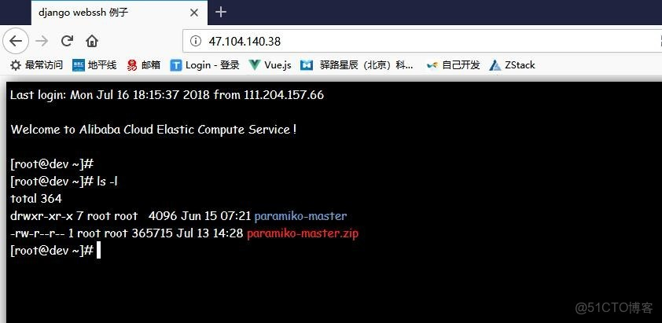

> **内容介绍**
>
> 用 Django + Channels + paramiko 实现一个浏览器里的 WebSSH 终端：前端通过 WebSocket 连接后端，后端用 paramiko 登录远程主机并把 SSH 通道的输出实时推送到网页 xterm 终端。文章给出了 consumers、routing、前端页面的完整最小示例，并提醒了按用户名建 channel group 时中文用户名会报错的问题。

> **技术备注**
>
> 文中基于 channels 2.0.2 + channels-redis 2.1.0，Channels 3.x 之后 API 有较大变化（如 AsyncWebsocketConsumer 成为主流、Routing 写法调整）；xterm.min.js 对应的是 xterm.js 2.x/3.x 时代的用法，现在的 xterm.js 5.x 需配合 AttachAddon 等插件使用。paramiko 用法至今基本兼容。

---



### 说明

> 新建一个 django 程序，本文为 chain。

> 需要有用户登录。是通道那里 用的用户名字 创建的通道。

> 以下仅为简单例子，实际应用 可根据自己平台情况 进行修改。

> 打开首页后，需要输入1，后台去登录主机，然后返回登录结果。

> 正常项目 可以post 主机和登录账户，进行权限判断，然后去后台读取账户密码，进行登录。

---

> 特别注意:  测试的用户  请设置成  英文，本文的例子 不能是中文的。 因为会把用户名字 当 组名字，中文组名字会报错，所以会有这个问题。 如果实际是中文名字的，，建议把  group 换成其他的。  async_to_sync(self.channel_layer.group_add)(self.scope['user'].username, self.channel_name)

### django 后台

#### 需要安装以下模块

安装后会有一个版本号报错，不影响

```shell
pip install channels==2.0.2 channels-redis==2.1.0 amqp==1.4.9 anyjson==0.3.3 asgi-redis==1.4.3 asgiref==2.3.0 async-timeout==2.0.0 attrs==17.4.0

cd /tmp/
wget https://files.pythonhosted.org/packages/12/2a/e9e4fb2e6b2f7a75577e0614926819a472934b0b85f205ba5d5d2add54d0/Twisted-18.4.0.tar.bz2
tar xf Twisted-18.4.0.tar.bz2
cd Twisted-18.4.0
python3 setup.py install
```

#### 启动 redis

需先启动一个本地 redis（127.0.0.1:6379），供 channel layer 使用。

---

### 目录结构

```text
chain /
		chain/
			 settings.py
			 asgi.py
			 consumers.py
			 routing.py
			 urls.py
			 views.py
    templates/
		   index.html
```

---

#### settings.py

```python
INSTALLED_APPS = [
    'channels',
]

# django-channels配置
CHANNEL_LAYERS = {
    "default": {
        "BACKEND": "channels_redis.core.RedisChannelLayer",
        "CONFIG": {
            "hosts": [("127.0.0.1", 6379)],
        },
    },
}

# 配置ASGI
ASGI_APPLICATION = "chain.routing.application"
```

#### consumers.py

```python
from asgiref.sync import async_to_sync
from channels.generic.websocket import WebsocketConsumer

import paramiko
import threading
import time

from channels.layers import get_channel_layer
channel_layer = get_channel_layer()

class MyThread(threading.Thread):
    def __init__(self, id, chan):
        threading.Thread.__init__(self)
        self.chan = chan

    def run(self):
        while not self.chan.chan.exit_status_ready():
            time.sleep(0.1)
            try:
                data = self.chan.chan.recv(1024)
                async_to_sync(self.chan.channel_layer.group_send)(
                    self.chan.scope['user'].username,
                    {
                        "type": "user.message",
                        "text": bytes.decode(data)
                    },
                )
            except Exception as ex:
                print(str(ex))
        self.chan.sshclient.close()
        return False

class EchoConsumer(WebsocketConsumer):

    def connect(self):
        # 创建channels group， 命名为：用户名，并使用channel_layer写入到redis
        async_to_sync(self.channel_layer.group_add)(self.scope['user'].username, self.channel_name)
        # 返回给receive方法处理

        path = self.scope['path']

        self.accept()

    def receive(self, text_data):

        if text_data == '1':
            self.sshclient = paramiko.SSHClient()
            self.sshclient.load_system_host_keys()
            self.sshclient.set_missing_host_key_policy(paramiko.AutoAddPolicy())
            self.sshclient.connect('47.104.140.38', 22, 'root', '123456')
            self.chan = self.sshclient.invoke_shell(term='xterm')
            self.chan.settimeout(0)
            t1 = MyThread(999, self)
            t1.setDaemon(True)
            t1.start()
        else:
            try:
                self.chan.send(text_data)
            except Exception as ex:
                print(str(ex))

    def user_message(self, event):
        # 消费
        self.send(text_data=event["text"])

    def disconnect(self, close_code):
        async_to_sync(self.channel_layer.group_discard)(self.scope['user'].username, self.channel_name)
```

#### asgi.py

```python
import os
import django
from channels.routing import get_default_application

os.environ.setdefault("DJANGO_SETTINGS_MODULE", "chain.settings")
django.setup()
application = get_default_application()
```

#### urls.py

```python
from .views  import   index
urlpatterns = [
 path('', index),
 ]
```

#### views.py

```python
from django.shortcuts import redirect, render

def index(request):
    return render(request, 'index.html', )
```

#### routing.py

```python
from channels.auth import AuthMiddlewareStack
from channels.routing import URLRouter, ProtocolTypeRouter
from django.urls import path

from .consumers import EchoConsumer

application = ProtocolTypeRouter({
    "websocket": AuthMiddlewareStack(
        URLRouter([
            path(r"ws/", EchoConsumer),
            # path(r"stats/", StatsConsumer),
        ])
    )
})
```

---

### 网页设置：

需要下载一个 xterm.min.js，加载。

index.html

```html
<!DOCTYPE html>
<html lang="en">
<head>
    <meta charset="UTF-8">
    <title>django webssh 例子</title>

    <link href="/static/css/plugins/ztree/awesomeStyle/awesome.css" rel="stylesheet">

    <link href="/static/webssh_static/css/xterm.min.css" rel="stylesheet" type="text/css"/>
    <style>
        body {
            padding-bottom: 30px;
        }

        .terminal {
            border: #000 solid 5px;
            font-family: cursive;
        {#                font-family: Arial, Helvetica, Tahoma ,"Monaco", "DejaVu Sans Mono", "Liberation Mono", sans-serif;#}{#                font-family: Tahoma, Helvetica, Arial, sans-serif;#}{#                font-family: "\5B8B\4F53","","Monaco", "DejaVu Sans Mono", "Liberation Mono", "Microsoft YaHei", monospace;#} font-size: 15px;
        {#                color: #f0f0f0;#} background: #000;
        {#                width: 893px;#}{#                height: 550px;#} box-shadow: rgba(0, 0, 0, 0.8) 2px 2px 20px;
        }

        .reverse-video {
            color: #000;
            background: #f0f0f0;
        }
    </style>
</head>
<body>

</body>

<script src="/static/webssh_static/js/xterm.min.js"></script>
<script>
    var socket = new WebSocket('ws://' + window.location.host + '/ws/');

    socket.onopen = function () {

        var term = new Terminal();
        term.open(document.getElementById('terms'));

        term.on('data', function (data) {
            console.log(data);
            socket.send(data);
        });

        socket.onmessage = function (msg) {
            console.log(msg);
            console.log(msg.data);
            term.write(msg.data);
        };
        socket.onerror = function (e) {
            console.log(e);
        };

        socket.onclose = function (e) {
            console.log(e);
            term.destroy();
        };
    };

</script>

</html>
```
