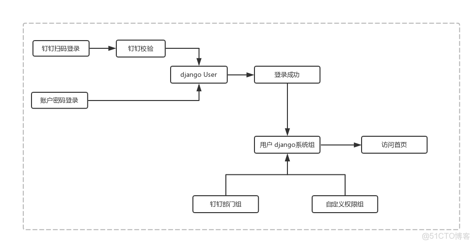
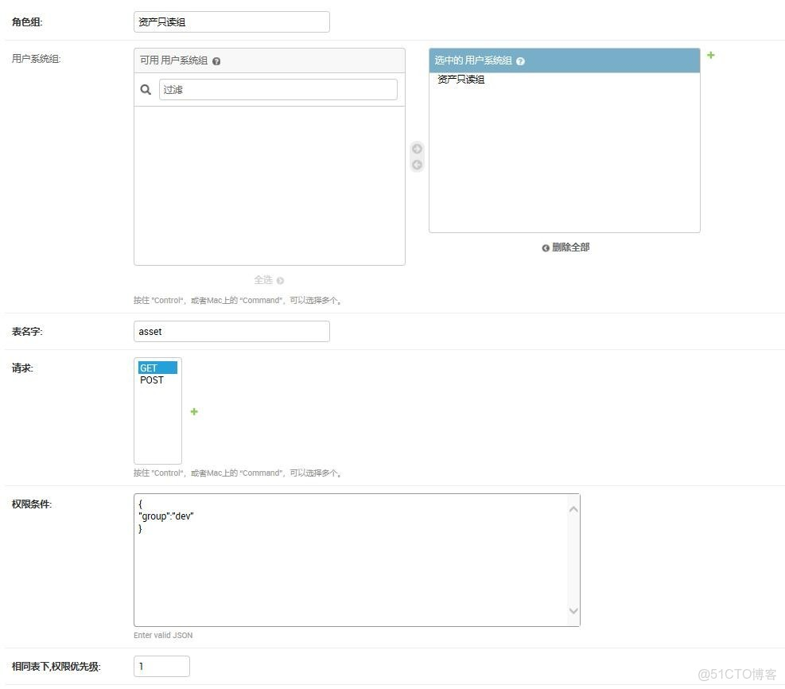

> **内容介绍**
>
> 本文是Python 编程实战笔记,记录了「django 利用钉钉 扩展用户系统」的相关内容。主要涉及:### django 利用钉钉 扩展用户系统 #### 用户架构图 #### 说明…

> **技术备注**
>
> 本文写于较早年代,文中软件版本与命令在新系统上可能有差异,执行前请核对当前环境。

---

### django 利用钉钉 扩展用户系统

#### 用户架构图



#### 说明

```shell
以django 自带 user,group 为基础 ,结合 钉钉用户系统 进行结合，以达到能够满足实际需求。

组关系: 钉钉部门组 通过 多对多 关系到 系统Group。
然后设置计划任务，如果 有钉钉部门组 关联到了 系统组，就把该用户组下的 用户 自动添加相应的 系统组。

组关系2: 自定义权限组 通过 多对多 关系到 系统Group。
根据 用户 系统组 的名字 查询到 自定义权限信息，进行判断
```
l

---

#### 版本

```
Django==2.0.9
jsonfield==2.0.2
```
l

#### 建立表结构

- 钉钉部门表
- 扩展User表
- 自定义权限组
- 钉钉token信息表

```python
from django.db import models
from django.contrib.auth.models import AbstractUser, Group, User
from jsonfield import JSONField

class Dept(models.Model):
    name = models.CharField(max_length=128, verbose_name='部门名称', )
    group = models.ManyToManyField(to=Group, blank=True)
    parentid = models.CharField(max_length=128, verbose_name='部门上一级id', blank=True, null=True)
    parentname1 = models.CharField(max_length=128, verbose_name='部门上一级名字', blank=True, null=True)
    parentname2 = models.CharField(max_length=128, verbose_name='部门上二级名字', blank=True, null=True)
    parentname3 = models.CharField(max_length=128, verbose_name='部门上三级名字', blank=True, null=True)
    parentname4 = models.CharField(max_length=128, verbose_name='部门上四级名字', blank=True, null=True)

    class Meta:
        db_table = "dept"
        verbose_name = "钉钉部门"
        verbose_name_plural = verbose_name

    def __str__(self):
        return

class Users(AbstractUser):
    position = models.CharField(max_length=64, verbose_name='职位信息', blank=True, null=True)
    unionid = models.CharField(max_length=64, verbose_name='钉钉unionid', blank=True, null=True)
    userid = models.CharField(max_length=64, verbose_name='钉钉userid', blank=True, null=True)
    dingId = models.CharField(max_length=64, verbose_name='钉钉dingId', blank=True, null=True)

    avatar = models.CharField(max_length=256, verbose_name='头像', blank=True, null=True)
    mobile = models.CharField(max_length=11, verbose_name='手机', blank=True, null=True)

    isBoss = models.BooleanField(verbose_name='是否为BOSS', default=False, )
    is_ding_admin = models.BooleanField(verbose_name='是否为钉钉admin', default=False, )
    ding_group = models.ManyToManyField(to=Dept, blank=True, verbose_name='钉钉组', related_name='dept')

    class Meta:
        db_table = 'users'
        verbose_name = '用户信息'
        verbose_name_plural = verbose_name

    def __str__(self):
        return self.username

 class Request(models.Model):
    request = models.CharField(max_length=16, verbose_name='请求类型(大写)')

    class Meta:
        db_table = "request"
        verbose_name = "请求类型"
        verbose_name_plural = verbose_name

    def __str__(self):
        return self.request

class RolePermission(models.Model):
    role = models.CharField(max_length=32, verbose_name='角色组')
    group = models.ManyToManyField(Group, verbose_name='用户系统组', related_name='roles',blank=True)
    table = models.CharField(max_length=32, verbose_name='表名字')
    request = models.ManyToManyField(Request, verbose_name='请求', related_name='re', )
    permission = JSONField(max_length=1024, verbose_name='权限条件')
    level = models.IntegerField(verbose_name='相同表下,权限优先级',default='1')

    class Meta:
        db_table = "role_permission"
        verbose_name = "自定义权限组"
        verbose_name_plural = verbose_name

    def __str__(self):
        return self.role

class DingdingToken(models.Model):
    DINGDING_CHOICES = (
        ('0', '登录认证token'),
        ('1', '通讯录token'),
    )
    appId = models.CharField(max_length=128, verbose_name='appId')
    appSecret = models.CharField(max_length=128, verbose_name='appSecret')
    access_token = models.CharField(max_length=128, verbose_name='access_token', blank=True, null=True)
    type = models.CharField(choices=DINGDING_CHOICES, max_length=16, verbose_name='钉钉token类型')
    up_time = models.DateTimeField(auto_now=True, verbose_name='更新时间')

    class Meta:
        db_table = "dingding_token"
        verbose_name = "钉钉token"
        verbose_name_plural = verbose_name

    def __str__(self):
        return self.appId
```
l

#### 自定义权限组例子



- 以常见的资产   asset 为例

>```shell> 表名字  asset     字段 group     (分组 为 dev,ops)
> ```

- 在Request  表 添加 GET     （代表只读）
POST   （代表更新 删除）

- 在RolePermission 添加

> 角色            资产只读组
> 系统组        资产只读组
> 表名字        assset
>
> 请求           GET
>
> 权限条件    {"group":'dev'}
> level   1      （如系统组 有多条相同表 的权限，根据级别 判断最高权限）

> 把 钉钉部门   系统运维部    添加  系统组  资产只读， 这样        系统运维部 下面的用户 就自动有了只读资产权限。

#### 获取钉钉信息

> 首先   把 钉钉用户 、部门， 注册到 user 和 钉钉部门表内。

> 定时更新  钉钉用户 钉钉部门

```python
import time
import requests
from  test.models import DingdingToken, Users, Dept

def ding_book_token():
    """
    通讯录token
    :return:
    """
    ding = DingdingToken.objects.get(type='1')
    app_id = ding.appId
    app_secret = ding.appSecret
    token = requests.get(f'https://oapi.dingtalk.com/gettoken?corpid={app_id}&corpsecret={app_secret}')
    ding.access_token = token.json()["access_token"]
    ding.save()

def ding_get_user_info():
    """
    更新 钉钉 用户 信息 ,根据部门ID
    :return:
    """
    access_token = DingdingToken.objects.get(type='1').access_token
    list_ids = Dept.objects.all()
    for u in list_ids:
        if u.id < 1000:
            continue
        user_list_requests = requests.get(
            f'https://oapi.dingtalk.com/user/simplelist?access_token={access_token}&department_id={u.id}')
        user_list = user_list_requests.json()['userlist']

        for i in user_list:
            user_info_request = requests.get(
                f'https://oapi.dingtalk.com/user/get?access_token={access_token}&userid={i["userid"]}')
            user_info = user_info_request.json()
            try:
                username = i['name']
                print(username)
                Users.objects.update_or_create(userid=i['userid'],
                                               defaults={'username': username, 'email': user_info[
                                                   'email'] if 'email' in user_info.keys() else '',
                                                         'position': user_info['position'],
                                                         'unionid': user_info['unionid'], 'dingId': user_info['dingId'],
                                                         'mobile': user_info['mobile'],
                                                         'is_active': user_info['active'],
                                                         'isBoss': user_info['isBoss'],
                                                         'avatar': user_info['avatar'],
                                                         'is_ding_admin': user_info['isAdmin']
                                                         })

            except Exception as e:
                Users.objects.update_or_create(userid=i['userid'],
                                               defaults={'username': f"{i['name']}{(user_info['mobile'])[-4:]}",
                                                         'email': user_info[
                                                             'email'] if 'email' in user_info.keys() else '',
                                                         'position': user_info['position'],
                                                         'unionid': user_info['unionid'], 'dingId': user_info['dingId'],
                                                         'mobile': user_info['mobile'],
                                                         'is_active': user_info['active'],
                                                         'isBoss': user_info['isBoss'],
                                                         'avatar': user_info['avatar'],
                                                         'is_ding_admin': user_info['isAdmin']
                                                         })

            u = Users.objects.get(userid=i['userid'])
            u.ding_group.set(user_info['department'])
            u.save()
            time.sleep(0.2)

def ding_book_update():
    ding = DingdingToken.objects.filter(type='1').first()
    print(ding)
    if ding:
        token = ding.access_token
        department = requests.get(f"https://oapi.dingtalk.com/department/list?access_token={token}")

        for i in department.json()['department']:
            if i['id'] == 1:
                Dept.objects.update_or_create(id=i['id'], defaults={'name': '', 'parentid': '0', })
            else:
                parent_name2 = ''
                parent_name3 = ''
                parent_name4 = ''
                try:
                    parent = Dept.objects.get(id=i['parentid'])
                    parent_id1 = parent.parentid
                    parent_name1 =

                    try:
                        parent2 = Dept.objects.get(id=parent_id1)
                        parent_name2 =
                        parent_id2 = parent2.parentid

                        try:
                            parent3 = Dept.objects.get(id=parent_id2)
                            parent_name3 =
                            parent_id3 = parent3.parentid
                            try:
                                parent4 = Dept.objects.get(id=parent_id3)
                                parent_name4 =
                            except Exception as e:
                                parent_name4 = ''
                        except Exception as e:
                            parent_name3 = ''

                    except Exception as e:
                        parent_name2 = ''

                except Exception as e:
                    parent_name1 = ''

                Dept.objects.update_or_create(id=i['id'],
                                              defaults={'name': i['name'], 'parentid': i['parentid'],
                                                        'parentname1': parent_name1,
                                                        'parentname2': parent_name2,
                                                        'parentname3': parent_name3,
                                                        'parentname4': parent_name4})
```

> 计划任务, 更新 钉钉部门组 和系统的组的 对应关系。

```python
def ding_user_group_update():
    """
    更新 User   钉钉组 和 系统组 的权限关系
    :return:
    """
    for i in Users.objects.all():
        g_list = []
        for d in i.ding_group.all():
            if d.group.all():
                for g in d.group.all():
                    g_list.append()

        old_list = []
        for o in i.groups.all():
            old_list.append()
        if old_list != g_list:
            print(i.username, '用户组更新了')
            i.groups.set(g_list)
            i.save()
```
n

> 钉钉登录

http://blog.51cto.com/hequan/2304690

> admin设置

```python
from django.contrib import admin
from test.models import  Request, RolePermission, DingdingToken, Users, Dept
from django.contrib.auth.admin import UserAdmin

class DingdingTokenAdmin(admin.ModelAdmin):
    list_display = ('appId', 'type', 'access_token', 'up_time')

class RolePermissionAdmin(admin.ModelAdmin):
    list_display = ('role', 'table', 'show_group', 'permission', 'level',)

    @classmethod
    def show_group(self, obj):
        return [ for i in obj.group.all()]

    filter_horizontal = ('group', )

class DeptAdmin(admin.ModelAdmin):

    @classmethod
    def show_group(self, obj):
        return [ for i in obj.group.all()]

    list_display = ('id', 'name', 'show_group', 'parentname1', 'parentname2', 'parentname3', 'parentname4', 'parentid',)
    search_fields = ('id', 'name')
    list_display_links = ('id', 'name')
    filter_horizontal = ('group',)

class UsersAdmin(UserAdmin):
    fieldsets = (
        (None, {'fields': ('username', 'password')}),
        ('基本信息', {'fields': ('first_name', 'last_name', 'email')}),
        ('权限', {'fields': ('is_active', 'is_staff', 'is_superuser', 'groups', 'user_permissions')}),
        ('登录时间', {'fields': ('last_login', 'date_joined')}),
        ('钉钉信息', {'fields': (
            'position', 'unionid', 'dingId', 'userid', 'avatar', 'mobile', 'isBoss', 'is_ding_admin', 'ding_group')}),
    )

admin.site.register(Users, UsersAdmin)
admin.site.register(Request)
admin.site.register(RolePermission, RolePermissionAdmin)
admin.site.register(DingdingToken, DingdingTokenAdmin)
admin.site.register(Dept, DeptAdmin)
admin.site.site_header = '运维管理后台'
admin.site.site_title = admin.site.site_header
```

> 权限判断

```python
import json
from test.models import RolePermission
from functools import wraps
from django.shortcuts import HttpResponse
from django.db.models import Q

def role_permission_get_list(function):
    """
    列表页面
    :param function:
    :return:
    """

    @wraps(function)
    def wrapped(self):
        user = self.request.user
        groups = [x['name'] for x in self.request.user.groups.values()]
        request_type = self.request.method
        model = str(self.model._meta).split(".")[1]

        filter_dict = {}
        not_list = ['page', 'order_by', 'csrfmiddlewaretoken']
        for k, v in dict(self.request.GET).items():
            if [i for i in v if i != ''] and (k not in not_list):
                if '__in' in k:
                    filter_dict[k] = v
                else:
                    filter_dict[k] = v[0]

        if not user.is_superuser:
            role_groups = RolePermission.objects.filter(
                Q(group__name__in=groups) & Q(request__request=request_type) & Q(table=model)).values_list('table',
                                                                                                           'request__request',
                                                                                                           'permission',
                                                                                                           'level').order_by(
                '-level').first()

            permission_dict = json.loads(role_groups[2])
            if permission_dict:
                if filter_dict:
                    for k, v in permission_dict.items():
                        if '__in' in k:
                            k1 = k.replace('__in', '')
                        if '__gt' in k:
                            k1 = k.replace('__gt', '')
                        if '__lt' in k:
                            k1 = k.replace('__lt', '')
                        else:
                            k1 = k
                        if k1 in list(filter_dict.keys()):
                            del filter_dict[k1]

                    if filter_dict:
                        filter_dict.update(**permission_dict)
                    else:
                        print('查询条件处理后为空,默认权限')
                        filter_dict = permission_dict
                else:
                    print('查询条件为空,默认权限')
                    filter_dict = permission_dict
            else:
                print('没有权限')
                filter_dict = {'id': -1}

        self.filter_dict = filter_dict
        filter_dict = self.filter_dict
        self.queryset = self.model.objects.filter(**filter_dict)
        order_by_val = self.request.GET.get('order_by', '')
        if order_by_val:
            self.queryset = self.queryset.order_by(order_by_val) if self.queryset else self.queryset
        result = function(self)
        return result

    return wrapped

def role_permission_detail(function):
    """
    详情 页面
    :param function:
    :return:
    """

    @wraps(function)
    def wrapped(self, request, *args, **kwargs):
        user = self.request.user

        if not user.is_superuser:
            groups = [x['name'] for x in self.request.user.groups.values()]
            request_type = self.request.method
            model = str(self.model._meta).split(".")[1]
            pk = self.kwargs.get(self.pk_url_kwarg, None)
            role_groups = RolePermission.objects.filter(
                Q(group__name__in=groups) & Q(request__request=request_type) & Q(table=model)).values_list('table',
                                                                                                           'request__request',
                                                                                                           'permission',
                                                                                                           'level').order_by(
                '-level').first()
            permission_dict = json.loads(role_groups[2])
            if pk:
                permission_dict['id'] = pk
            obj = self.model.objects.filter(**permission_dict).count()
            if not obj:
                return HttpResponse(status=403)
        result = function(self, request, *args, **kwargs)
        return result

    return wrapped

def role_permission_update_delete(function):
    """
     更新 删除
    :param function:
    :return:
    """

    @wraps(function)
    def wrapped(self, request):
        user = self.request.user
        if not user.is_superuser:

            groups = [x['name'] for x in self.request.user.groups.values()]
            request_type = self.request.method
            model = str(self.model._meta).split(".")[1]
            pk = self.request.POST.get('nid', None)
            role_groups = RolePermission.objects.filter(
                Q(group__name__in=groups) & Q(request__request=request_type) & Q(table=model)).values_list('table',
                                                                                                           'request__request',
                                                                                                           'permission',
                                                                                                           'level').order_by(
                '-level').first()
            permission_dict = json.loads(role_groups[2])
            if pk:
                permission_dict['id'] = pk
            else:
                instance = (self.get_form_kwargs())['instance']
                permission_dict['id'] = instance.id
            obj = self.model.objects.filter(**permission_dict).count()
            if not obj:
                ret = {'status': None, 'error': "没有权限,拒绝", 'msg': 'Without permission, rejected'}
                return HttpResponse(json.dumps(ret))
        result = function(self, request)
        return result

    return wrapped

例如
@role_permission_get_list
def get_context_data(self, **kwargs):
```
