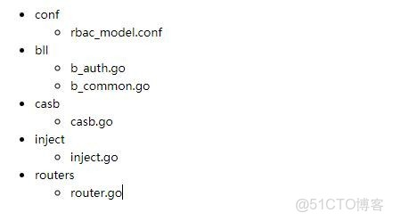

> **内容介绍**
>
> 本文是Go 语言后端开发实战,记录了「go  gin+casbin RBAC 简单例子」的相关内容。主要涉及:### go gin+casbin RBAC 简单例子 #### 说明 > 详情 可以查看 我写的这个项目 https:///hequan2017/go-adm…

---

### go  gin+casbin RBAC 简单例子

#### 说明

> 详情 可以查看 我写的这个项目 https:///hequan2017/go-admin

```shell利用的库:
/casbin/casbin
/gin-gonic/gin
/facebookgo/inject

casbin文档: https://casbin.org/zh-CN/

下面例子 未利用 casbin 的 adapter, 而是启动的时候 先初始化，
然后通过数据库里面的 对应关系 ，动态加载所有的 权限条目

然后通过中间件去判断，如果有更新，可以动态修改更新 权限条目.
```

#### 例子

##### 目录



##### 代码

```shellrbac_model.conf

[request_definition]
r = sub, obj, act

[policy_definition]
p = sub, obj, act

[role_definition]
g = _, _

[policy_effect]
e = some(where (p.eft == allow))

[matchers]
m = g(r.sub, p.sub) == true \
    && keyMatch2(r.obj, p.obj) == true \
    && regexMatch(r.act, p.act) == true
```

```pythonb_auth.go

package bll

//gin-allin/models  为自己的项目  请忽略
import (
   "gin-allin/models"
   "/casbin/casbin"
)

//models.Auth  为 User表     实际可以写成自己的USER 表
type Role struct {
   Role      *models.Auth     `inject:""`
   Enforcer  *casbin.Enforcer `inject:""`
}

// LoadPolicy 加载角色权限策略,
func (a *Role) LoadPolicy(roleID string) error {
   a.Enforcer.AddPolicy(roleID, "/api/v1/auth_info","GET")
   return nil
}
```

```shellb_common.go

package bll

//把 权限表  注入到 Common
type Common struct {
   Role   *Role    `inject:""`
}

inject.go
```

```pythonpackage inject

import (
   "gin-allin/bll"
   "/casbin/casbin"
   "/facebookgo/inject"
   "os"
)

// Object 注入对象
type Object struct {
   Common     *bll.Common
   Enforcer   *casbin.Enforcer
}

// Init 初始化依赖注入
func Init() *Object {
   g := new(inject.Graph)

   // 注入casbin
   dir, _ := os.Getwd()
   path := dir + "\\src\\gin-allin\\conf\\rbac_model.conf"
   enforcer := casbin.NewEnforcer(path, false)
   _ = g.Provide(&inject.Object{Value: enforcer})

   //  注入Common  也就是 Role
   Common := new(bll.Common)
   _ = g.Provide(&inject.Object{Value: Common})

   if err := g.Populate(); err != nil {
      panic("初始化依赖注入发生错误：" + err.Error())
   }

   // 返回 注入完的对象
   return &Object{
      Enforcer:  enforcer,
      Common :Common,
   }
}

package casb

import (
   "gin-allin/inject"
   "/gin-gonic/gin"
   "net/http"
)

// 权限判断
func CasbinMiddleware(obj *inject.Object) gin.HandlerFunc {
   return func(c *gin.Context) {

      // 判断   权限 是否为 true
      if b, err := obj.Enforcer.EnforceSafe("hequan", c.Request.URL.Path, c.Request.Method); err != nil {
         c.JSON(http.StatusUnauthorized, gin.H{
            "code": "权限 判断错误",
            "msg":  "权限 判断错误",
            "data": "权限 判断错误",
         })
         c.Abort()
         return
      } else if !b {

         c.JSON(http.StatusUnauthorized, gin.H{
            "code": "没有权限",
            "msg":  "没有权限",
            "data": "没有权限",
         })
         c.Abort()
         return
      }
      c.Next()
   }
}

package routers

func InitRouter() *gin.Engine {
   // 生成对象
   obj := inject.Init()

   err := loadCasbinPolicyData(obj)

   if err != nil {
      panic("加载casbin策略数据发生错误：" + err.Error())
   }

   apiv1.Use(casb.CasbinMiddleware(obj))
}

// 加载casbin策略数据   加载 hequan  的一个权限
func loadCasbinPolicyData(obj *inject.Object) error {
   err := obj.Common.Role.LoadPolicy("hequan")
   if err != nil {
      fmt.Println(err)
      return err
   }
   return nil
}

#### 结果

```shell当 用户  hequan  去 访问   /api/v1/auth_info 时，会去判断是否有GET 权限，有就通过，没有就拒绝。

测试 可以把  用户名 写成其他的， 再重新启动，此时，中间件判断 不通过，就会返回 拒绝。

