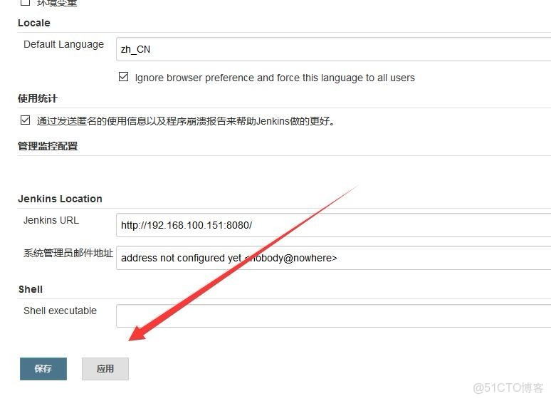

> **内容介绍**
>
> 本文是 Kubernetes 云原生实践的一篇短记，介绍 Jenkins 界面的简体中文汉化方法：
> 在插件管理中安装 Localization: Chinese (Simplified) 插件，再在「系统设置」的
> Locale 区域将 Default Language 设为 zh_CN，并勾选忽略浏览器偏好、对所有用户
> 强制使用该语言，保存后界面即切换为简体中文，文末附配置位置截图。

> **技术备注**
>
> - 截至 2026 年，Localization: Chinese (Simplified)（插件 ID:
>   localization-zh-cn）仍在 Jenkins 插件中心持续维护，仍是简体中文汉化的主流方案；
>   新版 Jenkins 安装该插件后界面通常直接中文化，一般无需再像文中那样手动配置 Locale。
> - Jenkins 版本演进很快：2.357 起不再支持 Java 8，2.477 起要求 Java 17/21，
>   2019 年的旧版本均已停止维护，建议直接使用最新 LTS 并搭配新版插件。

---

## 1. 安装汉化插件

安装插件 **Localization: Chinese (Simplified)**。

## 2. 设置默认语言并保存

在「系统设置」页的 **Locale** 区域将 Default Language 设为 `zh_CN`，并勾选
*Ignore browser preference and force this language to all users*
（忽略浏览器语言偏好，强制所有用户使用该语言），最后点击左下角「保存 / 应用」生效：

