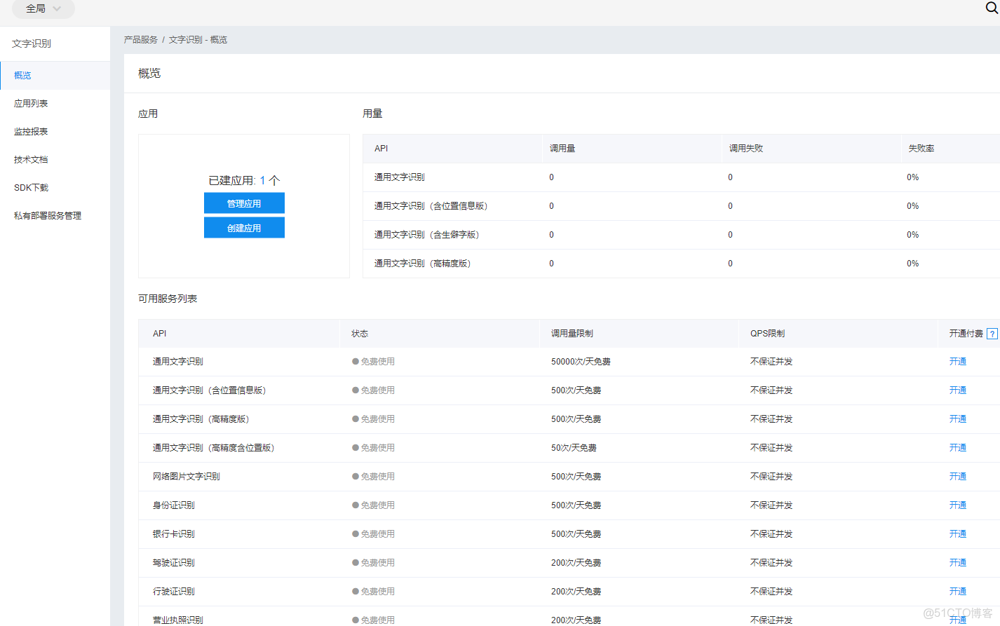

> **内容介绍**
>
> 本文用 Go 调用百度云车牌识别接口，走通从鉴权到识别的完整流程：
> 先注册百度云账号，在"人工智能-文字识别"下创建应用并获取
> appkey、secret，用 client_credentials 换取 access_token；
> 再分别给出网络图片（下载后 Base64 编码）与本地图片（读文件后编码）
> 两种实现，末尾附一次真实调用的返回数据与识别结果"豫A99999"。

> **技术备注**
>
> 百度智能云（原"百度云"）的车牌识别接口（rest/2.0/ocr/v1/license_plate）
> 截至 2026 年仍在提供，鉴权方式仍是 client_credentials 换取 access_token。
> 文中 io/ioutil 的写法在写作时是惯例；Go 1.16（2021 年）起该包已废弃，
> 对应改用 io.ReadAll、os.ReadFile。
> 本地图片示例中 50000000000 字节（约 46.6 GiB）的缓冲区为原文原样，
> 现代写法建议用 io.ReadAll(f) 按需读取。

---

## 1. 准备工作



> 先注册一个百度云账号，然后选择"人工智能-文字识别"，创建一个应用，获取 appkey 与 secret。

## 2. 网络图片

```go
package main

import (
   "encoding/base64"
   "encoding/json"
   "io/ioutil"
   "log"
   "net/http"
   "net/url"
)

func main() {
   handler := PlateHandler{}

   appKey := "11111"
   secret := "11111111z"
   accessToken := handler.GetAccessToken(appKey, secret)
   log.Println("获取到的accessToken:",accessToken)

   pictureUrl := "https://gss0.baidu.com/70cFv8Sh_Q1YnxGkpoWK1HF6hhy/it/u=2181674788,2215933125&fm=26&gp=0.jpg"
   plate,err:=handler.GetPlate(pictureUrl,accessToken)
   if err!=nil{
      log.Fatal("获取车牌失败",err)
   }
   log.Println("获取到的车牌:",plate)
}

type accessTokenInfo struct {
   AccessToken string `json:"access_token"`
   ExpiresIn   int64  `json:"expires_in"`
}

type WordResult struct {
   Number string `json:"number"`
}
type Data struct {
   WordsResult WordResult `json:"words_result"`
}
type PlateHandler struct {
}

func (handler *PlateHandler) GetAccessToken(appKey string, appSecret string) (accessToken string) {
   url := "https://aip.baidubce.com/oauth/2.0/token?grant_type=client_credentials&client_id="+appKey+"&client_secret="+appSecret

   response, err := http.Get(url)
   if err != nil {
      log.Fatal(err)
      return ""
   }
   data, err := ioutil.ReadAll(response.Body)
   if err != nil {
      log.Fatal(err)
      return ""
   }
   info := accessTokenInfo{}
   json.Unmarshal(data, &info)
   log.Print("请求accessToken返回的数据:", string(data))
   return info.AccessToken
}

func (handler *PlateHandler) GetPlate(picture_url string,accessToken string) (plate string, err error) {
   rsp, err := http.Get(picture_url)
   if err != nil {
      log.Fatal(err)
      return "", err
   }
   image, _ := ioutil.ReadAll(rsp.Body)
   image_value, err2 := url.Parse(base64.StdEncoding.EncodeToString(image))
   if err2 != nil {
      log.Fatal(err)
      return "", err
   }
   to_url := "https://aip.baidubce.com/rest/2.0/ocr/v1/license_plate?access_token="+accessToken
   values := url.Values{}
   values.Add("image", image_value.EscapedPath())
   values.Add("multi_detect", "false")
   rsp2, err := http.PostForm(to_url, values)
   defer rsp2.Body.Close()
   if err != nil {
      log.Fatal(err)
      return "", err
   }
   data, err := ioutil.ReadAll(rsp2.Body)
   if err != nil {
      log.Fatal(err)

      return "", err
   }
   log.Println("请求车牌返回的数据:",string(data))
   m := Data{}
   err = json.Unmarshal(data, &m)
   if err != nil {
      log.Fatal(err)
      return "", err
   }
   log.Println(m)
   return m.WordsResult.Number, nil
}
```

## 3. 本地图片

```go
package main

import (
   "encoding/base64"
   "encoding/json"
   "io/ioutil"
   "log"
   "net/http"
   "net/url"
   "os"
)

func main() {
   handler := PlateHandler{}

   appKey := "111111111"
   secret := "111111111"
   accessToken := handler.GetAccessToken(appKey, secret)
   log.Println("获取到的accessToken:",accessToken)

   pictureUrl := "day02/img/1.png"    // 路径，从根开始写
   plate,err:=handler.GetPlate(pictureUrl,accessToken)
   if err!=nil{
      log.Fatal("获取车牌失败",err)
   }
   log.Println("获取到的车牌:",plate)
}

type accessTokenInfo struct {
   AccessToken string `json:"access_token"`
   ExpiresIn   int64  `json:"expires_in"`
}

type WordResult struct {
   Number string `json:"number"`
}
type Data struct {
   WordsResult WordResult `json:"words_result"`
}
type PlateHandler struct {
}

func (handler *PlateHandler) GetAccessToken(appKey string, appSecret string) (accessToken string) {
   url := "https://aip.baidubce.com/oauth/2.0/token?grant_type=client_credentials&client_id="+appKey+"&client_secret="+appSecret

   response, err := http.Get(url)
   if err != nil {
      log.Fatal(err)
      return ""
   }
   data, err := ioutil.ReadAll(response.Body)
   if err != nil {
      log.Fatal(err)
      return ""
   }
   info := accessTokenInfo{}
   json.Unmarshal(data, &info)
   log.Print("请求accessToken返回的数据:", string(data))
   return info.AccessToken
}

func (handler *PlateHandler) GetPlate(picture_url string,accessToken string) (plate string, err error) {

   ff, _ := os.Open(picture_url)
   sourcebuffer := make([]byte, 50000000000)
   n, _ := ff.Read(sourcebuffer)
   //base64压缩
   sourcestring := base64.StdEncoding.EncodeToString(sourcebuffer[:n])

   to_url := "https://aip.baidubce.com/rest/2.0/ocr/v1/license_plate?access_token="+accessToken

   values := url.Values{}
   values.Add("image", sourcestring)
   values.Add("multi_detect", "false")
   rsp2, err := http.PostForm(to_url, values)
   defer rsp2.Body.Close()
   if err != nil {
      log.Fatal(err)
      return "", err
   }
   data, err := ioutil.ReadAll(rsp2.Body)
   if err != nil {
      log.Fatal(err)

      return "", err
   }
   log.Println("请求车牌返回的数据:",string(data))
   m := Data{}
   err = json.Unmarshal(data, &m)
   if err != nil {
      log.Fatal(err)
      return "", err
   }
   log.Println(m)
   return m.WordsResult.Number, nil
}
```

## 4. 结果

```text
2019/12/25 11:48:34 请求车牌返回的数据: {"log_id": 8926648569804002425, "words_result": {"color": "blue", "number": "豫A99999", "probability": [0.9014493227005005, 0.9014158248901367, 0.900929868221283, 0.9012478590011597, 0.901341438293457, 0.9010871052742004, 0.9010393619537354], "vertexes_location": [{"y": 181, "x": 241}, {"y": 173, "x": 439}, {"y": 229, "x": 442}, {"y": 236, "x": 244}]}}
2019/12/25 11:48:34 {{豫A99999}}
2019/12/25 11:48:34 获取到的车牌: 豫A99999
```
