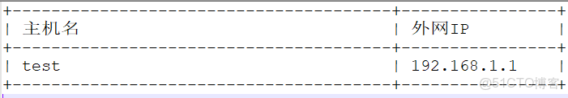

> **内容介绍**
>
> 本文是Python 编程实战笔记,记录了「python3 在服务器上打印资产信息」的相关内容。主要涉及:### python3 在服务器上打印资产信息 > url 为 资产信息接口地址，返回为json信息。 ####…

---

### python3 在服务器上打印资产信息

```shellpip3 install  prettytable
```python

> url 为 资产信息接口地址，返回为json信息。

####

```python# encoding=utf-8

import getopt
import sys
import prettytable as pt
import requests
import json

def main(argv):
    try:
        options, args = getopt.getopt(argv, "n:", ["name=", ])
    except getopt.GetoptError:
        sys.exit()

    for option, value in options:
        if option in ("-n", "--name"):
            url = 'http://xxxxxxxx/list'
            try:
                headers = {'Content-Type': 'application/json'}
                r = requests.post(url, data=json.dumps({"name": value}), headers=headers)
                if r.status_code == 200:
                    data = r.json()
                    tb = pt.PrettyTable()
                    tb.field_names = ["主机名", "外网IP"]
                    tb.align["主机名"] = "l"
                    tb.align["外网IP"] = "l"
                    for i in data:
                        tb.add_row([i["_id"], i["out_ip"]])
                    print(tb)
                else:
                    print("获取信息错误")
            except Exception as e:
                print(e)

if __name__ == '__main__':
    main(sys.argv[1:])
```

### 结果

> 执行:  /usr/bin/python3.6  test.py -n  test


