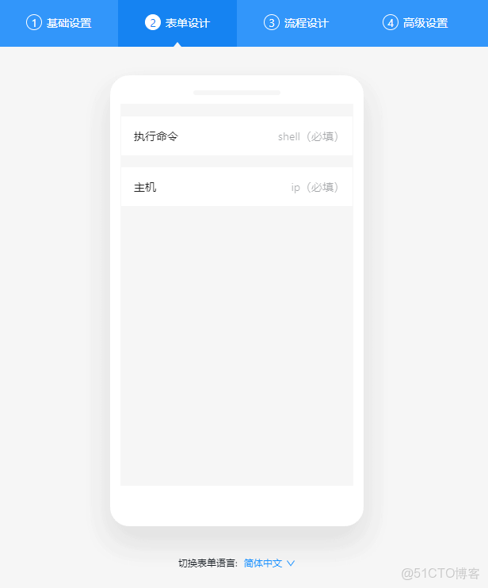

### 运维平台 py/go 调用钉钉工作流api接口示例

> py或者go找了好多开源的工作流引擎，但是没有找到一个合适能用的。最后决定用钉钉的审批 当工作流引擎，运维平台 通过API接口去调用使用。基本能够满足实际需要。缺点是 需要公司或者部门内部  用钉钉来走审批。

> 下面例子为python版本。go的自己改一下调用就可以。

#### 示例

- 创建接口


- 创建审批工单


- 执行效果


#### 代码

```
#!/usr/bin/env python
# -*- coding: utf-8 -*-

import json
import requests

# api接口  需要创建一个 小程序，然后授权，设置允许请求的服务器IP
# https://open-dev.dingtalk.com/#/corpeapp

def ding_book_token():
    """
    token
    :return:
    """
    app_key = "xxxxxxxxxxx"
    app_secret = "xxxxxxxxxxxxxxxxxxxxxxxxx"
    token = requests.get(f'https://oapi.dingtalk.com/gettoken?appkey={app_key}&appsecret={app_secret}')
    return token.json()["access_token"]

# 获取所有审批工单 的 process_code
url = f'https://oapi.dingtalk.com/topapi/process/listbyuserid?access_token={ding_book_token()}'
headers = {"Content-Type": "application/json"}
req = requests.post(url, headers=headers, data=json.dumps({
    "offset": 10,
    "size": "100"
}))

# 提前设置好一个表单
process_code = ""
for i in req.json()["result"]["process_list"]:
    if i["name"] == "命令执行":
        process_code = i["process_code"]

# 返回想要的工单信息    'name': '命令执行', 'process_code': 'PROC-123B9BAC-7170-40C9-A88A-7F18DFD54E4F',

# 发起流程工单
data = {
    "form_component_values": [
        {
            "name": "执行命令",
            "value": "hostname",
        },
        {
            "name": "主机",
            "value": "192.168.100.50",
        },
    ],
    "dept_id": "1",  # 部门id
    "process_code": process_code,
    "originator_user_id": "manager2704"  # 用户
}

url = f'https://oapi.dingtalk.com/topapi/processinstance/create?access_token={ding_book_token()}'
headers = {"Content-Type": "application/json"}
req = requests.post(url, headers=headers, data=json.dumps(data))

print(req.json()["process_instance_id"])

# {
# 	"errcode":0,
# 	"process_instance_id":"9ab7fa57-96fd-40a0-b6c3-6e73f21f2f51",
# 	"request_id":"1461t2b34oifh"
# }

# 获取工单现在状态

data1 = {
    "process_instance_id": req.json()["process_instance_id"]
}

url = f'https://oapi.dingtalk.com/topapi/processinstance/get?access_token={ding_book_token()}'
headers = {"Content-Type": "application/json"}
req = requests.post(url, headers=headers, data=json.dumps(data1))

print(req.json())
```
