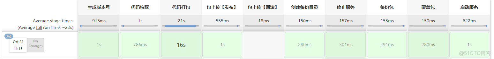

### jenkins 流水线控制 发布回滚jar包

> 插件 active choices



```
properties([
    parameters([
        [$class: 'CascadeChoiceParameter', 
            choiceType: 'PT_SINGLE_SELECT', 
            description: '回滚时选择', 
            referencedParameters: "action",
            filterLength: 1, 
            name: 'rollbck', 
            script: [
                $class: 'GroovyScript', 
                script: [
                    classpath: [], 
                    sandbox: false, 
                    script: '''path="/data/jenkins/workspace/test/backup/"
rollback=['bash', '-c', "ls -t1 ${path} "].execute().text.readLines()
if (action.equals("rollback")) {
  return rollback
} else {
  return ["选择rollback后显示"]
}'''
    
                ]
            ]
        ]
    ])
])

pipeline {
    
    agent any
        
    options {
        buildDiscarder(logRotator(numToKeepStr: '5'))
    }
    
    
    environment {
	 PROJECT='test'
     GIT_URL='https://gitee.com/test/test.git'
	 DIR_WORK="/data/work-test/${PROJECT}"
	 TARGET_DIR="/data/test/${PROJECT}"
     START="sh ./test.sh start"
     STOP="sh ./test.sh stop"
    }
    
    parameters {
        string(name: 'ENV', defaultValue: 'test', description: '环境')
        string(name: 'BRANCH', defaultValue: 'master', description: '分支')
        choice(name: 'SERVICE', choices: ['test',], description: 'test')
        choice(name: 'action', choices: ['deploy','rollback'], description: 'deploy 构建     rollback 回滚')
    }

    stages {
       stage('生成版本号'){
            steps{
                script{
					DATA_BASE ="${sh(script:'date +%Y%m%d_%H%M%S | xargs echo -n', returnStdout: true)}"
					env.DATA_BASE = DATA_BASE
					echo "/data/backup/${PROJECT}/${DATA_BASE}"
				    sh "ssh root@${SERVICE}    mkdir -p ${DIR_WORK}/${DATA_BASE}"
                    sh "mkdir -p   ${WORKSPACE}/backup"
                    sh "printenv"
					}
				}
            }
       stage ('代码拉取') {
         when { expression { return params.action  != 'rollback' } }
         steps {
			git branch: "${BRANCH}",credentialsId: 'test',url: "${GIT_URL}"
		}
	   }
	   stage("代码打包"){
    	 when { expression { return params.action  != 'rollback' } }
    		steps {
            sh '/usr/local/maven/bin/mvn -s /usr/local/maven/conf/settings.xml -e clean package  -U -Ptest'
		    sh "cp target/*.jar  ${WORKSPACE}/backup/${BUILD_ID}_${DATA_BASE}_${PROJECT}_test.jar"
		    sh '''cd ${WORKSPACE}/backup/
		    total_file_num=`ls -l | grep -v 'total' | wc -l`
            if [ $total_file_num -gt 5 ];
            then
                num=`expr $total_file_num - 5`
                files=`ls -ltr | grep -v 'total' | awk '{print $9}' | head -n $num`
                echo $files | xargs rm -f
                echo "保留5个备份，删除早期备份: " $files
            fi
		    '''
       }
	   }
	    stage("包上传【发布】"){
	   when { expression { return params.action  != 'rollback' } }
		steps {
		sh "scp target/*.jar   root@${SERVICE}:${DIR_WORK}/${DATA_BASE}/${PROJECT}.jar "
		sh "rm -rf target/*.jar "
		}
      }
      stage("包上传【回滚】"){
       when { expression { return params.action  == 'rollback' } }  
		steps {
		sh "scp ${WORKSPACE}/backup/${rollbck}   root@${SERVICE}:${DIR_WORK}/${DATA_BASE}/${PROJECT}.jar  "
		}
      }
	  stage("创建备份目录"){
		steps {
            sh "ssh root@${SERVICE}   mkdir  -p  /data/backup/${PROJECT}/${DATA_BASE}"
		}
      }
      stage("停止服务"){
		steps {
        sh 'ssh root@${SERVICE}   "cd ${TARGET_DIR} && ${STOP}"'
		}
      } 
      stage("备份包"){
		steps {
        sh "ssh root@${SERVICE}    mv ${TARGET_DIR}/${PROJECT}.jar  /data/backup/${PROJECT}/${DATA_BASE}"
		}
      }
	  stage("覆盖包"){
		steps {
        sh 'ssh root@${SERVICE}     mv  ${DIR_WORK}/${DATA_BASE}/${PROJECT}.jar   ${TARGET_DIR}'
		}
      }
	 stage("启动服务"){
		steps {
		    withEnv(['JENKINS_NODE_COOKIE=dontKillMe']) {
                sh 'ssh root@${SERVICE}    "cd ${TARGET_DIR} && ${START}"'
		    	sh 'ssh root@${SERVICE}    "ps -aux | grep ${PROJECT}.jar | grep -v grep " '
		    	script{
    		    	re ="${sh(script:'ssh root@${SERVICE}    ps -aux | grep ${PROJECT}.jar | grep -v grep |wc -l | xargs echo -n ', returnStdout: true)}"
    		    	echo re
    				if (re == '1' ) {
    				  	="构建服务 启动成功"  
    				}else{
    				   	="构建服务 启动失败" 
    				}
		       }
		    }
		}
	    post {
            success {
                    dingtalk (
                        robot: 'test',
                        type: 'TEXT',
                        text: [
                            "${PROJECT} ${}",
                        ]
                    )
                }
            }
		}
    }
}
```
