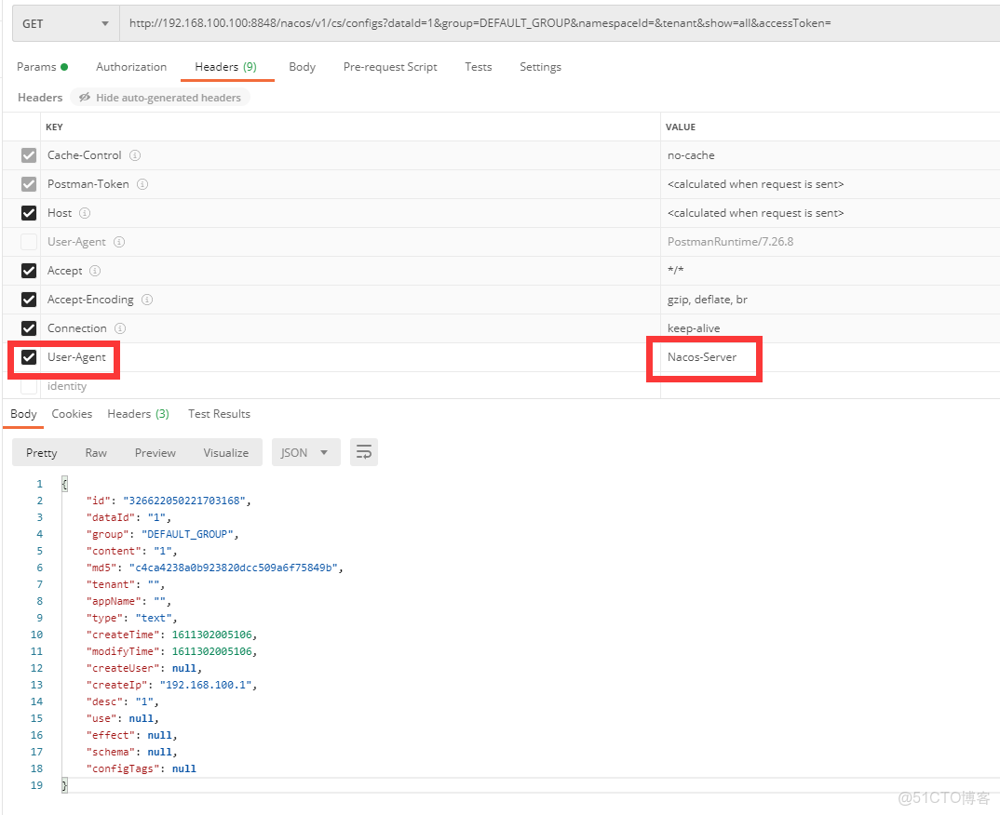
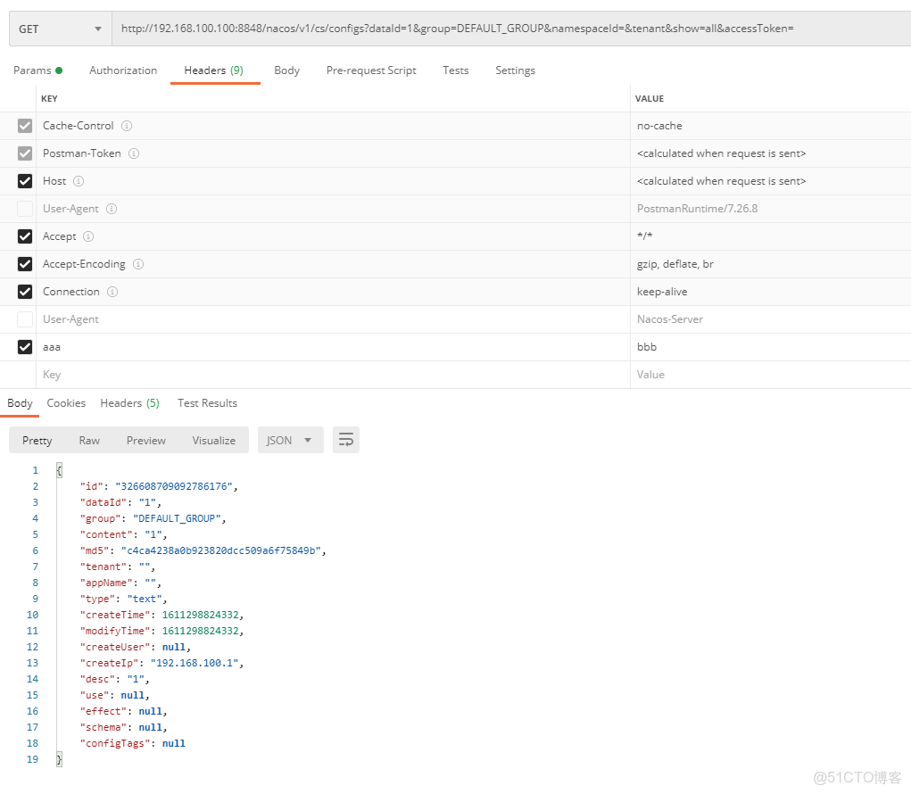

> **内容介绍**
>
> 本文是Go 语言后端开发实战,记录了「Nacos 1.4.1 之前存在鉴权漏洞，建议修复到最新版」的相关内容。主要涉及:### Nacos 1.4.1 之前存在鉴权漏洞，建议修复到最新版 ### 1.4.1 ### sdk-go…

---

### Nacos 1.4.1 之前存在鉴权漏洞，建议修复到最新版

```shellnacos
.core.auth.enabled=true

开启鉴权得情况下，添加请求参数，可以获取到信息
```



### 1.4.1

```shellnacos
.core.auth.enabled=true

### Since 1.4.1, Turn on/off white auth for user-agent: nacos-server, only for upgrade from old version.
nacos.core.auth.enable.userAgentAuthWhite=false

### Since 1.4.1, worked when nacos.core.auth.enabled=true and nacos.core.auth.enable.userAgentAuthWhite=false.
### The two properties is the white list for auth and used by identity the request from other server.
nacos.core.auth.server.identity.key=aaa
nacos.core.auth.server.identity.value=bbb

请求url得时候 带上

key :         value
```



### sdk-go

> 需要添加 用户密码，才能获取到信息

```pythonpackage
main

import (
	"fmt"
	"/nacos-group/nacos-sdk-go/clients"
	"/nacos-group/nacos-sdk-go/common/constant"
	"/nacos-group/nacos-sdk-go/vo"
)

func main()  {

	clientConfig := constant.ClientConfig{

		TimeoutMs:           5000,
		NotLoadCacheAtStart: true,
		RotateTime:          "1h",
		MaxAge:              3,
		LogLevel:            "debug",
		Username:			"nacos",
		Password:			"nacos",
	}

	// 至少一个ServerConfig
	serverConfigs := []constant.ServerConfig{
		{
			IpAddr:      "192.168.100.100",
			ContextPath: "/nacos",
			Port:        8848,
			Scheme:      "http",
		},
	}
	// 创建动态配置客户端的另一种方式 (推荐)
	configClient, _ := clients.NewConfigClient(
		vo.NacosClientParam{
			ClientConfig:  &clientConfig,
			ServerConfigs: serverConfigs,
		},
	)
	content, _ := configClient.GetConfig(vo.ConfigParam{
		DataId: "1",
		Group:  "DEFAULT_GROUP"})

	fmt.Println(content)

}
```
