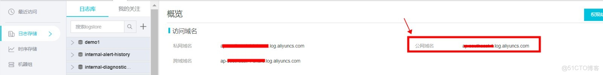

> **内容介绍**
>
> 解决阿里云日志服务 SLS 上报失败、提示 `address is null` 的问题：原因是 `ilogtail` 默认使用私网 Endpoint，跨网络或公网环境需修改 `user_log_config.json` 中的 `defaultEndpoint` 为公网域名，然后重启 `ilogtaild` 服务。

> **技术备注**
>
> 示例基于阿里云 Logtail（原 ilogtail）旧版配置；新版 Logtail 已支持通过控制台或环境变量直接配置 Endpoint，且推荐改用 `systemctl` 管理服务。公网 Endpoint 会产生外网流量费用，内网环境建议优先使用私网或 VPC Endpoint。

---

```shell
send data to SLS fail, error_code:RequestError	error_message:address is null.	endpoint:http://
修改 /usr/local/ilogtail/user_log_config.json

 "defaultEndpoint" :   默认是私网，改成公网域名

 然后重启服务即可。

  sudo /etc/init.d/ilogtaild stop
  sudo /etc/init.d/ilogtaild start

```


