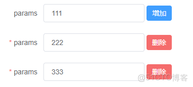
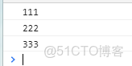

> **内容介绍**
>
> 本文是前端开发学习与实践,记录了「vue element 动态添加 表单 中的行」的相关内容。

---





```html
<template>
  <div>
    <el-form ref="elForm" :model="formData" size="medium" label-width="100px">

        <el-form-item label="params" prop="params"  :inline="true">
          <el-input v-model="formData.params" palceholder="请输入params" :style="{width: '200px'}" >
          </el-input>
          &#12288;
          <el-button @click="addItem" type="primary">增加</el-button>
        </el-form-item>

      <div v-for="(item, index) in formData.dynamicItem" :key="index"  >
        <el-form-item
            label="params"
            :prop="'dynamicItem.' + index + '.params'"
            :rules="{
            required: true, message: '不能为空', trigger: 'blur' }"

            :inline="true"
        >
          <el-input :style="{width: '200px'}" v-model="item.params"></el-input>
          &#12288;
          <el-button @click="deleteItem(item, index)" type="danger">删除</el-button>
        </el-form-item>

      </div>

      <el-form-item size="large">
        <el-button type="primary" @click="submitForm">提交</el-button>
      </el-form-item>
    </el-form>
  </div>
</template>

<script>
export default {
  components: {},
  props: [],
  data() {
    return {
      formData: {
        params: '111',
        dynamicItem: []
      },
      formRules: {
        params: [{required: true, message: ' ', trigger: 'blur'}],
      }
    }
  },
  computed: {},
  watch: {},
  created() {},
  mounted() {},
  methods: {
    submitForm() {
      this.$refs['elForm'].validate(valid => {
        console.log(this.formData.params)

        for(let item of this.formData.dynamicItem) {
            console.log(item.params)
        }
        if (!valid) return
        // TODO 提交表单
      })
    },
    addItem () {
      this.formData.dynamicItem.push({
        params: this.formData.params+1,
      })
    },
    deleteItem (item, index) {
      this.formData.dynamicItem.splice(index, 1)
    }
  },

}

</script>
<style>
</style>
```
