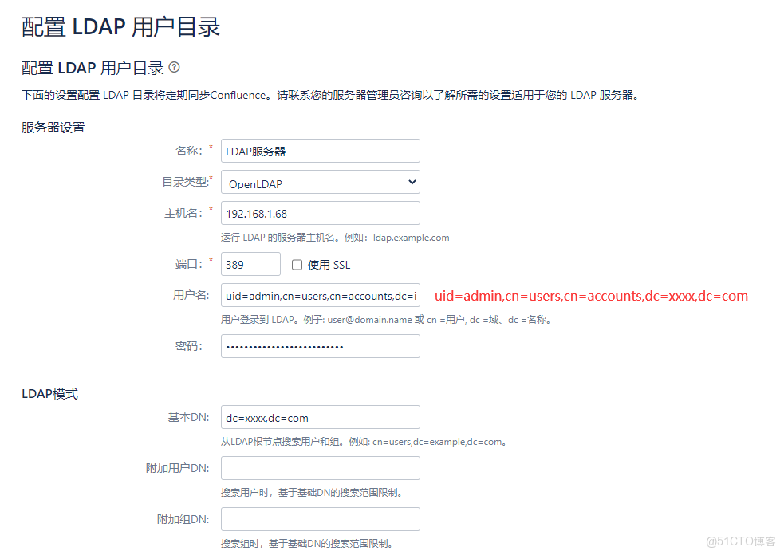
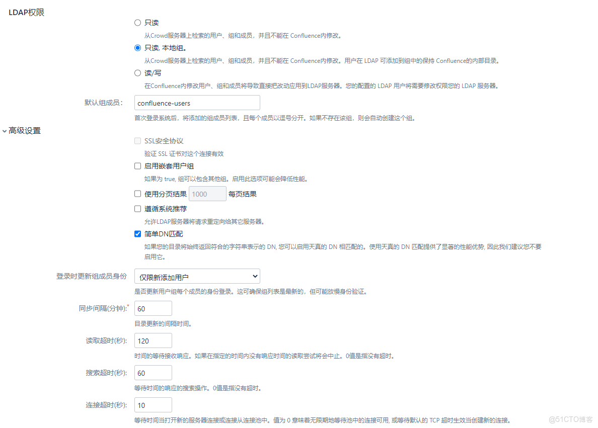
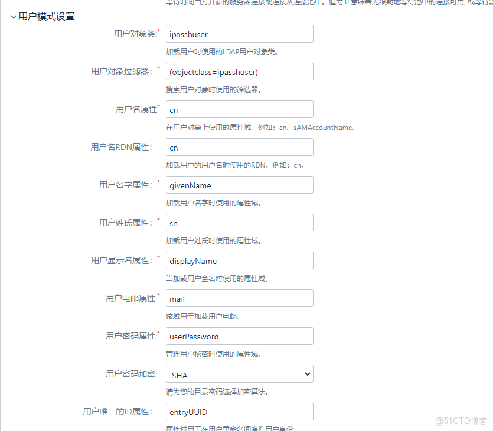
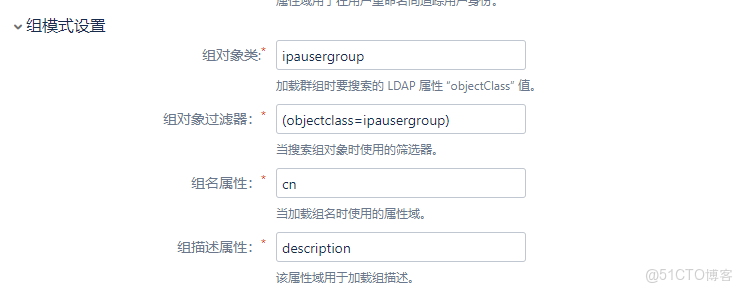
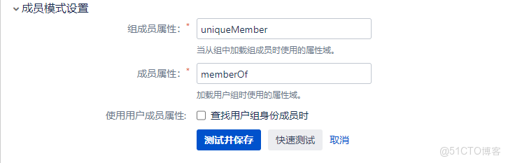
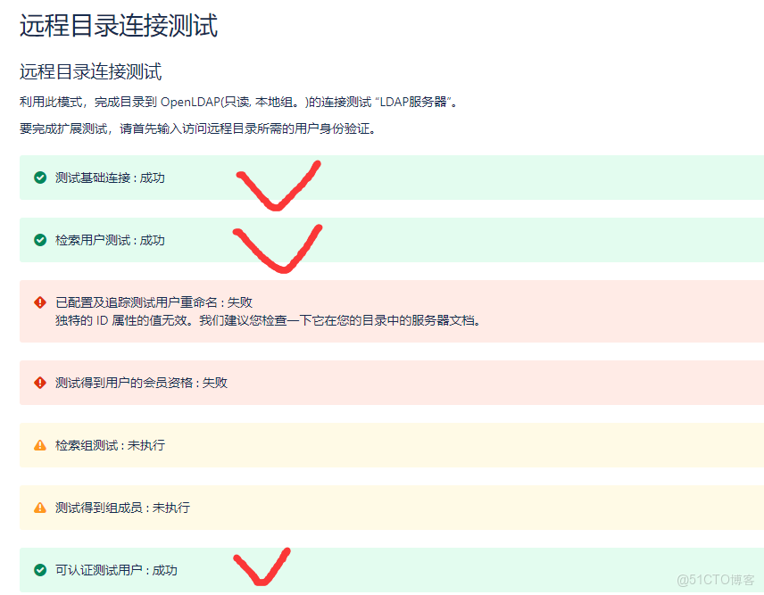

> **内容介绍**
>
> 用 Docker 快速部署 FreeIPA 作为统一认证中心，然后在 Confluence 管理后台配置 LDAP 用户目录：填写 FreeIPA 服务器地址、Base DN、管理员 DN 与密码，测试连接并同步用户，实现 Wiki 与 FreeIPA 的账号打通。

> **技术备注**
>
> 示例基于 FreeIPA 4.8.7（CentOS 8 镜像）与 Confluence Server 版编写；FreeIPA 官方镜像已迁移至 CentOS Stream / Fedora，Confluence Server 版已于 2024 年停止支持，建议评估迁移到 Confluence Data Center 或 Cloud。生产环境建议使用 HTTPS/LDAPS 并限制匿名绑定。

---

### 搭建freeipa

```shell
docker run --name dev-freeipa -ti -h ipa.example.com --read-only \
  -v /sys/fs/cgroup:/sys/fs/cgroup:ro \
  -v /var/lib/ipa-data:/data:Z \
  -e PASSWORD=xxxxxxxxxxxxxxxx \
  -p 80:80 -p 389:389 -p 443:443 \
  --sysctl net.ipv6.conf.all.disable_ipv6=0 \
  freeipa/freeipa-server:centos-8-4.8.7 \
  ipa-server-install -U -r XXXX.COM --no-ntp

# 进入容器
kinit admin
ipa user-find --all
```






> 3个ok 就可以。
> 
