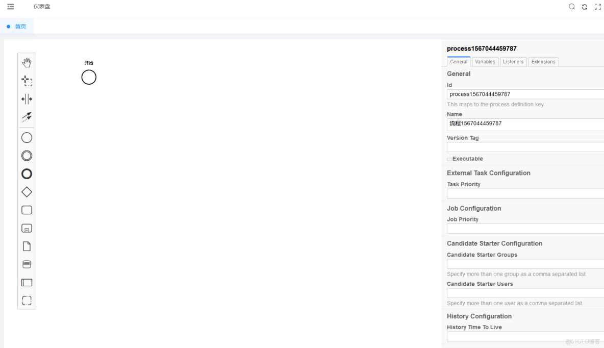

> **内容介绍**
>
> 在 Vue 项目中集成 `bpmn-js` 流程建模器：初始化 Modeler 时挂载右侧属性面板并加载 Camunda 扩展描述符，然后把一段包含开始事件的 BPMN 2.0 XML 导入画布渲染出来，作为自定义工作流设计器的最小示例。

> **技术备注**
>
> 示例基于 `bpmn-js` 7.x / 8.x 与 `bpmn-js-properties-panel` 旧版 API 编写；`bpmn-js` 9.x 起改为 ES Module 并调整属性面板插件结构，`importXML` 也改为 Promise 风格。`camunda-bpmn-moddle` 适用于 Camunda 7，Camunda 8（Zeebe）需使用 `zeebe-bpmn-moddle`。

---

### BPMN 2.0 例子 （仅供参考）



### 代码

```vue
<template>

  <div class="containers">
    </div>

</template>

<script>
import BpmnModeler from 'bpmn-js/lib/Modeler'
import propertiesPanelModule from 'bpmn-js-properties-panel'
import propertiesProviderModule from 'bpmn-js-properties-panel/lib/provider/camunda'
import camundaModdleDescriptor from 'camunda-bpmn-moddle/resources/camunda'

import { mapGetters } from 'vuex'
export default {
  name: 'Dashboard',
  components: {
  },
  data() {
    return {
      bpmnModeler: null,
      container: null,
      canvas: null
    }
  },
  mounted(){
    const canvas = this.$refs.canvas
    // 建模
    this.bpmnModeler = new BpmnModeler({
      container: canvas,
      //添加控制板
      propertiesPanel: {
        parent: '#js-properties-panel'
      },
      additionalModules: [
        // 右边的属性栏
        propertiesProviderModule,
        propertiesPanelModule
      ],
      moddleExtensions: {
        camunda: camundaModdleDescriptor
      }
    })
    this.createNewDiagram()
  },
  computed: {
    ...mapGetters('user', ['userInfo'])
  },
  methods: {
    createNewDiagram () {
      const bpmnXmlStr = `
      <?xml version="1.0" encoding="UTF-8"?>
        <bpmn2:definitions xmlns:bpmn2="http://www.omg.org/spec/BPMN/20100524/MODEL" xmlns:xsi="http://www.w3.org/2001/XMLSchema-instance" xmlns:bpmndi="http://www.omg.org/spec/BPMN/20100524/DI" xmlns:dc="http://www.omg.org/spec/DD/20100524/DC" id="sample-diagram" targetNamespace="http://bpmn.io/schema/bpmn" xsi:schemaLocation="http://www.omg.org/spec/BPMN/20100524/MODEL BPMN20.xsd">
          <bpmn2:process id="process1567044459787" name="流程1567044459787">
            <bpmn2:documentation>描述</bpmn2:documentation>
            <bpmn2:startEvent id="StartEvent_1" name="开始"/>
          </bpmn2:process>
          <bpmndi:BPMNDiagram id="BPMNDiagram_1">
            <bpmndi:BPMNPlane id="BPMNPlane_1" bpmnElement="process1567044459787">
              <bpmndi:BPMNShape id="_BPMNShape_StartEvent_2" bpmnElement="StartEvent_1">
                <dc:Bounds x="184" y="64" width="36" height="36"/>
                <bpmndi:BPMNLabel>
                  <dc:Bounds x="191" y="40" width="22" height="14"/>
                </bpmndi:BPMNLabel>
              </bpmndi:BPMNShape>
            </bpmndi:BPMNPlane>
          </bpmndi:BPMNDiagram>
        <processType id="test"/></bpmn2:definitions>
      `
      // 将字符串转换成图显示出来
      this.bpmnModeler.importXML(bpmnXmlStr, (err) => {
        if (err) {
          console.error(err)
        }
      })
    }
  }
}
</script>

<style scoped>

@import '~bpmn-js/dist/assets/diagram-js.css';
@import '~bpmn-js/dist/assets/bpmn-font/css/bpmn.css';
@import '~bpmn-js/dist/assets/bpmn-font/css/bpmn-codes.css';
@import '~bpmn-js/dist/assets/bpmn-font/css/bpmn-embedded.css';

.containers{
  position: absolute;
  background-color: #ffffff;
  width: 100%;
  height: 100%;
}
.canvas{
  width: 100%;
  height: 100%;
}
.panel{
  position: absolute;
  right: 0;
  top: 0;
  width: 600px;
}
</style>
```
