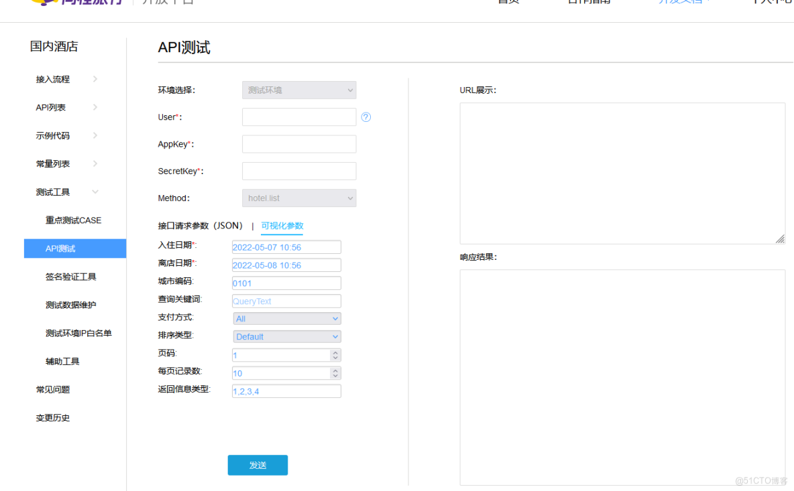

#### 地址

####

> ​[​https://open.elong.com/apit/index?plt=2​](https://open.elong.com/apit/index?plt=2)​



#### 代码

```
package yilongsync

import (
  "context"
  "time"
)

var Ctx = context.TODO()

type CityPostStruct struct {
  Version string
  Local   string
  Request struct {
    CountryType string
    CityIdType  string
    PageIndex   string
    PageSize    string
  }
}

type HotelPostStruct struct {
  Version string
  Local   string
  Request struct {
    CityId    string
    PageIndex string
    PageSize  string
  }
}

type HotelInfoStruct struct {
  Version string
  Local   string
  Request struct {
    HotelId string
  }
}

type CityResponse struct {
  CityID         string `json:"CityId"`
  CityName       string `json:"CityName"`
  CityNameEn     string `json:"CityNameEn"`
  CityLongitude  string `json:"CityLongitude"`
  CityLatitude   string `json:"CityLatitude"`
  CityParentID   string `json:"CityParentID"`
  ProvinceID     string `json:"ProvinceId"`
  ProvinceName   string `json:"ProvinceName"`
  ProvinceNameEn string `json:"ProvinceNameEn"`
  CountryID      string `json:"CountryId"`
  CountryName    string `json:"CountryName"`
  CountryNameEn  string `json:"CountryNameEn"`
  CountryCode    string `json:"CountryCode"`
}

type HotelStruct struct {
  HotelID      string    `json:"HotelId"`
  HotelName    string    `json:"HotelName"`
  HotelNameEn  string    `json:"HotelNameEn"`
  HotelStatus  int       `json:"HotelStatus"`
  CityID       string    `json:"CityId"`
  Modification string    `json:"Modification"`
  UpdateTime   time.Time `json:"UpdateTime"`
  IsGHotel     int       `json:"isGHotel"`
  Star         int       `json:"Star"`
  CountryID    string    `json:"CountryId"`
}

type HotelInfo struct {
  Detail    Detail      `json:"Detail"`
  Review    Review      `json:"Review"`
  Suppliers []Suppliers `json:"Suppliers"`
  Images    []Images    `json:"Images"`
  Rooms     []Rooms     `json:"Rooms"`
}

type HotelTypes struct {
  HotelTypeID     int    `json:"HotelTypeId"`
  HotelTypeName   string `json:"HotelTypeName"`
  HotelTypeNameEn string `json:"HotelTypeNameEn"`
}

type ServiceRank struct {
  SummaryScore        string `json:"SummaryScore"`
  InstantConfirmScore string `json:"InstantConfirmScore"`
  BookingSuccessScore string `json:"BookingSuccessScore"`
  ComplaintScore      string `json:"ComplaintScore"`
}

type TelList struct {
  NationCode string `json:"nationCode"`
  AreaCode   string `json:"areaCode"`
  MainCode   string `json:"mainCode"`
  ExtCode    string `json:"extCode"`
  Type       string `json:"type"`
}

type ParkInfos struct {
  Title string   `json:"title"`
  Desc  []string `json:"desc"`
  Type  string   `json:"type"`
}

type Detail struct {
  HotelID                 string       `json:"HotelId"`
  HotelName               string       `json:"HotelName"`
  HotelNameEn             string       `json:"HotelNameEn"`
  HotelUsedName           string       `json:"HotelUsedName"`
  HotelUsedNameEn         string       `json:"HotelUsedNameEn"`
  HotelNameLocal          string       `json:"HotelNameLocal"`
  HotelNameLocalEn        string       `json:"HotelNameLocalEn"`
  HotelStatus             int          `json:"HotelStatus"`
  ShortName               string       `json:"ShortName"`
  ShortNameEn             string       `json:"ShortNameEn"`
  Address                 string       `json:"Address"`
  AddressEn               string       `json:"AddressEn"`
  PostalCode              string       `json:"PostalCode"`
  StarRate                int          `json:"StarRate"`
  Category                int          `json:"Category"`
  Phone                   string       `json:"Phone"`
  Fax                     string       `json:"Fax"`
  Email                   string       `json:"Email"`
  Timezone                string       `json:"Timezone"`
  EstablishmentDate       string       `json:"EstablishmentDate"`
  RenovationDate          string       `json:"RenovationDate"`
  RoomTotalAmount         int          `json:"RoomTotalAmount"`
  GroupID                 string       `json:"GroupId"`
  GroupName               string       `json:"GroupName"`
  GroupNameEn             string       `json:"GroupNameEn"`
  BrandID                 string       `json:"BrandId"`
  BrandName               string       `json:"BrandName"`
  BrandNameEn             string       `json:"BrandNameEn"`
  IsEconomic              int          `json:"IsEconomic"`
  IsApartment             int          `json:"IsApartment"`
  ArrivalTime             string       `json:"ArrivalTime"`
  DepartureTime           string       `json:"DepartureTime"`
  GoogleLat               float64      `json:"GoogleLat"`
  GoogleLon               float64      `json:"GoogleLon"`
  BaiduLat                float64      `json:"BaiduLat"`
  BaiduLon                float64      `json:"BaiduLon"`
  CountryID               string       `json:"CountryId"`
  CountryName             string       `json:"CountryName"`
  CountryNameEn           string       `json:"CountryNameEn"`
  CityID                  string       `json:"CityId"`
  CityName                string       `json:"CityName"`
  CityNameEn              string       `json:"CityNameEn"`
  CityID2                 string       `json:"CityId2"`
  District                string       `json:"District"`
  DistrictName            string       `json:"DistrictName"`
  DistrictNameEn          string       `json:"DistrictNameEn"`
  BusinessZone            string       `json:"BusinessZone"`
  BusinessZoneName        string       `json:"BusinessZoneName"`
  BusinessZoneNameEn      string       `json:"BusinessZoneNameEn"`
  BusinessZone2           string       `json:"BusinessZone2"`
  BusinessZone2Name       string       `json:"BusinessZone2Name"`
  BusinessZone2NameEn     string       `json:"BusinessZone2NameEn"`
  CreditCards             string       `json:"CreditCards"`
  CreditCardsEn           string       `json:"CreditCardsEn"`
  HasCoupon               bool         `json:"HasCoupon"`
  IntroEditor             string       `json:"IntroEditor"`
  IntroEditorEn           string       `json:"IntroEditorEn"`
  Description             string       `json:"Description"`
  DescriptionEn           string       `json:"DescriptionEn"`
  AirportPickUpService    string       `json:"AirportPickUpService"`
  AirportPickUpServiceEn  string       `json:"AirportPickUpServiceEn"`
  Traffic                 string       `json:"Traffic"`
  TrafficEn               string       `json:"TrafficEn"`
  Features                string       `json:"Features"`
  FeaturesEn              string       `json:"FeaturesEn"`
  HotelTypes              []HotelTypes `json:"HotelTypes"`
  ServiceRank             ServiceRank  `json:"ServiceRank"`
  TelList                 []TelList    `json:"TelList"`
  ParkInfos               []ParkInfos  `json:"ParkInfos"`
  GeneralFacilities       []Facilities `json:"GeneralFacilities"`
  RecreationFacilities    []Facilities `json:"RecreationFacilities"`
  ServiceFacilities       []Facilities `json:"ServiceFacilities"`
  BookingNoticeFacilities []Facilities `json:"BookingNoticeFacilities"`
}

type Review struct {
  ReviewCount      int    `json:"ReviewCount"`
  ReviewGoodsCount int    `json:"ReviewGoodsCount"`
  ReviewPoorCount  int    `json:"ReviewPoorCount"`
  ReviewScore      string `json:"ReviewScore"`
}

type Suppliers struct {
  SupplierID       string `json:"SupplierID"`
  HotelCode        string `json:"HotelCode"`
  WeekendStart     int    `json:"WeekendStart"`
  WeekendEnd       int    `json:"WeekendEnd"`
  InstantRoomTypes string `json:"InstantRoomTypes"`
  Status           bool   `json:"Status"`
  InvokeType       string `json:"InvokeType"`
}

type Locations struct {
  WaterMark int    `json:"WaterMark"`
  Size      int    `json:"Size"`
  URL       string `json:"Url"`
}

type Images struct {
  RoomID           string      `json:"RoomID"`
  Type             int         `json:"Type"`
  TypeName         string      `json:"TypeName"`
  TypeNameEn       string      `json:"TypeNameEn"`
  AuthorType       string      `json:"AuthorType"`
  IsCoverImage     bool        `json:"IsCoverImage"`
  IsRoomCoverImage bool        `json:"IsRoomCoverImage"`
  Locations        []Locations `json:"Locations"`
}

type Facilities struct {
  FacilityID     int    `json:"FacilityId"`
  FacilityName   string `json:"FacilityName"`
  FacilityNameEn string `json:"FacilityNameEn"`
}

type Rooms struct {
  RoomID         string       `json:"RoomID"`
  RoomName       string       `json:"RoomName"`
  RoomNameEn     string       `json:"RoomNameEn"`
  Area           string       `json:"Area"`
  Floor          string       `json:"Floor"`
  BroadnetAccess int          `json:"BroadnetAccess"`
  BroadnetFee    int          `json:"BroadnetFee"`
  BedType        string       `json:"BedType"`
  BedTypeEn      string       `json:"BedTypeEn"`
  Description    string       `json:"Description"`
  DescriptionEn  string       `json:"DescriptionEn"`
  Comments       string       `json:"Comments"`
  CommentsEn     string       `json:"CommentsEn"`
  Capacity       int          `json:"Capacity"`
  Amount         int          `json:"Amount"`
  Facilities     []Facilities `json:"Facilities"`
}

type YilongCity struct {
  ID             uint      `gorm:"primarykey"` // 主键ID
  ProvinceId     string    `json:"provinceId" form:"provinceId" gorm:"column:provinceId;comment:;size:255;"`
  ProvinceName   string    `json:"provinceName" form:"provinceName" gorm:"column:provinceName;comment:;size:255;"`
  CityId         string    `json:"cityId" form:"cityId" gorm:"column:cityId;comment:;size:255;"`
  CityName       string    `json:"cityName" form:"cityName" gorm:"column:cityName;comment:;size:255;"`
  LocationId     string    `json:"locationId" form:"locationId" gorm:"column:locationId;comment:;size:255;"`
  LocationName   string    `json:"locationName" form:"locationName" gorm:"column:locationName;comment:;size:255;"`
  CountryId      string    `json:"countryId" form:"countryId" gorm:"column:countryId;comment:;size:255;"`
  CountryName    string    `json:"countryName" form:"countryName" gorm:"column:countryName;comment:;size:255;"`
  CreateTime     time.Time `json:"createTime" form:"createTime" gorm:"column:createTime;comment:;"`
  LastUpdateTime time.Time `json:"lastUpdateTime" form:"lastUpdateTime" gorm:"column:lastUpdateTime;comment:;"`
  CreateUser     string    `json:"createUser" form:"createUser" gorm:"column:createUser;comment:;size:50;"`
  LastUpdateUser string    `json:"lastUpdateUser" form:"lastUpdateUser" gorm:"column:lastUpdateUser;comment:;size:50;"`
  HotelCount     int       `json:"hotelCount" form:"hotelCount" gorm:"column:hotelCount;comment:;size:10;"`
}

func (YilongCity) TableName() string {
  return "yilong_city"
}

type YilongHotel struct {
  ID             uint      `gorm:"primarykey"` // 主键ID
  HotelId        string    `json:"hotelId" form:"hotelId" gorm:"column:hotelId;comment:;size:255;"`
  CityId         string    `json:"cityId" form:"cityId" gorm:"column:cityId;comment:;size:255;"`
  LocationIds    string    `json:"locationIds" form:"locationIds" gorm:"column:locationIds;comment:;size:700;"`
  GroupId        string    `json:"groupId" form:"groupId" gorm:"column:groupId;comment:;size:255;"`
  BrandId        string    `json:"brandId" form:"brandId" gorm:"column:brandId;comment:;size:255;"`
  HotelName      string    `json:"hotelName" form:"hotelName" gorm:"column:hotelName;comment:;size:255;"`
  Type           string    `json:"type" form:"type" gorm:"column:type;comment:;size:50;"`
  NameEn         string    `json:"nameEn" form:"nameEn" gorm:"column:nameEn;comment:;size:255;"`
  Address        string    `json:"address" form:"address" gorm:"column:address;comment:;size:500;"`
  AddressEn      string    `json:"addressEn" form:"addressEn" gorm:"column:addressEn;comment:;size:500;"`
  OfficialStar   string    `json:"officialStar" form:"officialStar" gorm:"column:officialStar;comment:;size:255;"`
  Star           string    `json:"star" form:"star" gorm:"column:star;comment:;size:50;"`
  Score          string    `json:"score" form:"score" gorm:"column:score;comment:;size:50;"`
  Comments       string    `json:"comments" form:"comments" gorm:"column:comments;comment:;size:50;"`
  Acclaim        string    `json:"acclaim" form:"acclaim" gorm:"column:acclaim;comment:;size:50;"`
  Longitude      float64   `json:"longitude" form:"longitude" gorm:"column:longitude;comment:;size:22;"`
  Latitude       float64   `json:"latitude" form:"latitude" gorm:"column:latitude;comment:;size:22;"`
  Tags           string    `json:"tags" form:"tags" gorm:"column:tags;comment:;size:255;"`
  TagsEn         string    `json:"tagsEn" form:"tagsEn" gorm:"column:tagsEn;comment:;size:255;"`
  CreateTime     time.Time `json:"createTime" form:"createTime" gorm:"column:createTime;comment:;"`
  LastUpdateTime time.Time `json:"lastUpdateTime" form:"lastUpdateTime" gorm:"column:lastUpdateTime;comment:;"`
  CreateUser     string    `json:"createUser" form:"createUser" gorm:"column:createUser;comment:;size:50;"`
  LastUpdateUser string    `json:"lastUpdateUser" form:"lastUpdateUser" gorm:"column:lastUpdateUser;comment:;size:50;"`
  Phone          string    `json:"phone" form:"phone" gorm:"column:phone;comment:;size:255;"`
  IsSync         string    `json:"isSync" form:"isSync" gorm:"column:isSync;comment:;size:255;"`
}

// TableName YilongHotel 表名
func (YilongHotel) TableName() string {
  return "yilong_hotel"
}

type YilongHoteldetail struct {
  ID                uint      `gorm:"primarykey"` // 主键ID
  HotelId           string    `json:"hotelId" form:"hotelId" gorm:"column:hotelId;comment:;size:255;"`
  OpeningTime       string    `json:"openingTime" form:"openingTime" gorm:"column:openingTime;comment:;size:255;"`
  Phone             string    `json:"phone" form:"phone" gorm:"column:phone;comment:;size:255;"`
  Fax               string    `json:"fax" form:"fax" gorm:"column:fax;comment:;size:50;"`
  Fitment           string    `json:"fitment" form:"fitment" gorm:"column:fitment;comment:;size:255;"`
  Introduction      string    `json:"introduction" form:"introduction" gorm:"column:introduction;comment:;size:4294967295;"`
  IntroductionEn    string    `json:"introductionEn" form:"introductionEn" gorm:"column:introductionEn;comment:;size:4294967295;"`
  Perimeter         string    `json:"perimeter" form:"perimeter" gorm:"column:perimeter;comment:;size:255;"`
  ParkingFacilities string    `json:"parkingFacilities" form:"parkingFacilities" gorm:"column:parkingFacilities;comment:;size:255;"`
  Notice            string    `json:"notice" form:"notice" gorm:"column:notice;comment:;size:4294967295;"`
  Foreign           string    `json:"foreign" form:"foreign" gorm:"column:foreign;comment:;size:50;"`
  Description       string    `json:"description" form:"description" gorm:"column:description;comment:;size:4294967295;"`
  DescriptionEn     string    `json:"descriptionEn" form:"descriptionEn" gorm:"column:descriptionEn;comment:;size:4294967295;"`
  CheckInTime       string    `json:"checkInTime" form:"checkInTime" gorm:"column:checkInTime;comment:;size:50;"`
  CheckOutTime      string    `json:"checkOutTime" form:"checkOutTime" gorm:"column:checkOutTime;comment:;size:50;"`
  CreateTime        time.Time `json:"createTime" form:"createTime" gorm:"column:createTime;comment:;"`
  LastUpdateTime    time.Time `json:"lastUpdateTime" form:"lastUpdateTime" gorm:"column:lastUpdateTime;comment:;"`
  CreateUser        string    `json:"createUser" form:"createUser" gorm:"column:createUser;comment:;size:50;"`
  LastUpdateUser    string    `json:"lastUpdateUser" form:"lastUpdateUser" gorm:"column:lastUpdateUser;comment:;size:50;"`
}

// TableName YilongHoteldetail 表名
func (YilongHoteldetail) TableName() string {
  return "yilong_hoteldetail"
}

type YilongFacility struct {
  ID             uint      `gorm:"primarykey"` // 主键ID
  HotelId        string    `json:"hotelId" form:"hotelId" gorm:"column:hotelId;comment:;size:255;"`
  RoomId         string    `json:"roomId" form:"roomId" gorm:"column:roomId;comment:;size:255;"`
  Name           string    `json:"name" form:"name" gorm:"column:name;comment:;size:50;"`
  NameEn         string    `json:"nameEn" form:"nameEn" gorm:"column:nameEn;comment:;size:50;"`
  Types          string    `json:"types" form:"types" gorm:"column:types;comment:;size:50;"`
  CreateTime     time.Time `json:"createTime" form:"createTime" gorm:"column:createTime;comment:;"`
  LastUpdateTime time.Time `json:"lastUpdateTime" form:"lastUpdateTime" gorm:"column:lastUpdateTime;comment:;"`
  CreateUser     string    `json:"createUser" form:"createUser" gorm:"column:createUser;comment:;size:50;"`
  LastUpdateUser string    `json:"lastUpdateUser" form:"lastUpdateUser" gorm:"column:lastUpdateUser;comment:;size:50;"`
}

// TableName YilongFacility 表名
func (YilongFacility) TableName() string {
  return "yilong_facility"
}

type YilongImage struct {
  ID             uint      `gorm:"primarykey"` // 主键ID
  HotelId        string    `json:"hotelId" form:"hotelId" gorm:"column:hotelId;comment:;size:255;"`
  RoomId         string    `json:"roomId" form:"roomId" gorm:"column:roomId;comment:;size:255;"`
  ImageId        string    `json:"imageId" form:"imageId" gorm:"column:imageId;comment:;size:255;"`
  ImageName      string    `json:"imageName" form:"imageName" gorm:"column:imageName;comment:;size:255;"`
  IsHotelMain    string    `json:"isHotelMain" form:"isHotelMain" gorm:"column:isHotelMain;comment:;size:5;"`
  IsRoomMain     string    `json:"isRoomMain" form:"isRoomMain" gorm:"column:isRoomMain;comment:;size:5;"`
  Author         string    `json:"author" form:"author" gorm:"column:author;comment:;size:255;"`
  CreateTime     time.Time `json:"createTime" form:"createTime" gorm:"column:createTime;comment:;"`
  LastUpdateTime time.Time `json:"lastUpdateTime" form:"lastUpdateTime" gorm:"column:lastUpdateTime;comment:;"`
  CreateUser     string    `json:"createUser" form:"createUser" gorm:"column:createUser;comment:;size:50;"`
  LastUpdateUser string    `json:"lastUpdateUser" form:"lastUpdateUser" gorm:"column:lastUpdateUser;comment:;size:50;"`
}

// TableName YilongImage 表名
func (YilongImage) TableName() string {
  return "yilong_image"
}

type YilongImageaddress struct {
  ID             uint      `gorm:"primarykey"` // 主键ID
  ImageId        string    `json:"imageId" form:"imageId" gorm:"column:imageId;comment:;size:255;"`
  Size           string    `json:"size" form:"size" gorm:"column:size;comment:;size:50;"`
  Url            string    `json:"url" form:"url" gorm:"column:url;comment:;size:255;"`
  CreateTime     time.Time `json:"createTime" form:"createTime" gorm:"column:createTime;comment:;"`
  LastUpdateTime time.Time `json:"lastUpdateTime" form:"lastUpdateTime" gorm:"column:lastUpdateTime;comment:;"`
  CreateUser     string    `json:"createUser" form:"createUser" gorm:"column:createUser;comment:;size:50;"`
  LastUpdateUser string    `json:"lastUpdateUser" form:"lastUpdateUser" gorm:"column:lastUpdateUser;comment:;size:50;"`
  ImageName      string    `json:"imageName" form:"imageName" gorm:"column:imageName;comment:;size:255;"`
}

// TableName YilongImageaddress 表名
func (YilongImageaddress) TableName() string {
  return "yilong_imageaddress"
}

type YilongRoom struct {
  ID             uint      `gorm:"primarykey"` // 主键ID
  HotelId        string    `json:"hotelId" form:"hotelId" gorm:"column:hotelId;comment:;size:255;"`
  RoomId         string    `json:"roomId" form:"roomId" gorm:"column:roomId;comment:;size:255;"`
  Name           string    `json:"name" form:"name" gorm:"column:name;comment:;size:100;"`
  Area           string    `json:"area" form:"area" gorm:"column:area;comment:;size:50;"`
  Floor          string    `json:"floor" form:"floor" gorm:"column:floor;comment:;size:50;"`
  Internet       string    `json:"internet" form:"internet" gorm:"column:internet;comment:;size:50;"`
  BedTypeName    string    `json:"bedTypeName" form:"bedTypeName" gorm:"column:bedTypeName;comment:;size:50;"`
  Description    string    `json:"description" form:"description" gorm:"column:description;comment:;size:255;"`
  Remark         string    `json:"remark" form:"remark" gorm:"column:remark;comment:;size:4294967295;"`
  MaxPassengers  string    `json:"maxPassengers" form:"maxPassengers" gorm:"column:maxPassengers;comment:;size:5;"`
  Count          int       `json:"count" form:"count" gorm:"column:count;comment:;size:10;"`
  CreateTime     time.Time `json:"createTime" form:"createTime" gorm:"column:createTime;comment:;"`
  LastUpdateTime time.Time `json:"lastUpdateTime" form:"lastUpdateTime" gorm:"column:lastUpdateTime;comment:;"`
  CreateUser     string    `json:"createUser" form:"createUser" gorm:"column:createUser;comment:;size:50;"`
  LastUpdateUser string    `json:"lastUpdateUser" form:"lastUpdateUser" gorm:"column:lastUpdateUser;comment:;size:50;"`
}

// TableName YilongRoom 表名
func (YilongRoom) TableName() string {
  return "yilong_room"
}
```

```
package yilongsync

import (
  "encoding/json"
  "fmt"
  "/Anderson-Lu/gofasion/gofasion"
  "/gogf/gf/v2/os/glog"
  uuid "/satori/go.uuid"
  "/tidwall/gjson"
  "gorm.io/gorm"
  "io"
  "io/ioutil"
  "math"
  "net/http"
  "strconv"
  "strings"
  "sync"
  "time"
)

func yiLongPost(method string, reqJson string) (string, error) {
  url := "&method=" + method + "&reqJson=" + reqJson
  client := &http.Client{Timeout: 20 * time.Second}

  resp, err := client.Post("https://open.elong.com/apit/submit?envKey=product&user=xxxxxxxxxx&appKey=xxxxxx&secretKey=xxxxxxx&isHttps=false"+url, "application/json", nil)
  if err != nil {
    glog.File("yl-error-{Ymd}.log").Print(Ctx, err.Error())
    return "", err
  }
  defer func(Body io.ReadCloser) {
    err1 := Body.Close()
    if err1 != nil {
      glog.File("yl-error-{Ymd}.log").Print(Ctx, err1.Error())
    }
  }(resp.Body)

  result, err1 := ioutil.ReadAll(resp.Body)
  if err1 != nil {
    glog.File("yl-error-{Ymd}.log").Print(Ctx, err1.Error())
    return "", err1
  }

  if gjson.Get(string(result), "state").String() == "true" {
    return gjson.Get(string(result), "data.resp").String(), nil
  } else {
    return "", err
  }

}

func cityCh(wg *sync.WaitGroup, ch chan bool, i int, db *gorm.DB, pagesize int) {
  defer wg.Done()
  wg.Add(1)

  ch <- true

  reqCity := CityPostStruct{
    Version: "1.5",
    Local:   "zh_CN",
    Request: struct {
      CountryType string
      CityIdType  string
      PageIndex   string
      PageSize    string
    }{CountryType: "1", CityIdType: "0", PageIndex: strconv.Itoa(i), PageSize: strconv.Itoa(pagesize)},
  }
  resultTwo, _ := json.Marshal(reqCity)
  reTwo, err := yiLongPost("hotel.static.city", string(resultTwo))
  if err != nil {
    glog.File("yl-error-{Ymd}.log").Print(Ctx, err.Error())
  } else {
    reDataTwo := gofasion.NewFasion(reTwo)
    cityTwo := reDataTwo.Get("Result")
    cityListTwo := cityTwo.Get("Citys").Array()
    for _, v := range cityListTwo {
      var c CityResponse
      _ = json.Unmarshal([]byte(v.ValueStr()), &c)
      glog.File("yl-info-{Ymd}.log").Print(Ctx, c.CityName, "   城市请求第", i, "次 ")
      var d YilongCity
      if c.ProvinceID == "" {
        d.ProvinceId = c.CityID
      } else {
        d.ProvinceId = c.ProvinceID
      }
      if c.ProvinceName == "" {
        d.ProvinceName = c.CityName
      } else {
        d.ProvinceName = c.ProvinceName
      }
      d.CityId = c.CityID
      d.CityName = c.CityName
      d.CountryId = c.CountryID
      d.CountryName = c.CountryNameEn
      loc, _ := time.LoadLocation("Asia/Shanghai")
      d.CreateTime = time.Now().In(loc)
      d.LastUpdateTime = time.Now().In(loc)
      _ = db.Create(&d).Error
    }
  }

  <-ch
}

func CityPost(db *gorm.DB, pagesize int, chanNum int) {

  req := CityPostStruct{
    Version: "1.5",
    Local:   "zh_CN",
    Request: struct {
      CountryType string
      CityIdType  string
      PageIndex   string
      PageSize    string
    }{CountryType: "1", CityIdType: "0", PageIndex: "1", PageSize: "10"},
  }
  result, _ := json.Marshal(req)
  re, err := yiLongPost("hotel.static.city", string(result))
  if err != nil {
    glog.File("yl-error-{Ymd}.log").Print(Ctx, err.Error())
  } else {
    reData := gofasion.NewFasion(re)
    city := reData.Get("Result")
    _, cityCount := city.Get("Count").ValInt()
    fmt.Println(cityCount)
    PageIndex := math.Ceil(float64(cityCount) / float64(pagesize))
    PageIndexInt, _ := strconv.Atoi(fmt.Sprintf("%1.0f", PageIndex))
    wg1 := sync.WaitGroup{}
    ch := make(chan bool, chanNum)
    for i := 1; i < PageIndexInt+1; i++ {
      go cityCh(&wg1, ch, i, db, pagesize)
    }
    wg1.Wait()
  }
}

func hotelCh(wg *sync.WaitGroup, ch chan bool, city string, name string, pageIndexInt int, i int, db *gorm.DB, pagesize int) {
  defer wg.Done()
  wg.Add(1)

  ch <- true
  reqH := HotelPostStruct{
    Version: "1.5",
    Local:   "zh_CN",
    Request: struct {
      CityId    string
      PageIndex string
      PageSize  string
    }{CityId: city, PageIndex: strconv.Itoa(i), PageSize: strconv.Itoa(pagesize)},
  }
  resultTwo, _ := json.Marshal(reqH)
  reTwo, err := yiLongPost("hotel.static.list", string(resultTwo))
  if err != nil {
    glog.File("yl-error-{Ymd}.log").Print(Ctx, err.Error())
  } else {
    reDataTwo := gofasion.NewFasion(reTwo)
    hotelTwo := reDataTwo.Get("Result")
    hotelListTwo := hotelTwo.Get("Hotels").Array()
    glog.File("yl-info-{Ymd}.log").Print(Ctx, city, name, " 请求次数: ", i, "总请求次数: ", pageIndexInt)
    for _, vList := range hotelListTwo {
      var c HotelStruct
      _ = json.Unmarshal([]byte(vList.ValueStr()), &c)
      var d YilongHotel
      d.CityId = c.CityID
      d.HotelId = c.HotelID
      d.HotelName = c.HotelName
      d.NameEn = c.HotelNameEn
      loc, _ := time.LoadLocation("Asia/Shanghai")
      d.CreateTime = time.Now().In(loc)
      d.LastUpdateTime = c.UpdateTime.Add(time.Hour * 8)
      _ = db.Create(&d).Error
    }
  }
  <-ch
}

func HotelPost(db *gorm.DB, pagesize int, chanNum int) {
  var yiLongCity []YilongCity
  _ = db.Find(&yiLongCity).Error
  for iCity, v := range yiLongCity {
    glog.File("yl-info-{Ymd}.log").Print(Ctx, "-----------------------第", iCity+1, "个城市,", v.CityId, "--------------------------------")
    reqHotel := HotelPostStruct{
      Version: "1.5",
      Local:   "zh_CN",
      Request: struct {
        CityId    string
        PageIndex string
        PageSize  string
      }{CityId: v.CityId, PageIndex: "1", PageSize: "1"},
    }
    result, _ := json.Marshal(reqHotel)
    re, err := yiLongPost("hotel.static.list", string(result))
    if err != nil {
      glog.File("yl-error-{Ymd}.log").Print(Ctx, err.Error())
    } else {
      reData := gofasion.NewFasion(re)
      hotel := reData.Get("Result")
      _, hotelCount := hotel.Get("Count").ValInt()

      glog.File("yl-info-{Ymd}.log").Print(Ctx, v.CityId, v.CityName, "酒店总数:", hotelCount)
      v.HotelCount = hotelCount
      _ = db.Model(&YilongCity{}).Where("id = ?", v.ID).Updates(v)

      PageIndex := math.Ceil(float64(hotelCount) / float64(pagesize))
      PageIndexInt, _ := strconv.Atoi(fmt.Sprintf("%1.0f", PageIndex))

      wg2 := sync.WaitGroup{}
      ch := make(chan bool, chanNum)
      for i := 1; i < PageIndexInt+1; i++ {
        go hotelCh(&wg2, ch, v.CityId, v.CityName, PageIndexInt, i, db, pagesize)
      }
      wg2.Wait()
    }
  }
}

func hotelInfoCh(wg *sync.WaitGroup, ch chan bool, v YilongHotel, db *gorm.DB) {
  defer wg.Done()
  wg.Add(1)
  ch <- true

  //var v YilongHotel
  //_ = db.Where("id = ?", v1).First(&v).Error

  glog.File("yl-info-hotelInfoCh-{Ymd}.log").Print(Ctx, v.ID, v.CityId, v.HotelId, v.HotelName)

  loc, _ := time.LoadLocation("Asia/Shanghai")

  reqInfo := HotelInfoStruct{
    Version: "1.5",
    Local:   "zh_CN",
    Request: struct {
      HotelId string
    }{HotelId: v.HotelId},
  }
  result, _ := json.Marshal(reqInfo)
  re, err := yiLongPost("hotel.static.info", string(result))
  if err != nil {
    glog.File("yl-error-{Ymd}.log").Print(Ctx, err.Error())
    <-ch
    return
  } else {
    reData := gofasion.NewFasion(re)
    hotelInfoResult := reData.Get("Result").ValueStr()
    var c HotelInfo
    _ = json.Unmarshal([]byte(hotelInfoResult), &c)
    now := time.Now().In(loc)
    // 酒店

    // 酒店详情
    if c.Detail.HotelID != "" {
      var yLHotelDetail YilongHoteldetail
      yLHotelDetail.HotelId = c.Detail.HotelID
      yLHotelDetail.OpeningTime = c.Detail.EstablishmentDate
      yLHotelDetail.Phone = c.Detail.Phone
      yLHotelDetail.Fax = c.Detail.Fax
      yLHotelDetail.Fitment = c.Detail.RenovationDate
      yLHotelDetail.Introduction = c.Detail.IntroEditor
      yLHotelDetail.IntroductionEn = c.Detail.IntroEditorEn
      parking := ""
      if len(c.Detail.ParkInfos) > 0 {
        parking = strings.Join(c.Detail.ParkInfos[0].Desc, ",")
      }
      yLHotelDetail.ParkingFacilities = parking
      yLHotelDetail.Description = c.Detail.Description
      yLHotelDetail.DescriptionEn = c.Detail.DescriptionEn
      yLHotelDetail.CheckInTime = c.Detail.ArrivalTime
      yLHotelDetail.CheckOutTime = c.Detail.DepartureTime
      yLHotelDetail.CreateTime = now
      yLHotelDetail.LastUpdateTime = now
      _ = db.Create(&yLHotelDetail).Error
    }

    //酒店设备
    for _, v1 := range c.Detail.GeneralFacilities {
      var yLFacility YilongFacility
      yLFacility.HotelId = c.Detail.HotelID
      yLFacility.Name = v1.FacilityName
      yLFacility.NameEn = v1.FacilityNameEn
      yLFacility.Types = "基础设置"
      yLFacility.CreateTime = now
      yLFacility.LastUpdateTime = now
      _ = db.Create(&yLFacility).Error
    }

    for _, v2 := range c.Detail.RecreationFacilities {
      var yLFacility YilongFacility
      yLFacility.HotelId = c.Detail.HotelID
      yLFacility.Name = v2.FacilityName
      yLFacility.NameEn = v2.FacilityNameEn
      yLFacility.Types = "休闲设施"
      yLFacility.CreateTime = now
      yLFacility.LastUpdateTime = now
      _ = db.Create(&yLFacility).Error
    }

    for _, v3 := range c.Detail.ServiceFacilities {
      var yLFacility YilongFacility
      yLFacility.HotelId = c.Detail.HotelID
      yLFacility.Name = v3.FacilityName
      yLFacility.NameEn = v3.FacilityNameEn
      yLFacility.Types = "服务设施"
      yLFacility.CreateTime = now
      yLFacility.LastUpdateTime = now
      _ = db.Create(&yLFacility).Error
    }

    // 图片
    for _, vImage := range c.Images {
      var yLImage YilongImage
      yLImage.RoomId = vImage.RoomID
      uid := uuid.NewV4().String()
      yLImage.ImageId = uid
      yLImage.HotelId = c.Detail.HotelID
      yLImage.IsHotelMain = strconv.FormatBool(vImage.IsCoverImage)
      yLImage.IsRoomMain = strconv.FormatBool(vImage.IsRoomCoverImage)
      yLImage.Author = vImage.TypeName
      yLImage.CreateTime = now
      yLImage.LastUpdateTime = now
      _ = db.Create(&yLImage).Error

      // 图片地址
      for _, vImageA := range vImage.Locations {
        var yLImageAddress YilongImageaddress
        if vImageA.URL == "" {
          continue
        }
        yLImageAddress.ImageId = uid
        yLImageAddress.Url = vImageA.URL
        yLImageAddress.CreateTime = now
        yLImageAddress.LastUpdateTime = now
        size := 1
        if vImageA.Size != 0 {
          size = vImageA.Size
        }
        yLImageAddress.Size = strconv.Itoa(size)
        _ = db.Create(&yLImageAddress).Error
      }
    }

    // room
    for _, vR := range c.Rooms {
      var yLRoom YilongRoom
      if vR.RoomID == "" || vR.RoomName == "" {
        continue
      }
      yLRoom.HotelId = c.Detail.HotelID
      yLRoom.RoomId = vR.RoomID
      yLRoom.Area = vR.Area
      internet := "无宽带"
      if vR.BroadnetAccess == 1 {
        internet = "有宽带"
      } else if vR.BroadnetAccess == 2 {
        internet = "wifi"
      }
      yLRoom.Internet = internet
      yLRoom.BedTypeName = vR.BedType
      yLRoom.Description = vR.Description
      yLRoom.Remark = vR.Comments
      yLRoom.MaxPassengers = strconv.Itoa(vR.Capacity)
      yLRoom.Count = vR.Amount
      yLRoom.CreateTime = now
      yLRoom.LastUpdateTime = now
      _ = db.Create(&yLRoom).Error
      for _, vRF := range vR.Facilities {
        var yLFacilityRoom YilongFacility
        yLFacilityRoom.HotelId = c.Detail.HotelID
        yLFacilityRoom.RoomId = vR.RoomID
        yLFacilityRoom.Name = vRF.FacilityName
        yLFacilityRoom.NameEn = vRF.FacilityNameEn
        yLFacilityRoom.Types = "房间设施"
        yLFacilityRoom.CreateTime = now
        yLFacilityRoom.LastUpdateTime = now
        _ = db.Create(&yLFacilityRoom).Error
      }
    }

    locationIds := []string{
      c.Detail.DistrictName, c.Detail.BusinessZoneName, c.Detail.BusinessZone2Name,
    }
    v.LocationIds = strings.Join(locationIds, ",")
    v.Address = c.Detail.Address
    v.AddressEn = c.Detail.AddressEn
    v.OfficialStar = strconv.Itoa(c.Detail.StarRate)
    v.Score = c.Detail.ServiceRank.SummaryScore
    v.Comments = strconv.Itoa(c.Review.ReviewCount)
    v.Acclaim = c.Review.ReviewScore
    v.Longitude = c.Detail.BaiduLon
    v.Latitude = c.Detail.BaiduLat
    v.GroupId = c.Detail.GroupID
    v.BrandId = c.Detail.BrandID
    v.Phone = c.Detail.Phone
    v.IsSync = "1"

    _ = db.Model(&YilongHotel{}).Where("hotelId = ?", v.HotelId).Updates(v)

  }
  <-ch
  return
}

func HotelInfoPost(db *gorm.DB, chanNum int) {
  var yiLongHotel []YilongHotel
  _ = db.Where("isSync  is  Null").Find(&yiLongHotel)

  wg3 := sync.WaitGroup{}
  ch := make(chan bool, chanNum)
  for _, v := range yiLongHotel {
    go hotelInfoCh(&wg3, ch, v, db)
  }
  wg3.Wait()
}
```

```
package main

import (
  "fmt"
  "/gogf/gf/v2/os/glog"
  "gorm.io/driver/mysql"
  "gorm.io/gorm"
  "time"
)

func main() {

  dsn := "root:123456@tcp(192.168.209.128:3306)/go?charset=utf8mb4&parseTime=True&loc=Local"
  path := "./log"

  
  _ = glog.SetPath(path)

  db1, _ := gorm.Open(mysql.Open(dsn), &gorm.Config{})
  _ = db1

  //glog.SetStdoutPrint(false)

  // 艺龙
  yilongsync.CityPost(db1, 500, 4) // 城市表
  yilongsync.HotelPost(db1, 400, 40) // 酒店表  
  yilongsync.HotelInfoPost(db1, 12) // 剩下的

  fmt.Println("结束")

  time.Sleep(time.Hour * 10000)

}
```

#### 数据库 大并发配置

```
[mysqld]
pid-file    = /var/run/mysqld/mysqld.pid
socket      = /var/run/mysqld/mysqld.sock
datadir     = /var/lib/mysql
log-error  = /var/log/mysql/error.log

server-id=1
log-bin=/var/lib/mysql/mysql-bin

innodb_log_file_size = 256M
max_allowed_packet = 1024M
max_connections = 5000
innodb_flush_log_at_trx_commit = 0
sync_binlog = 500
innodb_buffer_pool_size = 8G
skip-name-resolve
skip-log-bin
disable-log-bin
```
