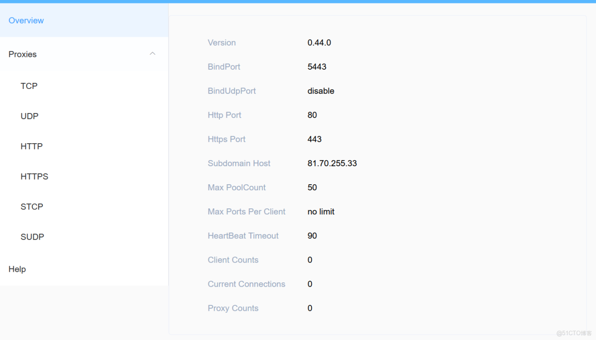
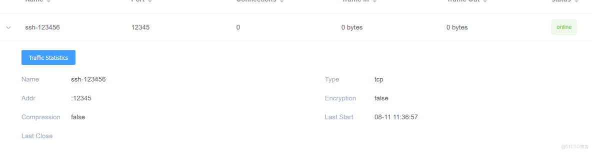

> **内容介绍**
>
> 本文是技术实践笔记,记录了「frp 部署使用 内网机器必备」的相关内容。

> **技术备注**
>
> CentOS 7 已于 2024 年 6 月 30 日停止维护(EOL),建议迁移至 Rocky Linux 9 / AlmaLinux 9 或国产 openEuler。

---

```shell服务端
wget https://code.aliyun.com/MvsCode/frps-onekey/raw/master/ -O ./
chmod 700 ./install-frps.sh
./install-frps.sh install
```



```shell客户端
wget https:///fatedier/frp/releases/download/v0.44.0/frp_0.44.0_linux_amd64.tar.gz
tar xf frp_0.44.0_linux_amd64.tar.gz

vim
[common]
server_addr = www.hequan.xyz
server_port = 5443
token = 123456

[ssh-123456]
type = tcp
local_ip = 127.0.0.1
local_port = 22
remote_port = 12345

nohup /root/frp_0.44.0_linux_amd64/frpc -c /root/frp_0.44.0_linux_amd64/frpc.ini &

ssh  -o "StrictHostKeyChecking no"   -p 12345 root@www.hequan.xyz
```


