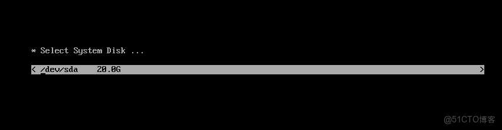

> **内容介绍**
>
> 一篇运维实践笔记，讲解自定义 CentOS 的三个步骤：用 unsquashfs 解包
> squashfs.img 并修改其中的 rootfs.img，再用 mksquashfs 压缩回去；
> 用 rpmbuild 制作包含 /usr/local/hequan 的自定义 RPM 包；最后向
> comps.xml 添加软件包分组，用 createrepo 重建 repodata，得到定制安装源。
>
> **技术备注**
>
> - 时效性：CentOS 8 已于 2021 年底 EOL，CentOS Linux 7 也已于
>   2024-06-30 停止维护；如今同类定制可参考 Rocky Linux、AlmaLinux
>   或 CentOS Stream。
> - 工具现状：文中命令仍可参考，但 EL8+ 中 yum 已由 dnf 接管，
>   createrepo 多被 createrepo_c 取代，mkisofs 通常由 genisoimage
>   或 xorriso 提供。

---



## 1. 修改 rootfs.img

```shell
1.安装工具
[root@localhost ~]# yum install -y squashfs-tools

2.用unsquashfs命令直接解压缩squashfs.img
[root@localhost ~]# unsquashfs squashfs.img

3.挂载文件系统
[root@localhost ~]# cd squashfs-root/LiveOS/
[root@localhost LiveOS]# mount rootfs.img /mnt/rootfs/
[root@localhost LiveOS]# ls /mnt/rootfs/
bin  boot  dev  etc  firmware  lib  lib64  lost+found  mnt  modules  proc  root  run  sbin  sys  tmp  usr  var

4.根据需要可以修改/mnt/rootfs目录下文件

5.修改后重新打包
[root@localhost ~]# mksquashfs squashfs-root/ squashfs.img -comp xz -Xbcj x86 -e boot
```

## 2. 创建 rpm 包

```shell
rpmdev-setuptree
mkdir -p BUILDROOT/hequan-1.0-1.1.x86_64

[root@test SPECS]# cat temp.spec
Name: hequan
Version: 1.0
Release: 1.1
Summary: This is a hedata package

Group: he
License: Special Proprietary
BuildArch: x86_64
# BuildArch: noarch

%description
%prep
%build
%pre
%post
%preun
%postun
%files
/usr/local/hequan/
%changelog

mkdir -p /root/rpmbuild/BUILDROOT/hequan-1.0-1.1.x86_64

cp -r --parents /usr/local/hequan/*  BUILDROOT/hequan-1.0-1.1.x86_64/
cd SPECS/
rpmbuild -bb temp.spec
```

## 3. 修改 createrepo

```shell
yum -y install createrepo mkisofs isomd5sum rsync

mkdir /ISO

/usr/bin/rsync -a  /media/ /ISO/

上传包 到 Packages

cp /media/repodata/*-comps.xml  /ISO/repodata/comps.xml

vim comps.xml
```

在 comps.xml 中增加：

```xml
<group>
<id>he</id>
<name>he</name>
<default>true</default>
<uservisible>true</uservisible>
<packagelist>
  <packagereq type="default">hequan</packagereq>
</packagelist>
</group>

<grouplist>
      <groupid>core</groupid>
      <groupid>core</groupid>
      <groupid>he</groupid>
</grouplist>
```

最后重新生成仓库元数据：

```shell
cd iso/
createrepo -g repodata/comps.xml ./
```
