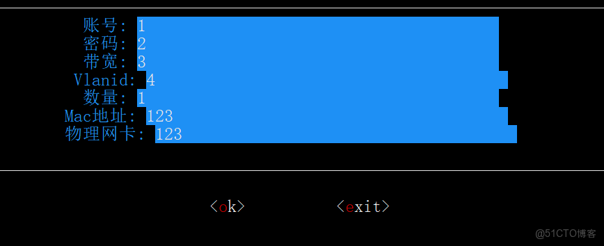

> **内容介绍**
>
> 本文给出拨号管理系统终端 UI 输入框的完整实现：基于 termdash 构建表单，
> 含账号、密码、带宽、Vlanid、数量、Mac 地址、物理网卡七个输入项，
> 以及 ok / exit 两个按钮；通过 container 划分布局并做焦点分组，
> 支持 Tab 与方向键切换焦点，点击提交后把表单内容回显到终端界面。
>
> **技术备注**
>
> - termdash（github.com/mum4k/termdash）是 Go 语言的终端 TUI 库，底层基于 tcell，
>   提供 textinput、button 等控件与 container 布局、焦点分组（KeyFocusGroups）机制。
> - 原文代码块被误标为 python，实为 Go，已更正；import 路径中被吃掉的
>   `github.com` 前缀已补回。

---

## 1. termdash 终端输入框表单完整代码

运行效果（Mac 终端）：



```go
package qr

import (
    "context"
    "fmt"
    "github.com/mum4k/termdash/align"
    "github.com/mum4k/termdash/linestyle"
    "github.com/mum4k/termdash/widgets/text"
    "time"

    "github.com/mum4k/termdash"
    "github.com/mum4k/termdash/cell"
    "github.com/mum4k/termdash/container"
    "github.com/mum4k/termdash/keyboard"
    "github.com/mum4k/termdash/terminal/tcell"
    "github.com/mum4k/termdash/widgets/button"
    "github.com/mum4k/termdash/widgets/textinput"
)

func buttonChunks(text string) []*button.TextChunk {
    if len(text) == 0 {
        return nil
    }
    first := string(text[0])
    rest := text[1:]

    return []*button.TextChunk{
        button.NewChunk(
            "<",
            button.TextCellOpts(cell.FgColor(cell.ColorWhite)),
            button.FocusedTextCellOpts(cell.FgColor(cell.ColorBlack)),
            button.PressedTextCellOpts(cell.FgColor(cell.ColorBlack)),
        ),
        button.NewChunk(
            first,
            button.TextCellOpts(cell.FgColor(cell.ColorRed)),
        ),
        button.NewChunk(
            rest,
            button.TextCellOpts(cell.FgColor(cell.ColorWhite)),
            button.FocusedTextCellOpts(cell.FgColor(cell.ColorBlack)),
            button.PressedTextCellOpts(cell.FgColor(cell.ColorBlack)),
        ),
        button.NewChunk(
            ">",
            button.TextCellOpts(cell.FgColor(cell.ColorWhite)),
            button.FocusedTextCellOpts(cell.FgColor(cell.ColorBlack)),
            button.PressedTextCellOpts(cell.FgColor(cell.ColorBlack)),
        ),
    }
}

type pppformtext struct {
    Account   *textinput.TextInput
    Password  *textinput.TextInput
    Bandwidth *textinput.TextInput
    Vlanid    *textinput.TextInput
    Count     *textinput.TextInput
    Mac       *textinput.TextInput
    Nic       *textinput.TextInput

    // submitB is a button that submits the form.
    submitB *button.Button
    // cancelB is a button that exits the application.
    cancelB *button.Button
}

// newForm returns a new form instance.
// The cancel argument is a function that terminates the application when called.
func newForm(cancel context.CancelFunc) (*pppformtext, error) {
    //var username string
    //u, err := user.Current()
    //if err != nil {
    //  username = "mum4k"
    //} else {
    //  username = u.Username
    //}

    account, err := textinput.New(
        textinput.Label("账号: ", cell.FgColor(cell.ColorNumber(33))),
        textinput.DefaultText(""),
        textinput.MaxWidthCells(40),
        textinput.ExclusiveKeyboardOnFocus(),
    )
    password, err := textinput.New(
        textinput.Label("密码: ", cell.FgColor(cell.ColorNumber(33))),
        textinput.DefaultText(""),
        textinput.MaxWidthCells(40),
        textinput.ExclusiveKeyboardOnFocus(),
    )
    bandwidth, err := textinput.New(
        textinput.Label("带宽: ", cell.FgColor(cell.ColorNumber(33))),
        textinput.DefaultText(""),
        textinput.MaxWidthCells(40),
        textinput.ExclusiveKeyboardOnFocus(),
    )
    vlanid, err := textinput.New(
        textinput.Label("Vlanid: ", cell.FgColor(cell.ColorNumber(33))),
        textinput.DefaultText(""),
        textinput.MaxWidthCells(40),
        textinput.ExclusiveKeyboardOnFocus(),
    )
    count, err := textinput.New(
        textinput.Label("数量: ", cell.FgColor(cell.ColorNumber(33))),
        textinput.DefaultText("1"),
        textinput.MaxWidthCells(40),
        textinput.ExclusiveKeyboardOnFocus(),
    )
    Mac, err := textinput.New(
        textinput.Label("Mac地址: ", cell.FgColor(cell.ColorNumber(33))),
        textinput.DefaultText(""),
        textinput.MaxWidthCells(40),
        textinput.ExclusiveKeyboardOnFocus(),
    )
    nic, err := textinput.New(
        textinput.Label("物理网卡: ", cell.FgColor(cell.ColorNumber(33))),
        textinput.DefaultText(""),
        textinput.MaxWidthCells(40),
        textinput.ExclusiveKeyboardOnFocus(),
    )

    submitB, err := button.NewFromChunks(buttonChunks("ok"), nil,
        button.Key(keyboard.KeyEnter),
        button.GlobalKeys('s', 'S'),
        button.DisableShadow(),
        button.Height(1),
        button.TextHorizontalPadding(0),
        button.FillColor(cell.ColorBlack),
        button.FocusedFillColor(cell.ColorNumber(117)),
        button.PressedFillColor(cell.ColorNumber(220)),
    )
    if err != nil {
        panic(err)
    }

    cancelB, err := button.NewFromChunks(buttonChunks("exit"), func() error {
        cancel()
        return nil
    },
        button.FillColor(cell.ColorNumber(220)),
        button.Key(keyboard.KeyEnter),
        button.GlobalKeys('c', 'C'),
        button.DisableShadow(),
        button.Height(1),
        button.TextHorizontalPadding(0),
        button.FillColor(cell.ColorBlack),
        button.FocusedFillColor(cell.ColorNumber(117)),
        button.PressedFillColor(cell.ColorNumber(220)),
    )
    if err != nil {
        panic(err)
    }

    return &pppformtext{
        Account:   account,
        Password:  password,
        Bandwidth: bandwidth,
        Vlanid:    vlanid,
        Count:     count,
        Mac:       Mac,
        Nic:       nic,
        submitB:   submitB,
        cancelB:   cancelB,
    }, nil
}

func formLayout(c *container.Container, f *pppformtext) error {
    return c.Update("root",
        container.KeyFocusNext(keyboard.KeyTab),
        container.KeyFocusGroupsNext(keyboard.KeyArrowDown, 1),
        container.KeyFocusGroupsPrevious(keyboard.KeyArrowUp, 1),
        container.KeyFocusGroupsNext(keyboard.KeyArrowRight, 2),
        container.KeyFocusGroupsPrevious(keyboard.KeyArrowLeft, 2),
        container.SplitHorizontal(
            container.Top(
                container.Border(linestyle.Light),
                container.SplitHorizontal(
                    container.Top(
                        container.SplitHorizontal(
                            container.Top(
                                container.SplitHorizontal(
                                    container.Top(
                                        container.SplitHorizontal(
                                            container.Top(
                                                container.Focused(),
                                                container.KeyFocusGroups(1),
                                                container.PlaceWidget(f.Account),
                                            ),
                                            container.Bottom(
                                                container.KeyFocusGroups(1),
                                                container.KeyFocusSkip(),
                                                container.PlaceWidget(f.Password),
                                            ),
                                        ),
                                    ),
                                    container.Bottom(
                                        container.SplitHorizontal(
                                            container.Top(
                                                container.KeyFocusGroups(1),
                                                container.KeyFocusSkip(),
                                                container.PlaceWidget(f.Bandwidth),
                                            ),
                                            container.Bottom(
                                                container.KeyFocusGroups(1),
                                                container.KeyFocusSkip(),
                                                container.PlaceWidget(f.Vlanid),
                                            ),
                                        ),
                                    ),
                                ),
                            ),
                            container.Bottom(),
                            container.SplitFixed(4),
                        ),
                    ),
                    container.Bottom(
                        container.SplitHorizontal(
                            container.Top(
                                container.SplitHorizontal(
                                    container.Top(
                                        container.Focused(),
                                        container.KeyFocusGroups(1),
                                        container.PlaceWidget(f.Count),
                                    ),
                                    container.Bottom(
                                        container.KeyFocusGroups(1),
                                        container.KeyFocusSkip(),
                                        container.PlaceWidget(f.Mac),
                                    ),
                                ),
                            ),
                            container.Bottom(
                                container.KeyFocusGroups(1),
                                container.KeyFocusSkip(),
                                container.PlaceWidget(f.Nic),
                            ),
                        ),
                    ),
                ),
            ),
            container.Bottom(
                container.SplitHorizontal(
                    container.Top(
                        container.SplitVertical(
                            container.Left(
                                container.KeyFocusGroups(1, 2),
                                container.PlaceWidget(f.submitB),
                                container.AlignHorizontal(align.HorizontalRight),
                                container.PaddingRight(5),
                            ),
                            container.Right(
                                container.KeyFocusGroups(1, 2),
                                container.PlaceWidget(f.cancelB),
                                container.AlignHorizontal(align.HorizontalLeft),
                                container.PaddingLeft(5),
                            ),
                        ),
                    ),
                    container.Bottom(
                        container.KeyFocusSkip(),
                    ),
                    container.SplitFixed(3),
                ),
            ),
            container.SplitFixed(10),
        ),
    )
}

func submitLayout(c *container.Container, f *pppformtext, cancel context.CancelFunc) (string, error) {
    t, err := text.New()
    if err != nil {
        return "ok", err
    }

    if err := t.Write(fmt.Sprintf("账号: %s\n", f.Account.Read())); err != nil {
        return "ok", err
    }
    if err := t.Write(fmt.Sprintf("密码: %s\n", f.Password.Read())); err != nil {
        return "ok", err
    }
    if err := t.Write(fmt.Sprintf("带宽: %s\n", f.Bandwidth.Read())); err != nil {
        return "ok", err
    }
    if err := t.Write(fmt.Sprintf("vlanId: %s\n", f.Vlanid.Read())); err != nil {
        return "ok", err
    }
    if err := t.Write(fmt.Sprintf("数量: %s\n", f.Count.Read())); err != nil {
        return "ok", err
    }
    if err := t.Write(fmt.Sprintf("mac地址: %s\n", f.Mac.Read())); err != nil {
        return "ok", err
    }
    if err := t.Write(fmt.Sprintf("物理网卡: %s\n", f.Nic.Read())); err != nil {
        return "ok", err
    }

    ok1, err := button.NewFromChunks(buttonChunks("exit"), func() error {
        cancel()
        return nil
    },
        button.FillColor(cell.ColorNumber(220)),
        button.Key(keyboard.KeyEnter),
        button.GlobalKeys('o', 'O'),
        button.DisableShadow(),
        button.Height(1),
        button.TextHorizontalPadding(0),
        button.FillColor(cell.ColorBlack),
        button.FocusedFillColor(cell.ColorNumber(117)),
        button.PressedFillColor(cell.ColorNumber(220)),
    )
    if err != nil {
        return "ok", err
    }
    a := "ok"
    return a, c.Update("root",
        container.SplitHorizontal(
            container.Top(
                container.SplitVertical(
                    container.Left(),
                    container.Right(
                        container.PlaceWidget(t),
                    ),
                    container.SplitPercent(33),
                ),
            ),
            container.Bottom(
                container.Focused(),
                container.PlaceWidget(ok1),
            ),
            container.SplitFixed(7),
        ),
    )
}

func PppForm() string {

    t, err := tcell.New()
    if err != nil {
        panic(err)
    }
    defer t.Close()

    ctx, cancel := context.WithCancel(context.Background())
    c, err := container.New(t, container.ID("root"))
    if err != nil {
        panic(err)
    }

    f, err := newForm(cancel)
    if err != nil {
        panic(err)
    }
    a := ""
    f.submitB.SetCallback(func() error {
        a, _ = submitLayout(c, f, cancel)
        return nil
    })

    if err := formLayout(c, f); err != nil {
        panic(err)
    }

    if err := termdash.Run(ctx, t, c, termdash.RedrawInterval(100*time.Millisecond)); err != nil {
        panic(err)
    }

    return a
}
```
