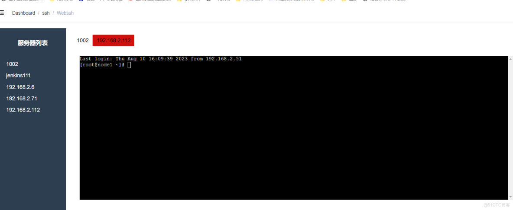

> **内容介绍**
>
> 本文是前端开发学习与实践,记录了「vue 前端实现webssh 多窗口模式」的相关内容。

> **技术备注**
>
> CentOS 7 已于 2024 年 6 月 30 日停止维护(EOL),建议迁移至 Rocky Linux 9 / AlmaLinux 9 或国产 openEuler。

---

```plai
n
<template>
  <!-- 省略其他模板代码 -->

  <div class="main-content">
    <!-- ... -->

    </div>

  <!-- ... -->
</template>

<script>
// ... 其他 import 语句 ...

export default {
  // ... 其他选项 ...

  data() {
    return {
      // ... 其他 data ...

      // 将每个连接的服务器终端容器关联到对应服务器的键
      terminalContainers: {}
    }
  },

  methods: {
    // ... 其他方法 ...

    connectToServer() {
      const socketURI =
        `ws://127.0.0.1:8000/api/admin/user/ssh/webssh?ip=${this.selectedServer.private_ip}&port=${this.selectedServer.ssh_port}&username=${this.selectedServer.username}&password=${this.selectedServer.password}&authmodel=${this.selectedConnectionType}`;

      // 创建新的终端实例和 WebSocket 连接
      const term = new Terminal();
      const socket = new WebSocket(socketURI);
      const attachAddon = new AttachAddon(socket);
      const fitAddon = new FitAddon();
      term.loadAddon(attachAddon);
      term.loadAddon(fitAddon);

      // 创建一个新的 DOM 元素来承载终端
      const terminalContainer = document.createElement('div');
      term.open(terminalContainer);
      fitAddon.fit();
      term.focus();

      // 将连接的服务器及其终端实例保存到数组中
      const connectedServer = {
        server: this.selectedServer,
        term: term,
        socket: socket
      };
      this.connectedServers.push(connectedServer);
      this.activeTab = connectedServer;

      // 将终端容器关联到对应服务器的键
      this.terminalContainers[] = terminalContainer;

      // 清空之前的终端容器
      this.$refs.xtermContainer.innerHTML = '';
      // 将当前服务器的终端容器添加到页面
      this.$refs.xtermContainer.appendChild(terminalContainer);

      // 关闭连接选项对话框
      this.connectionOptionsDialog = false;
    },

    // ... 其他方法 ...
  }
}
</script>
```


