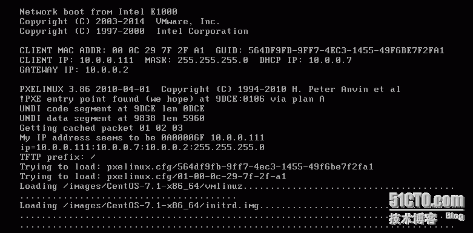
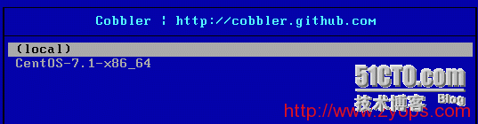
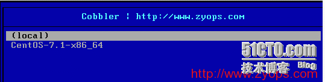
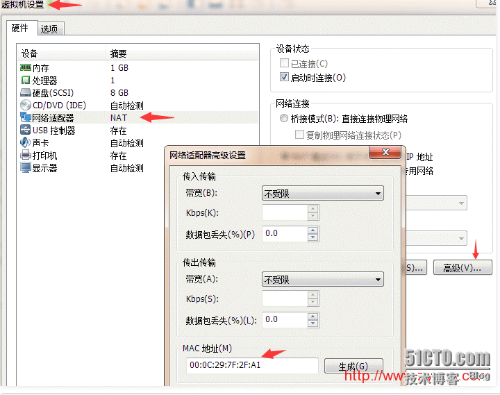
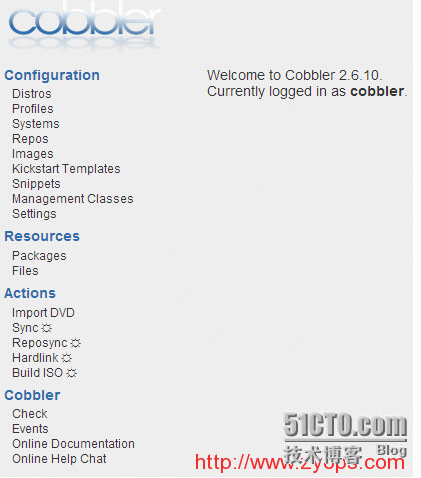

> **About this post**
>
> This post is reposted from zyops.com and was verified by the author on real
> servers. It documents the complete workflow for building Cobbler/PXE
> unattended installation on CentOS 6.7: an introduction to the services
> Cobbler integrates and environment preparation; installation via yum and the
> directory layout; resolving the seven cobbler check warnings one by one
> (server/next_server/manage_dhcp/pxe_just_once in settings and the default
> root password); editing dhcp.template and running cobbler sync; importing the
> CentOS 7.1 image; binding a custom ks.cfg; appending the net.ifnames=0 kernel
> parameter; per-MAC customized installation via cobbler system add; and
> finally a brief walkthrough of the ks.cfg template plus the installation and
> configuration of the cobbler-web UI.

> **Technical notes**
>
> CentOS 6 reached end of life (EOL) in November 2020, and CentOS 7 in June
> 2024; for production environments, migrating to alternative distributions
> such as Rocky Linux or AlmaLinux is recommended. The chkconfig and
> /etc/init.d/ scripts in this post are SysV-era usage; CentOS 7+ has switched
> to systemd (systemctl enable/start). Since Cobbler 3.x the main configuration
> lives in /etc/cobbler/settings.yaml, and some options differ from the 2.x
> syntax used in this post.

---

This post is reposted from [http://www.zyops.com/autoinstall-cobbler](http://www.zyops.com/autoinstall-cobbler).

The installation has been tested on real servers; if you follow the steps as written, it will just work.

What follows is mainly about writing the KS file. CentOS 7 uses xfs as the default filesystem; the default ks file installs 292 packages, while a minimal install from the ISO is 297 — essentially the same, so you only need to adjust the timezone and partitioning.

Once installation finishes, the system boots straight into the OS and will not reinstall; unless you change it, the NIC will come up as ifcfg-em1.

## 1. Introduction to Cobbler

Cobbler is a Linux server provisioning service. Using network boot (PXE), it can quickly install or reinstall physical servers and virtual machines, and it can also manage DHCP, DNS, and more.

Cobbler can be managed from the command line; it also provides a web-based management tool (cobbler-web) and an API for easy secondary development.

Cobbler is an upgrade over the older kickstart: it is easier to configure and comes with a web UI that makes management simpler.

Cobbler has a lightweight configuration management system built in, but it also integrates with other configuration management systems such as Puppet; SaltStack is not supported yet.

Cobbler official site: http://cobbler.github.com

### 1.1 Services integrated in Cobbler

- PXE boot support
- DHCP service management
- DNS service management (bind or dnsmasq optional)
- Power management
- Kickstart support
- YUM repository management
- TFTP (needed for PXE boot)
- Apache (serves the kickstart installation source and customized kickstart configurations)

### 1.2 Preparing the system environment

```shell
[root@linux-node1 ~]# cat /etc/redhat-release
CentOS release 6.7 (Final)
[root@linux-node1 ~]# uname -r
2.6.32-573.el6.x86_64
[root@linux-node1 ~]# getenforce
Disabled
[root@linux-node1 ~]# /etc/init.d/iptables status
iptables: Firewall is not running.
[root@linux-node1 ~]# ifconfig eth0|awk -F "[ :]+" 'NR==2 {print $4}'
10.0.0.7
[root@linux-node1 ~]# hostname
linux-node1
```

Configure the Aliyun EPEL repository:

```shell
[root@linux-node1 ~]# wget -O /etc/yum.repos.d/epel.repo http://mirrors.aliyun.com/repo/epel-6.repo
```

Notes:

- Use NAT mode for the VM's network adapter, not bridged mode, because we will set up a DHCP server later; multiple DHCP services on the same LAN will conflict.
- Also disable the DHCP service of VMware's NAT mode to avoid interference.

## 2. Installing and configuring Cobbler

### 2.1 Installing Cobbler

```shell
[root@linux-node1 ~]# yum -y install cobbler cobbler-web dhcp tftp-server pykickstart httpd
[root@linux-node1 ~]# rpm -ql cobbler   # show installed files, partial listing below
```

```text
/etc/cobbler                     # configuration file directory
/etc/cobbler/settings            # main Cobbler config file, YAML format; Cobbler is written in Python
/etc/cobbler/dhcp.template       # DHCP service config template
/etc/cobbler/tftpd.template      # tftp service config template
/etc/cobbler/rsync.template      # rsync service config template
/etc/cobbler/iso                 # iso template config directory
/etc/cobbler/pxe                 # pxe template directory
/etc/cobbler/power               # power config directory
/etc/cobbler/users.conf          # web service authorization config file
/etc/cobbler/users.digest        # username/password file for web access
/etc/cobbler/dnsmasq.template    # DNS service config template
/etc/cobbler/modules.conf        # Cobbler modules config file
/var/lib/cobbler                 # Cobbler data directory
/var/lib/cobbler/config          # configuration files
/var/lib/cobbler/kickstarts      # default location for kickstart files
/var/lib/cobbler/loaders         # various boot loaders
/var/www/cobbler                 # system installation image directory
/var/www/cobbler/ks_mirror       # imported system images
/var/www/cobbler/images          # boot files of imported system images
/var/www/cobbler/repo_mirror     # yum repo storage directory
/var/log/cobbler                 # log directory
/var/log/cobbler/install.log     # client OS installation log
/var/log/cobbler/cobbler.log     # cobbler log
```

### 2.2 Configuring Cobbler

```shell
[root@linux-node1 ~]# /etc/init.d/httpd restart
停止 httpd： [失败]
正在启动 httpd： [确定]
[root@linux-node1 ~]# /etc/init.d/cobblerd start
Starting cobbler daemon: [确定]
[root@linux-node1 ~]# cobbler check   # check the Cobbler configuration; if you don't see the output below, run /etc/init.d/cobblerd restart again
```

```text
The following are potential configuration items that you may want to fix:

1 : The 'server' field in /etc/cobbler/settings must be set to something other than localhost, or kickstarting features will not work. This should be a resolvable hostname or IP for the boot server as reachable by all machines that will use it.

2 : For PXE to be functional, the 'next_server' field in /etc/cobbler/settings must be set to something other than 127.0.0.1, and should match the IP of the boot server on the PXE network.

3 : some network boot-loaders are missing from /var/lib/cobbler/loaders, you may run 'cobbler get-loaders' to download them, or, if you only want to handle x86/x86_64 netbooting, you may ensure that you have installed a *recent* version of the syslinux package installed and can ignore this message entirely. Files in this directory, should you want to support all architectures, should include pxelinux.0, menu.c32, elilo.efi, and yaboot. The 'cobbler get-loaders' command is the easiest way to resolve these requirements.

4 : change 'disable' to 'no' in /etc/xinetd.d/rsync

5 : debmirror package is not installed, it will be required to manage debian deployments and repositories

6 : The default password used by the sample templates for newly installed machines (default_password_crypted in /etc/cobbler/settings) is still set to 'cobbler' and should be changed, try: "openssl passwd -1 -salt 'random-phrase-here' 'your-password-here'" to generate new one

7 : fencing tools were not found, and are required to use the (optional) power management features. install cman or fence-agents to use them

Restart cobblerd and then run 'cobbler sync' to apply changes.
```

Work through the output above one item at a time. For items 1, 2, and 6 — and a few other features along the way:

```shell
[root@linux-node1 ~]# cp /etc/cobbler/settings{,.ori}   # backup

# server, the Cobbler server's IP
[root@linux-node1 ~]# sed -i 's/server: 127.0.0.1/server: 10.0.0.7/' /etc/cobbler/settings

# next_server: change this if Cobbler manages DHCP; purpose not explained here, see kickstart
[root@linux-node1 ~]# sed -i 's/next_server: 127.0.0.1/next_server: 10.0.0.7/' /etc/cobbler/settings

# let Cobbler manage DHCP
[root@linux-node1 ~]# sed -i 's/manage_dhcp: 0/manage_dhcp: 1/' /etc/cobbler/settings

# prevent repeated installs; applies when the server's first boot device is PXE
[root@linux-node1 ~]# sed -i 's/pxe_just_once: 0/pxe_just_once: 1/' /etc/cobbler/settings
```

Set the default root password of newly installed systems to 123456. The command below comes from warning 6; random-phrase-here is a salt you can set to anything you like:

```shell
[root@linux-node1 ~]# openssl passwd -1 -salt 'root' '123456'
$1$root$j0bp.KLPyr.u9kgQ428D10
```

Write it into `/etc/cobbler/settings`:

```yaml
default_password_crypted: "$1$root$j0bp.KLPyr.u9kgQ428D10"
```

Item 3:

```shell
[root@linux-node1 ~]# cobbler get-loaders   # downloads automatically from the official site
[root@linux-node1 ~]# cd /var/lib/cobbler/loaders/
[root@linux-node1 loaders]# ls
COPYING.elilo COPYING.yaboot grub-x86_64.efi menu.c32 README
COPYING.syslinux elilo-ia64.efi grub-x86.efi pxelinux.0 yaboot
```

Item 4:

```shell
[root@linux-node1 ~]# vim /etc/xinetd.d/rsync   # change disable = no
[root@linux-node1 ~]# /etc/init.d/xinetd restart
停止 xinetd： [确定]
正在启动 xinetd： [确定]
[root@linux-node1 ~]# /etc/init.d/cobblerd restart
Stopping cobbler daemon: [确定]
Starting cobbler daemon: [确定]
[root@linux-node1 ~]# cobbler check
```

```text
The following are potential configuration items that you may want to fix:

1 : debmirror package is not installed, it will be required to manage debian deployments and repositories   # related to Debian systems; not needed
2 : fencing tools were not found, and are required to use the (optional) power management features. install cman or fence-agents to use them   # related to fence devices; not needed

Restart cobblerd and then run 'cobbler sync' to apply changes.
```

### 2.3 Configuring DHCP

Edit Cobbler's DHCP template — do not edit the DHCP configuration file itself, because Cobbler overwrites it:

```shell
[root@linux-node1 ~]# vim /etc/cobbler/dhcp.template
```

Only the changed fields are shown:

```ini
subnet 10.0.0.0 netmask 255.255.255.0 {
    option routers              10.0.0.2;
    option domain-name-servers  10.0.0.2;
    option subnet-mask          255.255.255.0;
    range dynamic-bootp         10.0.0.100 10.0.0.200;
```

### 2.4 Syncing the Cobbler configuration

Sync the latest Cobbler configuration; it automatically rewrites dhcp and the other services according to the configuration:

```shell
[root@linux-node1 ~]# cobbler sync   # syncs everything; take a careful look at what sync does
```

```text
task started: 2015-12-03_204822_sync
task started (id=Sync, time=Thu Dec 3 20:48:22 2015)
running pre-sync triggers
cleaning trees
removing: /var/lib/tftpboot/pxelinux.cfg/default
removing: /var/lib/tftpboot/grub/images
copying bootloaders
trying hardlink /var/lib/cobbler/loaders/pxelinux.0 -> /var/lib/tftpboot/pxelinux.0
copying: /var/lib/cobbler/loaders/pxelinux.0 -> /var/lib/tftpboot/pxelinux.0
trying hardlink /var/lib/cobbler/loaders/menu.c32 -> /var/lib/tftpboot/menu.c32
trying hardlink /var/lib/cobbler/loaders/yaboot -> /var/lib/tftpboot/yaboot
trying hardlink /usr/share/syslinux/memdisk -> /var/lib/tftpboot/memdisk
trying hardlink /var/lib/cobbler/loaders/grub-x86.efi -> /var/lib/tftpboot/grub/grub-x86.efi
trying hardlink /var/lib/cobbler/loaders/grub-x86_64.efi -> /var/lib/tftpboot/grub/grub-x86_64.efi
copying distros to tftpboot
copying images
generating PXE configuration files
generating PXE menu structure
rendering DHCP files
generating /etc/dhcp/dhcpd.conf
rendering TFTPD files
generating /etc/xinetd.d/tftp
cleaning link caches
running post-sync triggers
running python triggers from /var/lib/cobbler/triggers/sync/post/*
running python trigger cobbler.modules.sync_post_restart_services
running: dhcpd -t -q
received on stdout:
received on stderr:
running: service dhcpd restart
received on stdout: 关闭 dhcpd：[确定]
正在启动 dhcpd：[确定]
received on stderr:
running shell triggers from /var/lib/cobbler/triggers/sync/post/*
running python triggers from /var/lib/cobbler/triggers/change/*
running python trigger cobbler.modules.scm_track
running shell triggers from /var/lib/cobbler/triggers/change/*
*** TASK COMPLETE ***
```

Now look at the DHCP configuration file:

```shell
[root@linux-node1 ~]# less /etc/dhcp/dhcpd.conf
```

```ini
# ******************************************************************
# Cobbler managed dhcpd.conf file
# generated from cobbler dhcp.conf template (Thu Dec 3 12:48:23 2015)
# Do NOT make changes to /etc/dhcpd.conf. Instead, make your changes
# in /etc/cobbler/dhcp.template, as /etc/dhcpd.conf will be
# overwritten.
# ******************************************************************
ddns-update-style interim;
…………
```

### 2.5 Start on boot

Two methods, pick one.

Method 1: start the relevant services and enable them at boot (optional):

```shell
chkconfig httpd on
chkconfig xinetd on
chkconfig cobblerd on
chkconfig dhcpd on
/etc/init.d/httpd restart
/etc/init.d/xinetd restart
/etc/init.d/cobblerd restart
/etc/init.d/dhcpd restart
```

Method 2: write a startup script for the Cobbler-related services (optional):

```shell
cat >>/etc/init.d/cobbler<<EOF
#!/bin/bash
# chkconfig: 345 80 90
# description:cobbler
case \$1 in
start)
/etc/init.d/httpd start
/etc/init.d/xinetd start
/etc/init.d/dhcpd start
/etc/init.d/cobblerd start
 ;;
stop)
/etc/init.d/httpd stop
/etc/init.d/xinetd stop
/etc/init.d/dhcpd stop
/etc/init.d/cobblerd stop
;;
restart)
/etc/init.d/httpd restart
/etc/init.d/xinetd restart
/etc/init.d/dhcpd restart
/etc/init.d/cobblerd restart
;;
status)
/etc/init.d/httpd status
/etc/init.d/xinetd status
/etc/init.d/dhcpd status
/etc/init.d/cobblerd status
;;
sync)
cobbler sync
;;
*)
echo "Input error,please in put 'start|stop|restart|status|sync'!"
exit 2
;;
esac
EOF
chmod +x /etc/init.d/cobbler
chkconfig cobbler on
```

## 3. Managing Cobbler from the command line

### 3.1 Viewing command help

```shell
[root@linux-node1 ~]# cobbler
usage
=====
cobbler <distro|profile|system|repo|image|mgmtclass|package|file> ...
        [add|edit|copy|getks*|list|remove|rename|report] [options|--help]
cobbler <aclsetup|buildiso|import|list|replicate|report|reposync|sync|validateks|version|signature|get-loaders|hardlink> [options|--help]

[root@linux-node1 ~]# cobbler import --help   # import an image
Usage: cobbler [options]

Options:
  -h, --help            show this help message and exit
  --arch=ARCH           OS architecture being imported
  --breed=BREED         the breed being imported
  --os-version=OS_VERSION
                        the version being imported
  --path=PATH           local path or rsync location
  --name=NAME           name, ex 'RHEL-5'
  --available-as=AVAILABLE_AS
                        tree is here, don't mirror
  --kickstart=KICKSTART_FILE
                        assign this kickstart file
  --rsync-flags=RSYNC_FLAGS
                        pass additional flags to rsync
```

Common subcommands:

- `cobbler check` verify whether the current settings have problems
- `cobbler list` list all Cobbler elements
- `cobbler report` show detailed information for elements
- `cobbler sync` sync configuration to the data directories; run it after every configuration change
- `cobbler reposync` sync yum repositories
- `cobbler distro` show imported distribution information
- `cobbler system` show added system information
- `cobbler profile` show profile information

### 3.2 Importing an image

```shell
[root@linux-node1 ~]# mount /dev/cdrom /mnt/    # mount the CentOS 7 system image

# import the system image
[root@linux-node1 ~]# cobbler import --path=/mnt/ --name=CentOS-7.1-x86_64 --arch=x86_64

# --path  image path
# --name  define a name for the installation source
# --arch  specify 32-bit, 64-bit, or ia64; currently supported options: x86|x86_64|ia64

[root@linux-node1 ~]# cobbler distro list       # list images
CentOS-7.1-x86_64
```

The installation source is uniquely identified by the name parameter. After a successful import in this example, the unique identifier of the installation source is CentOS-7.1-x86_64; if it duplicates an existing one, the system reports that the import failed.

Where images are stored: Cobbler copies all installation files from the image to a local copy under /var/www/cobbler/ks_mirror, in a CentOS-7.1-x86_64 directory, so /var/www/cobbler must have enough space to hold the installation files.

```shell
[root@linux-node1 ~]# cd /var/www/cobbler/ks_mirror/
[root@linux-node1 ks_mirror]# ls
CentOS-7.1-x86_64  config
[root@linux-node1 ks_mirror]# ls CentOS-7.1-x86_64/
CentOS_BuildTag  GPL  LiveOS      RPM-GPG-KEY-CentOS-7
EFI              images  Packages  RPM-GPG-KEY-CentOS-Testing-7
EULA             isolinux  repodata  TRANS.TBL
```

### 3.3 Specifying the ks.cfg file and adjusting kernel parameters

Where Cobbler stores ks.cfg files:

```shell
[root@linux-node1 ks_mirror]# cd /var/lib/cobbler/kickstarts/
[root@linux-node1 kickstarts]# ls    # many are bundled
default.ks  install_profiles  sample_autoyast.xml  sample_esxi4.ks  sample_old.seed
esxi4-ks.cfg legacy.ks sample_end.ks(the default ks file)  sample_esxi5.ks  sample.seed
esxi5-ks.cfg pxerescue.ks  sample_esx4.ks  sample.ks
```

Upload the prepared ks file and rename it:

```shell
[root@linux-node1 kickstarts]# rz
rz waiting to receive.
Starting zmodem transfer. Press Ctrl+C to cancel.
Transferring Cobbler-CentOS-7.1-x86_64.cfg...
  100%  1 KB    1 KB/sec    00:00:01  0 Errors

[root@linux-node1 kickstarts]# mv Cobbler-CentOS-7.1-x86_64.cfg CentOS-7.1-x86_64.cfg
```

After the first system image import, Cobbler assigns the image a default kickstart automatic-installation file: sample_end.ks under /var/lib/cobbler/kickstarts.

```shell
[root@linux-node1 ~]# cobbler list
distros:
  CentOS-7.1-x86_64

profiles:
  CentOS-7.1-x86_64

systems:

repos:

images:

mgmtclasses:

packages:

files:
```

Show the imported image's information:

```shell
[root@linux-node1 ~]# cobbler distro report --name=CentOS-7.1-x86_64
```

```text
Name                           : CentOS-7.1-x86_64
Architecture                   : x86_64
TFTP Boot Files                : {}
Breed                          : redhat
Comment                        :
Fetchable Files                : {}
Initrd                         : /var/www/cobbler/ks_mirror/CentOS-7.1-x86_64/images/pxeboot/initrd.img
Kernel                         : /var/www/cobbler/ks_mirror/CentOS-7.1-x86_64/images/pxeboot/vmlinuz
Kernel Options                 : {}
Kernel Options (Post Install)  : {}
Kickstart Metadata             : {'tree': 'http://@@http_server@@/cblr/links/CentOS-7.1-x86_64'}
Management Classes             : []
OS Version                     : rhel7
Owners                         : ['admin']
Red Hat Management Key         : <<inherit>>
Red Hat Management Server      : <<inherit>>
Template Files                 : {}
```

Show all profile settings:

```shell
[root@linux-node1 ~]# cobbler profile report
```

Show a specific profile's settings:

```shell
[root@linux-node1 ~]# cobbler profile report --name=CentOS-7.1-x86_64
```

```text
Name                           : CentOS-7.1-x86_64
TFTP Boot Files                : {}
Comment                        :
DHCP Tag                       : default
Distribution                   : CentOS-7.1-x86_64
Enable gPXE?                   : 0
Enable PXE Menu?               : 1
Fetchable Files                : {}
Kernel Options                 : {}
Kernel Options (Post Install)  : {}
Kickstart                      : /var/lib/cobbler/kickstarts/sample_end.ks   <-- default ks file
Kickstart Metadata             : {}
Management Classes             : []
Management Parameters          : <<inherit>>
Name Servers                   : []
Name Servers Search Path       : []
Owners                         : ['admin']
Parent Profile                 :
Internal proxy                 :
Red Hat Management Key         : <<inherit>>
Red Hat Management Server      : <<inherit>>
Repos                          : []
Server Override                : <<inherit>>
Template Files                 : {}
Virt Auto Boot                 : 1
Virt Bridge                    : xenbr0
Virt CPUs                      : 1
Virt Disk Driver Type          : raw
Virt File Size(GB)             : 5
Virt Path                      :
Virt RAM (MB)                  : 512
Virt Type                      : kvm
```

Edit the profile to change the associated ks file:

```shell
[root@linux-node1 ~]# cobbler profile edit --name=CentOS-7.1-x86_64 --kickstart=/var/lib/cobbler/kickstarts/CentOS-7.1-x86_64.cfg
```

Change the kernel parameters used for installation. Something changed in CentOS 7: NIC names turned into forms like eno16777736. For operational standardization we want the familiar eth0, hence the parameters below. Note that only CentOS 7 needs this step; CentOS 6 does not.

```shell
[root@linux-node1 ~]# cobbler profile edit --name=CentOS-7.1-x86_64 --kopts='net.ifnames=0 biosdevname=0'

[root@linux-node1 ~]# cobbler profile report CentOS-7.1-x86_64
```

```text
Name                           : CentOS-7.1-x86_64
TFTP Boot Files                : {}
Comment                        :
DHCP Tag                       : default
Distribution                   : CentOS-7.1-x86_64
Enable gPXE?                   : 0
Enable PXE Menu?               : 1
Fetchable Files                : {}
Kernel Options                 : {'biosdevname': '0', 'net.ifnames': '0'}
Kernel Options (Post Install)  : {}
Kickstart                      : /var/lib/cobbler/kickstarts/CentOS-7.1-x86_64.cfg
Kickstart Metadata             : {}
Management Classes             : []
Management Parameters          : <<inherit>>
Name Servers                   : []
Name Servers Search Path       : []
Owners                         : ['admin']
Parent Profile                 :
Internal proxy                 :
Red Hat Management Key         : <<inherit>>
Red Hat Management Server      : <<inherit>>
Repos                          : []
Server Override                : <<inherit>>
Template Files                 : {}
Virt Auto Boot                 : 1
Virt Bridge                    : xenbr0
Virt CPUs                      : 1
Virt Disk Driver Type          : raw
Virt File Size(GB)             : 5
Virt Path                      :
Virt RAM (MB)                  : 512
Virt Type                      : kvm
```

Run a sync after every change:

```shell
[root@linux-node1 ~]# cobbler sync
```

### 3.4 Installing the system

I'm happy to tell you that at this point you can install the system!

Create a new VM, power it on, and you will see the PXE network boot screen:





Notice anything that does not look quite right?



That URL is not mine! Fix it. To change the Cobbler prompt, edit `/etc/cobbler/pxe/pxedefault.template`:

```ini
MENU TITLE Cobbler | http://www.zyops.com
```

```shell
[root@linux-node1 ~]# cobbler sync   # sync after every configuration change
```

OK, that looks much better. Pick the second entry to continue the installation. You can let the system fly while you keep reading!!

## 4. A quick look at the ks.cfg file

The meaning of most parameters is covered in the kickstart article; here I only cover the differences. You can also refer to the template files.

```shell
[root@linux-node1 kickstarts]# cat CentOS-7.1-x86_64.cfg
```

```kickstart
# Cobbler for Kickstart Configurator for CentOS 7.1 by yao zhang

install
url --url=$tree    # the $-prefixed variables pull values from the Cobbler configuration
text
lang en_US.UTF-8
keyboard us
zerombr
bootloader --location=mbr --driveorder=sda --append="crashkernel=auto rhgb quiet"
# Network information
$SNIPPET('network_config')
timezone --utc Asia/Shanghai
authconfig --enableshadow --passalgo=sha512
rootpw  --iscrypted $default_password_crypted
clearpart --all --initlabel
part /boot --fstype xfs --size 1024    # CentOS 7 defaults to xfs for disks
part swap --size 1024
part / --fstype xfs --size 1 --grow
firstboot --disable
selinux --disabled
firewall --disabled
logging --level=info
reboot

%pre
$SNIPPET('log_ks_pre')
$SNIPPET('kickstart_start')
$SNIPPET('pre_install_network_config')
# Enable installation monitoring
$SNIPPET('pre_anamon')
%end

%packages
@base
@compat-libraries
@debugging
@development
tree
nmap
sysstat
lrzsz
dos2unix
telnet
iptraf
ncurses-devel
openssl-devel
zlib-devel
OpenIPMI-tools
screen
%end

%post
systemctl disable postfix.service
%end
```

## 5. Customized installation

Ever since learning kickstart, people have wondered how to make a specific server use a specific ks file. That can be fairly complicated with plain kickstart, but with Cobbler it is simple.

The simplest way to tell one server from another is its physical MAC address.

A physical server's MAC address is printed on the label on the chassis; for a VM, find the MAC as follows:



```shell
cobbler system add --name=oldboy --mac=00:0C:29:7F:2F:A1 --profile=CentOS-7.1-x86_64 --ip-address=10.0.0.111 --subnet=255.255.255.0 --gateway=10.0.0.2 --interface=eth0 --static=1 --hostname= --name-servers="114.114.114.114 8.8.8.8"
# --name is custom, but must be unique

[root@linux-node1 ~]# cobbler system list   # list defined entries
oldboy
[root@linux-node1 ~]# cobbler sync
```

On the next boot, the installer no longer asks for a choice; it installs directly.

## 6. Installing and configuring the Cobbler web UI

The cobbler-web package is already installed.

Visit: http://10.0.0.7/cobbler_web and https://10.0.0.7/cobbler_web



Default username: cobbler; default password: cobbler.

```shell
/etc/cobbler/users.conf     # web service authorization config file
/etc/cobbler/users.digest   # username/password file for web access

[root@linux-node1 ~]# cat /etc/cobbler/users.digest
cobbler:Cobbler:a2d6bae81669d707b72c0bd9806e01f3
```

Set the Cobbler web user's login password: add the cobbler user in the Cobbler realm; you will be prompted to type the password twice:

```shell
[root@linux-node1 ~]# htdigest /etc/cobbler/users.digest "Cobbler" cobbler
Changing password for user cobbler in realm Cobbler
New password: 123456
Re-type new password: 123456

[root@linux-node1 ~]# cobbler sync
[root@linux-node1 ~]# /etc/init.d/httpd restart
停止 httpd： [确定]
正在启动 httpd： [确定]
[root@linux-node1 ~]# /etc/init.d/cobblerd restart
Stopping cobbler daemon: [确定]
Starting cobbler daemon: [确定]
```

From now on, log in with the password 123456.
