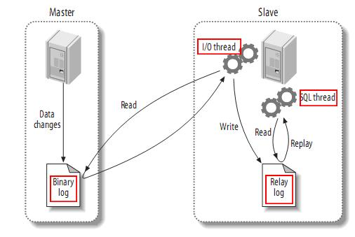
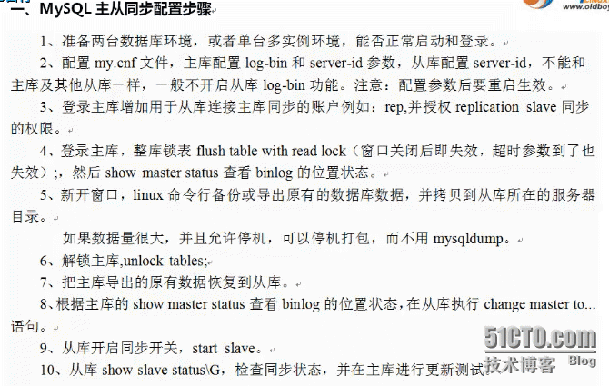

> **About this post**
>
> This post explains the principles and setup of MySQL master-slave replication. It first
> describes what replication offers in terms of architecture robustness, access speed, and
> maintenance (M-S, one master with multiple slaves, asynchronous replication), with a
> diagram illustrating the three steps of replication — the master writes the binary log,
> the slave I/O thread pulls it and writes to the relay log, and the SQL thread replays the
> updates on the slave — plus the limitation that replication is serialized on the slave.
> The hands-on part is based on dual instances on ports 3306/3307: confirming log_bin and a
> unique server-id, creating the rep account with grant replication slave, running
> mysqldump --master-data=2 for a full backup after flush table with read lock, using
> CHANGE MASTER TO to specify the log file and position, running start slave, and verifying
> with show slave status/processlist. Finally it covers a read/write-splitting grant scheme
> that keeps the mysql database out of replication, filtering options such as
> binlog-ignore-db/replicate_wild_ignore_table, read-only slaves, skip-name-resolve,
> skipping errors with sql_slave_skip_counter, and cascading replication
> (log-slave-updates).

> **Technical notes**
>
> MySQL 5.6+/8.0 recommend GTID replication (`CHANGE MASTER TO ... MASTER_AUTO_POSITION=1`);
> the traditional binlog position-based approach is still supported. In 8.0.23+ the syntax
> was renamed to CHANGE REPLICATION SOURCE TO. For read-only slaves, pair read-only with
> `super_read_only` to prevent users holding the SUPER privilege from writing by mistake.
> Asynchronous replication has lag; strong-consistency scenarios such as finance should
> consider semi-synchronous replication or MGR.

---

## 1. Why Master-Slave Replication

Master-slave replication helps with:

- Robustness of the database architecture
- Faster access
- Easier maintenance and management
- Master and slave back each other up

Common topologies: M (master) ---- S (slave), one master with multiple slaves, asynchronous replication.



## 2. How Replication Works

The first part of the process is the master recording changes to its binary log. Before each transaction that updates data completes, the master records those changes in the binary log. MySQL writes transactions to the binary log serially, even when the statements inside a transaction are executed interleaved. Once the events have been written to the binary log, the master notifies the storage engine to commit the transaction.

The next step is for the slave to copy the master's binary log into its own relay log. First, the slave starts a worker thread — the I/O thread. The I/O thread opens an ordinary connection on the master and starts the binlog dump process. The binlog dump process reads events from the master's binary log; if it has caught up with the master, it sleeps and waits for the master to produce new events. The I/O thread writes these events into the relay log.

The SQL slave thread handles the final step. The SQL thread reads the events from the relay log and replays them to update the slave's data, keeping it consistent with the data on the master. As long as this thread keeps up with the I/O thread, the relay log usually resides in the OS cache, so its overhead is small.

In addition, there is a worker thread on the master too: just like any other MySQL connection, the slave opening a connection to the master causes the master to start a thread. Replication has one very important limitation — it is serialized on the slave, meaning updates that run in parallel on the master cannot run in parallel on the slave.

## 3. Preparing the Master (3306 instance)

```shell
mysql -uroot -p123456 -S /data/3306/mysql.sock
```

```sql
mysql> show variables like 'log_bin%';
```

```text
+---------------------------------+-------+
| Variable_name                   | Value |
+---------------------------------+-------+
| log_bin                         | ON    |
+---------------------------------+-------+
```

The server-id of the two instances must not be the same.

Create the replication account:

```sql
mysql> grant replication slave on *.* to 'rep'@'192.168.10.%' identified by '123456';
mysql> flush privileges;
```

Acquire a read lock so the data does not change during the backup:

```sql
mysql> flush table with read lock;    # read lock
mysql> show master status/logs;
```

```text
+------------------+-----------+
| Log_name         | File_size |
+------------------+-----------+
| mysql-bin.000005 |       338 |
+------------------+-----------+
```

Take a full backup of the master (with the log position):

```shell
mysqldump -uroot -p123456 -S /data/3306/mysql.sock -A -B --events --master-data=2 > /opt/rep.sql
```

```sql
mysql> unlock tables;    # unlock
```

## 4. Configuring and Starting the Slave (3307 instance)

Import the full backup:

```shell
mysql -uroot -p123456 -S /data/3307/mysql.sock < /opt/rep.sql
mysql -uroot -p123456 -S /data/3307/mysql.sock
```

```sql
CHANGE MASTER TO
MASTER_HOST='192.168.10.10',
MASTER_PORT=3306,
MASTER_USER='rep',
MASTER_PASSWORD='123456',
MASTER_LOG_FILE='mysql-bin.000005',
MASTER_LOG_POS=417;
```

```text
/data/3307/data/master.info    # generated file
```

```sql
mysql> start slave;
mysql> show slave status\G
```

Key status:

```text
Slave_IO_Running: Yes
Slave_SQL_Running: Yes
```

The relay log and sync position information generated on the slave:

```text
relay-bin.index
/data/3307/relay-bin.000001
/data/3307/relay-bin.000002
# relay logs
427
mysql-bin.000005
591
```



## 5. Checking Replication Status

```sql
mysql> show processlist;    # check the status
```

```text
| Id | User        | Host               | db   | Command     | Time | State                                                                       | Info |
|  1 | rep         | 192.168.10.10:54094| NULL | Binlog Dump |  147 | Master has sent all binlog to slave; waiting for binlog to be updated        | NULL |
|  1 | system user |                    | NULL | Connect     |  144 | Slave has read all relay log; waiting for the slave I/O thread to update it  | NULL |
|  2 | system user |                    | NULL | Connect     |  144 | Waiting for master to send event                                            | NULL |
```

Meaning of the key states:

- Master has sent all binlog to slave; waiting for binlog to be updated: the master has sent all binlog to the slave and is waiting for the binlog to be updated
- Slave has read all relay log; waiting for the slave I/O thread to update it: the SQL thread has finished reading the relay log and is waiting for the I/O thread to update it
- Waiting for master to send event: the I/O thread is waiting for the master to produce new events

```sql
mysql> show slave status\G
```

```text
Slave_IO_Running: Yes
Slave_SQL_Running: Yes
Seconds_Behind_Master: 0
```

## 6. Read/Write Splitting Grant Scheme

Data replication is one-way. The mysql database is not replicated; grant privileges on the master and the slave separately.

Drawback: when a slave is promoted to master, the privileges of connected users become a problem. Keep one slave dedicated to taking over as the master.

```ini
# vim /etc/my.cnf
[mysqld]
binlog-ignore-db = mysql
binlog-ignore-db = performance_schema
binlog-ignore-db = information_schema
```

```sql
mysql> create user hequan@localhost identified by '123456';   -- grant no privileges yet
```

Replication filtering options:

- replicate-do-table: tables to replicate
- replicate-ignore-table: tables to skip
- replicate_wild_ignore_table=mysql.%: wildcards are supported; this approach is recommended

```ini
slave-skip-errors = 1032,1062    # skip errors 1032 and 1062
lower_case_table_names = 1       # make MySQL case-insensitive for table names; use with caution, it affects existing table names
```

## 7. Skipping DNS Resolution and Read-Only Slave

Starting mysqld with the --skip-name-resolve option disables DNS host name lookups: when MySQL receives a connection request it gets the client's IP, in order to better match the privilege records in mysql.user (some of which are defined by hostname). If the MySQL server is configured with a DNS server and the client IP has no corresponding hostname in DNS, this process is slow and the connection is left waiting.

```ini
skip-name-resolve
```

Read-only slave:

```ini
[mysqld]
read-only    # read-only; root is not restricted
```

The grant must not include super or all privileges, otherwise read-only has no effect on that user. A normal user creating a database on a read-only slave gets an error:

```sql
mysql> create database xxxxx;
ERROR 1290 (HY000): The MySQL server is running with the --read-only option so it cannot execute this statement
```

## 8. Handling Replication Desync

When Slave_SQL_Running is NO, you can skip the error with the following command: while the slave is in the stop state, run `set global sql_slave_skip_counter=N` to skip statements, with N=1.

Taking an insert statement as an example (InnoDB engine, binlog_format=statement), there are actually three events in the binlog: begin/insert/commit, all with the command type Query_log_event:

1. If N=1 and the current event is BEGIN, N stays unchanged; skip the current event and continue;
2. If N=1 and the current event falls inside a transaction (after BEGIN, before COMMIT), N stays unchanged; skip the current event and continue.

## 9. Cascading Replication

Enable binlog logging on the slave for cascading replication, which at the same time serves as a database backup:

```ini
log-bin = /data/3307/mysql-bin
log-slave-updates
expire_logs_days = 7    # keep for 7 days
```
