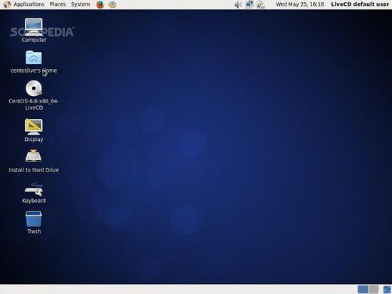
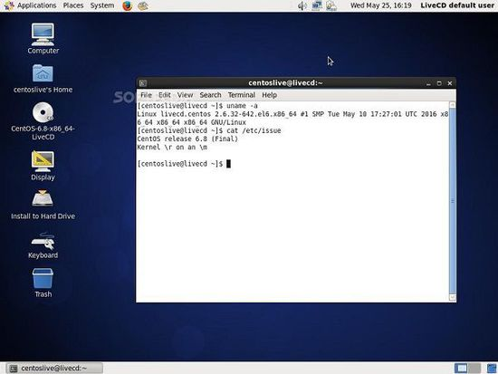

> **About this post**
>
> This post republishes the news of the official release of CentOS Linux 6.8:
> built on RHEL 6.8, shipped with the Linux 2.6.32 kernel, XFS supporting up to
> 300TB of storage, and NetworkManager now using libreswan instead of
> Openswan; SSLv2/SSLv3 are disabled by default, TLS 1.2 is supported, and
> applications such as LibreOffice and Squid have been updated.

> **Technical notes**
>
> CentOS 6.8 is a legacy release; the CentOS 6 series reached EOL in
> November 2020. Production environments are advised to migrate to Rocky
> Linux, AlmaLinux, or Ubuntu LTS. The download link in this post now points
> to the CentOS official latest-release page.

---

## 1. Release Overview

**Summary:** On May 25, CentOS developer and maintainer Johnny Hughes announced that the CentOS Linux 6.8 operating system had been officially released. Built on Red Hat Enterprise Linux 6.8 (RHEL), it brings numerous changes, such as the latest Linux 2.6.32 kernel, with support for storing up to 300TB of data on the XFS file system; the VPN endpoint solution in the network connection management utility NetworkManager now provides the libreswan library (instead of the previously used Openswan IPsec).



The System Security Services Daemon (SSSD) appears to have the SSLv2 protocol disabled by default, and it additionally supports smart cards. Johnny Hughes stated in the announcement:

> Compared with previous CentOS Linux 6 releases, there are many fundamental changes in this release, and all images of the 6.8 upstream release have been updated at zero-day. You can install CentOS 6.8 via various media, and after installation, run "yum update" on a regular basis.



## 2. Application Updates

CentOS Linux 6.8 also includes updates to many applications, including the long-term-supported LibreOffice 4.3.7 office suite and Squid 3.4, a caching and forwarding network proxy.

In addition, many applications now support TLS 1.2 (Transport Layer Security), such as Git, YUM, Postfix, OpenLDAP, stunnel, and vsftpd. Other changes:

- The open-source "dmidecode" tool (for viewing hardware information), which displays the computer's DMI table contents in a human-readable format, now supports SMBIOS 3.0.0
- Kickstart files can now be fetched from HTTPS sources; the NTPd (Network Time Protocol daemon) package has an optional solution (like chrony)
- SSLv3 has (finally) been disabled by default to protect users, and last but not least, there is better Hyper-V support

## 3. Download

```text
https://www.centos.org/download/
```
