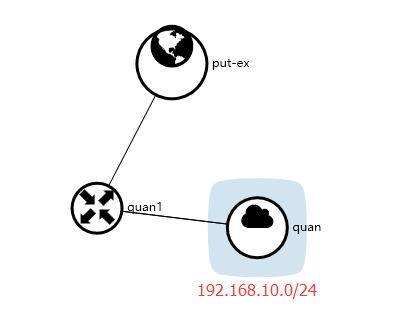
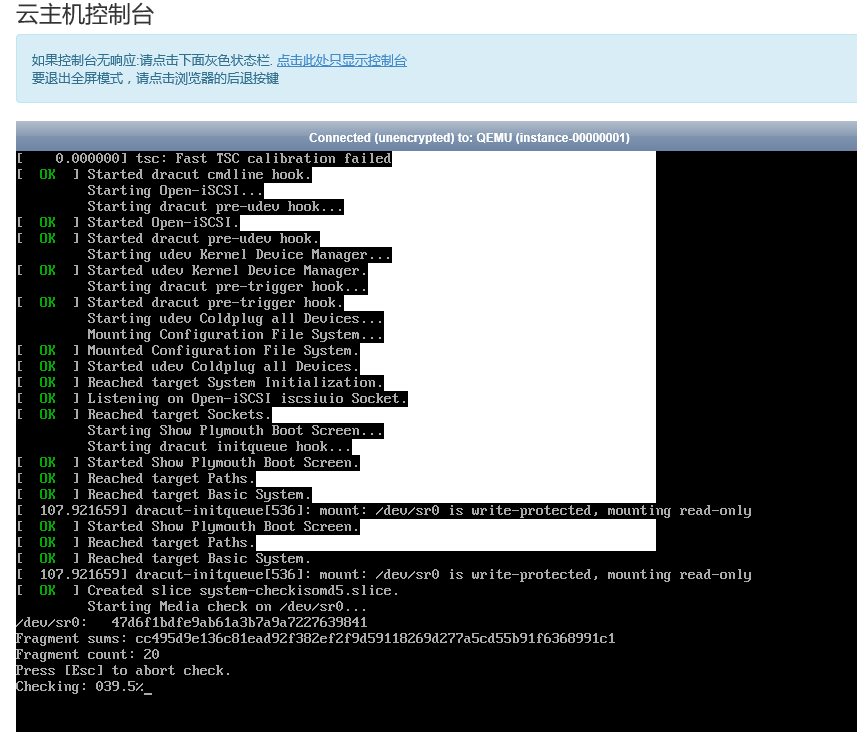
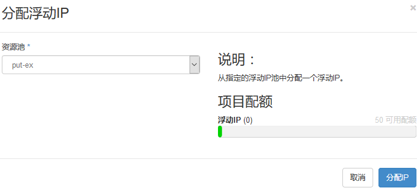
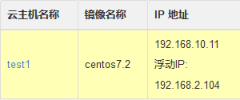
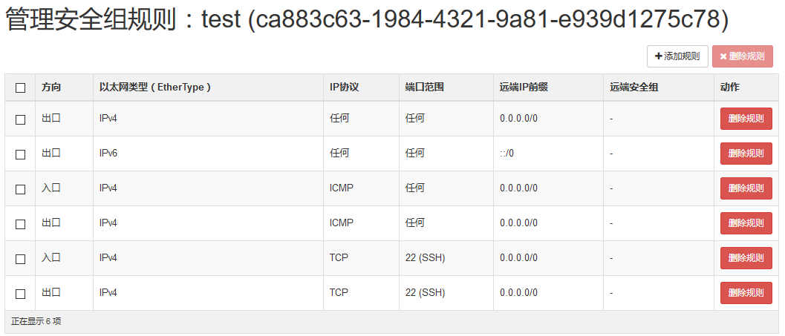
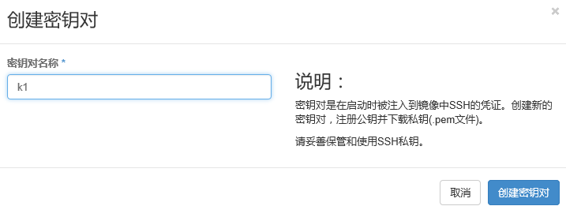
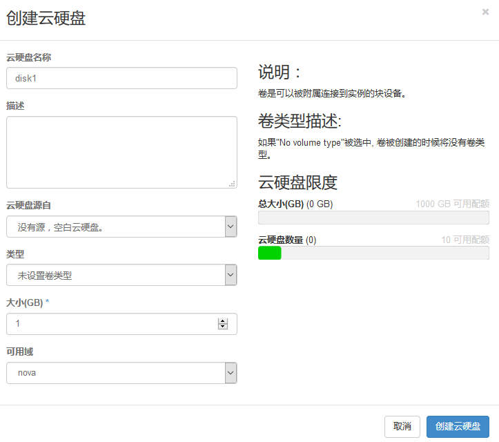
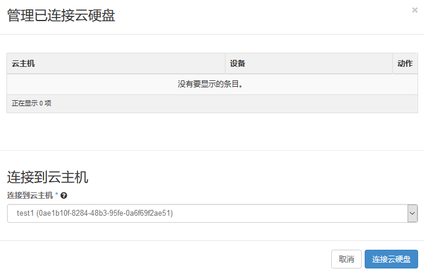
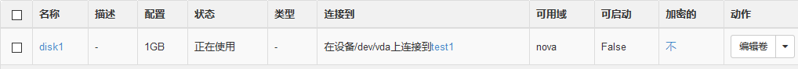
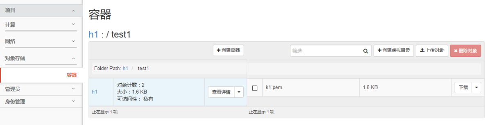

> **About this post**
>
> This post records the whole process of creating the first cloud instance after
> logging in as admin in the OpenStack Dashboard (Horizon): first create a basic
> network (an external network connected via a router to the internal network
> 192.168.10.0/24), then create a CentOS 7.2 image using an ISO URL from the 163
> mirror site, launch the instance test1 and open its console, then in turn
> associate a floating IP, configure ICMP/SSH security group rules, create and
> download a key pair, create a volume and attach it to the instance, and finally
> demonstrate storing the key file in an Object Storage container.

> **Technical notes**
>
> CentOS 7 reached end of life (EOL) on June 30, 2024; migrating to Rocky Linux 9 /
> AlmaLinux 9 or the Chinese openEuler is recommended.
> Also: with modern OpenStack (the Train release and later), the convention is to
> import a qcow2 cloud image and boot from it directly, with ISO images generally
> used only as installation sources. Dashboard menu paths vary slightly between
> versions, but the workflow is the same.

---

## 1. Create the Basic Network

Log in as admin and create a basic network:

## 2. Create an Image

An image is a disk file with an operating system already installed. The path is "Compute → Images → Create Image", with the parameters:

- Name: centos7.2-1511
- Image Source: Image Location
- Image Location: `http://mirrors.163.com/centos/7.2.1511/isos/x86_64/CentOS-7-x86_64-DVD-1511.iso`
- Format: iso
- Minimum Disk: 10GB
- Minimum RAM: 1024MB
- Copy Data: unchecked
- Public: checked

## 3. Launch an Instance and Open the Console

"Compute → Instances → Launch Instance":

- Instance Name: test1
- Instance Boot Source: centos7.2-1511

Click test1 to open the console:

## 4. Associate a Floating IP

## 5. Configure Security Groups

"Compute → Access & Security → Manage Security Groups, add test", then add rules and apply:

## 6. Create a Key Pair

Create a key pair and download it:

## 7. Volumes

Log in to the host and you can see it:

## 8. Object Storage

Object Storage (a cloud drive) can be used to store your own files:

