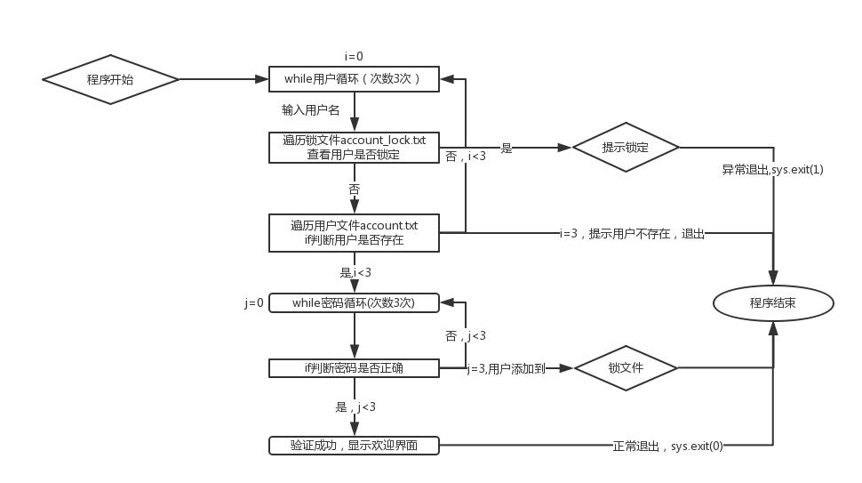

> **About this post**
>
> This post is a Day 1 Python beginner exercise: implementing a command-line user login program. The program reads the `account.txt` account file to verify usernames and passwords, with password input hidden via `getpass`; if the same user enters a wrong password 3 times in a row, the user is written to the `account_lock.txt` lock file, and any later login attempt by that user is rejected outright. The code combines file reading/writing, `while` loops, `for...else` / `while...else` constructs, and `sys.exit`.

> **Technical notes**
>
> The code is based on Python 3 (`input` and `print()` syntax) and still runs on Python 3.12/3.13 (the mainstream versions in 2026). Two caveats: `os.system('cls')` only works on Windows; on Linux/macOS it should be `clear`; storing passwords in plain text is for demonstration only — real projects must hash them with `hashlib`/`bcrypt`. The original code block's language tag had been truncated by a crawler to `bas` + `h`; it has been corrected to `python`.

---

## 1. Program Features



Execution logic of the login program:

1. The user has at most 3 attempts to enter a username.
2. After a username is entered, `account_lock.txt` is checked first; if that user is already locked, the program exits immediately.
3. The username is matched against `account.txt`; on a match, password verification begins (also with 3 attempts).
4. After 3 wrong passwords, the username is appended to the lock file and the program exits; if the username fails to match 3 times, the program exits directly.

## 2. Data File Formats

`account.txt`: one account per line, with the username and password separated by a space:

```text
alice 123456
bob  abcdef
```

`account_lock.txt`: one locked username per line (written automatically by the program).

## 3. Complete Code

```python
#!/usr/bin/python
#_*_ coding:utf-8 _*_
import sys, os, getpass

os.system('cls')   # Clear the screen (Windows only; use 'clear' on Linux/macOS)

i = 0
while i < 3:                                                     # Keep looping as long as login failures stay under 3
    name = input("请输入用户名：")
    lock_file = open('account_lock.txt', 'r+')                   # After the username is entered, open the LOCK file to check whether this user is already locked
    lock_list = lock_file.readlines()
    for lock_line in lock_list:                                  # Iterate over the LOCK file
        lock_line = lock_line.strip('\n')                        # Strip the newline
        if name == lock_line:                                    # Exit immediately if already locked
            sys.exit('用户 %s 已经被锁定，退出' % name)
    user_file = open('account.txt', 'r')                         # Open the account file
    user_list = user_file.readlines()
    for user_line in user_list:                                  # Iterate over the account file
        (user, password) = user_line.strip('\n').split()         # Get the account and password
        if name == user:                                         # Username matched
            j = 0
            while j < 3:                                         # Keep looping as long as password failures stay under 3
                passwd = getpass.getpass('请输入密码：')          # Read the password hidden (no echo)
                if passwd == password:                           # Password correct, welcome the user
                    print('欢迎登录管理平台，用户%s' % name)
                    sys.exit(0)                                  # Normal exit
                else:
                    if j != 2:                                   # When j == 2 it is the last attempt; no need to show 0 remaining
                        print('用户 %s 密码错误，请重新输入，还有 %d 次机会' % (name, 2 - j))
                j += 1                                           # Increment the counter after a wrong password
            else:
                lock_file.write(name + '\n')                     # After 3 wrong passwords, append the user to the LOCK file
                sys.exit('用户 %s 达到最大登录次数，将被锁定并退出' % name)
        else:
            pass                                                 # Username not matched; skip and keep looping
    else:
        if i != 2:                                               # When i == 2 it is the last attempt; no need to show 0 remaining
            print('用户 %s 不存在，请重新输入，还有 %d 次机会' % (name, 2 - i))
    i += 1                                                       # Increment the counter after a wrong username
else:
    sys.exit('用户 %s 不存在，退出' % name)                      # Abnormal exit after 3 wrong usernames

lock_file.close()                                                # Close the LOCK file
user_file.close()                                                # Close the account file
```

## 4. Key Points

- `while ... else` / `for ... else`: the `else` clause runs when the loop **finishes normally without being interrupted by `break`**; this post uses it to implement the fallback branch for "all 3 attempts used up".
- `getpass.getpass()`: does not echo input while reading the password, making it better suited than `input()` for password entry.
- File handles are not explicitly `close()`d before `sys.exit()`; cleanup relies on process exit. A safer approach is to use the `with open(...) as f:` context manager.
