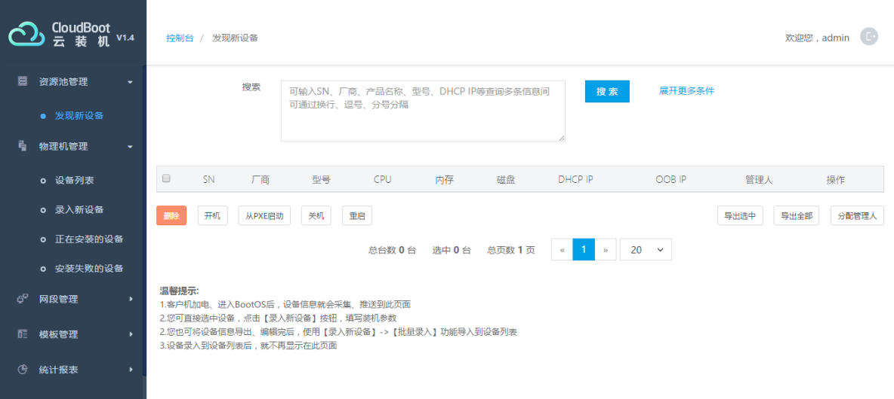
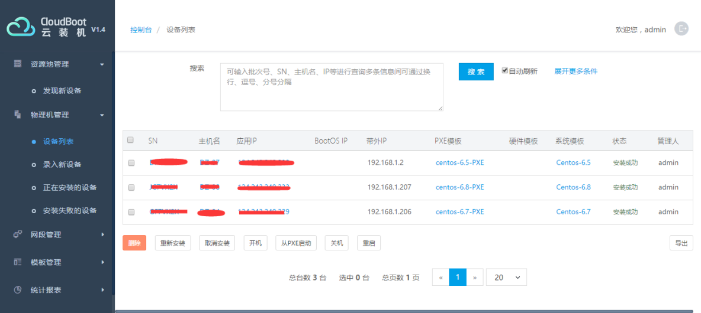
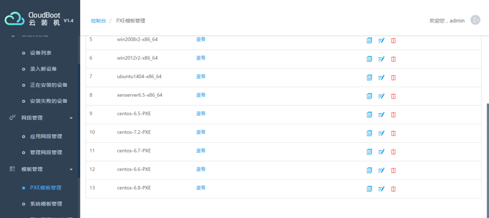

> **About this post**
>
> This post recommends the CloudBoot (Yunqi) OS provisioning platform from Yunji Technology as an automated provisioning solution that is far less hassle than Cobbler: the platform installs with a single RPM package and is likewise based on PXE; after installing ipmitool on the server to be provisioned, you use IPMI out-of-band commands to set the next boot to PXE and reboot remotely, and DHCP bootstrapping takes over to complete the installation. The post gives the preparation commands for IPMI out-of-band operations, the platform's eight product highlights (hardware RAID/BIOS configuration, multi-OS support, a built-in CMDB, one-click deployment, etc.), and screenshots of the platform's "Discover New Devices", device list, and PXE template management UI.

> **Technical notes**
>
> In the original command `ipmitool pass power reset`, `pass` was a typo; it has been corrected to the standard form `ipmitool chassis power reset` (used together with `chassis bootdev pxe`).
> `/etc/init.d/ipmi` is a SysV-era usage; on CentOS 7+ use `systemctl start ipmi` instead.
> CloudBoot was later open-sourced on GitHub (idcos/CloudBoot); the UI shown in this post is V1.4 and may differ from newer versions.

---

I'd like to recommend an automated OS provisioning solution — it is remarkably simple.

It is the CloudBoot (Yunqi) provisioning platform from Yunji Technology. I have tested it myself: installation is simple and it is convenient to use, so I'm giving it a plug here. Below are screenshots of the platform; for details, visit the official website.

## 1. Installation Principle

The installer comes pre-packaged: just install it with rpm and do a little configuration. The underlying principle is PXE-based provisioning.

The server to be provisioned needs ipmitool installed; then set the next boot to PXE, and DHCP will locate the host and start the installation:

```bash
yum install OpenIPMI ipmitool
/etc/init.d/ipmi start
lsmod | grep ipmi_devintf || insmod /lib/modules/`uname -r`/kernel/drivers/char/ipmi/ipmi_devintf.ko
/etc/init.d/ipmi restart

ipmitool chassis bootdev pxe
ipmitool chassis power reset
```

## 2. Product Highlights

1. Once a server is racked and powered on, the entire closed-loop process — hardware configuration, OS installation, hostname/IP configuration, and so on — runs fully automated with no manual intervention.
2. Supports hardware configuration for mainstream x86 servers (including RAID/OOB/BIOS, etc.), integrated with domestic hardware vendors to support mainstream server brands.
3. Controls server installation out-of-band via the standard IPMI interface.
4. Supports automated installation and configuration of enterprise-grade operating systems, including RedHat/CentOS/Windows/Ubuntu/SUSE/VMware/XenServer/OpenStack, etc.; ships with a simple built-in CMDB that can be used for asset management.
5. Builds a lightweight KVM virtual machine management system on x86 servers, and also works well with VMware, VirtualBox, KVM, Xen, and other virtualization platforms for OS deployment.
6. Supports one-click installation and deployment — one minute to get a week's work done.
7. Supports online or offline upgrades, and flexibly allows user-defined configuration.
8. Completely free and open source, with support for custom development on top of it.

## 3. Platform Interface






