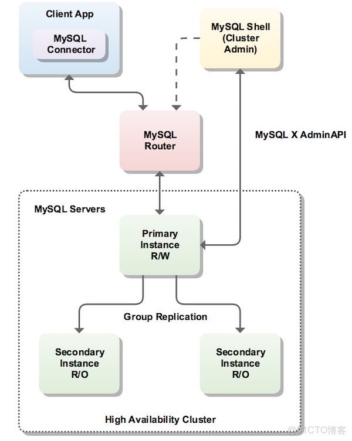

> **About this post**
>
> A hands-on walkthrough of a three-node InnoDB Cluster (Group Replication + MySQL Shell + MySQL Router) based on MySQL 5.7.21. It covers the mysql-shell dba.checkInstanceConfiguration pre-check, dba.configureLocalInstance auto-fixing GTID/binlog and other parameters, createCluster/addInstance to build the cluster, mysqlrouter --bootstrap to generate the 6446/6447 read-write and read-only routing ports, plus automatic failover on node outage, rejoinInstance, rebootClusterFromCompleteOutage, and a summary of errors encountered.

> **Technical notes**
>
> MySQL 5.7 reached EOL in October 2023; upgrading to MySQL 8.0 LTS is recommended. With InnoDB Cluster on 8.0, the mysql-shell version must match the server version (an 8.0 cluster can no longer use the 1.x shell), and the default authentication plugin becomes caching_sha2_password, so legacy clients need `default_authentication_plugin` adjusted. The password `123456` in this post is for demonstration only and must never be used in production.

---

> - This cluster is currently running on my own Django demo environment and has been stable so far.
> - Feel free to join group      620176501                        to discuss MySQL cluster applications.

---

### **Core Architecture**

```shell
* MySQL 5.7 introduced Group Replication, which enables automatic primary election among a group of MySQL servers, forming a one-primary, multiple-replica structure. With advanced configuration, a multi-primary, multi-replica structure can be achieved.
* MySQL Router is a lightweight, transparent middleware that automatically picks up the cluster state, plans SQL statements, and dispatches them to appropriate MySQL backends for execution.
* MySQL Shell is an interactive program that supports both JavaScript and SQL, allowing you to configure an InnoDB Cluster quickly.
```



---

### Deployment

- This setup uses 3 machines in total; set the hostnames and hosts file  |  configure the report_host field in my.cnf on each server to its own hostname

```shell
192.168.10.123 db1
192.168.10.124 db2
192.168.10.125 db3
```

- Install mysql5.7.21; you can refer to the installation post below — that is exactly what I used when building mine.

```shell
http://blog.51cto.com/hequan/2067341
```

- Install mysql-shell

```shell
wget https://cdn.mysql.com//Downloads/MySQL-Shell/mysql-shell-1.0.11-1.el7.x86_64.rpm
yum install mysql-shell-1.0.11-1.el7.x86_64.rpm  -y
```

- Set up permissions for the relevant user; in production you do not have to use the root user

```shell
grant all   privileges  on *.*  to 'root'@'%'  identified by '123456';
GRANT ALL PRIVILEGES ON mysql_innodb_cluster_metadata.* TO root@'%' WITH GRANT OPTION;
GRANT RELOAD, SHUTDOWN, PROCESS, FILE, SUPER, REPLICATION SLAVE, REPLICATION CLIENT, \
CREATE USER ON *.* TO root@'%' WITH GRANT OPTION;
GRANT SELECT ON *.* TO root@'%' WITH GRANT OPTION;
flush privileges;
```

---

### mysqlsh

```shell
[root@db1 ~]#  mysqlsh

## Check the MySQL configuration file (do this on all 3 hosts)
dba.checkInstanceConfiguration('root@db1:3306')

+----------------------------------+---------------+----------------+--------------------------------------------------+
| Variable                         | Current Value | Required Value | Note                                             |
+----------------------------------+---------------+----------------+--------------------------------------------------+
| binlog_checksum                  | CRC32         | NONE           | Update the server variable or restart the server |
| binlog_format                    | MIXED         | ROW            | Update the server variable or restart the server |
| enforce_gtid_consistency         | OFF           | ON             | Restart the server                               |
| gtid_mode                        | OFF           | ON             | Restart the server                               |
| log_slave_updates                | 0             | ON             | Restart the server                               |
| master_info_repository           | FILE          | TABLE          | Restart the server                               |
| relay_log_info_repository        | FILE          | TABLE          | Restart the server                               |
| transaction_write_set_extraction | OFF           | XXHASH64       | Restart the server                               |
+----------------------------------+---------------+----------------+--------------------------------------------------+

## Fix the MySQL configuration file; must use root (do this on all 3 hosts)
dba.configureLocalInstance('root@db1:3306')

Please provide the password for 'root@db1:3306':
Detecting the configuration file...
Found configuration file at standard location: /etc/my.cnf
Do you want to modify this file? [Y|n]:  [Y|n]: Y

## Restart MySQL

## Check again (do this on all 3 hosts)
dba.checkInstanceConfiguration('root@db1:3306')
Please provide the password for 'root@db1:3306':
Validating instance...

The instance 'db1:3306' is valid for Cluster usage
{
    "status": "ok"
}
```

```shell
## Log in
mysqlsh --uri root@db1:3306

## Create the cluster: main
mysql-js> var cluster = dba.createCluster('main')
A new InnoDB cluster will be created on instance 'hequan@db1:3306'.

Creating InnoDB cluster 'main' on 'hequan@db1:3306'...
Adding Seed Instance...

Cluster successfully created. Use Cluster.addInstance() to add MySQL instances.
At least 3 instances are needed for the cluster to be able to withstand up to
one server failure.

## Add child nodes
mysql-js> cluster.addInstance('root@db2:3306')
mysql-js> cluster.addInstance('root@db3:3306')

## View node information
mysql-js> cluster.status()

## Persist the configuration, writing it into my.cnf
mysql-js>  \connect db1
mysql-js> dba.configureLocalInstance('db1:3306')

## View basic information
mysql-js>  cluster.describe();

## After exiting, check the node information again
var cluster = dba.getCluster();
cluster.status();
```

### Mysql-route Setup

```shell
wget https://cdn.mysql.com//Downloads/MySQL-Router/mysql-router-2.1.4-1.el7.x86_64.rpm
yum install -y mysql-router-2.1.4-1.el7.x86_64.rpm
```

```shell
## This command updates the configuration in /etc/mysqlrouter/mysqlrouter.conf; it can run on another machine — here db2 was chosen

[root@db2 ~]# mysqlrouter --bootstrap root@db1:3306 --user mysqlrouter

Please enter MySQL password for root:
WARNING: The MySQL server does not have SSL configured and metadata used by the router may be transmitted unencrypted.

Bootstrapping system MySQL Router instance...
MySQL Router  has now been configured for the InnoDB cluster 'main'.

The following connection information can be used to connect to the cluster.

Classic MySQL protocol connections to cluster 'main':
- Read/Write Connections: localhost:6446    read-write
- Read/Only Connections: localhost:6447     read-only

X protocol connections to cluster 'main':
- Read/Write Connections: localhost:64460
- Read/Only Connections: localhost:64470

Existing configurations backed up to /etc/mysqlrouter/mysqlrouter.conf.bak
[root@db2 ~]# systemctl start mysqlrouter

## Start
systemctl start mysqlrouter
systemctl enable mysqlrouter

## Check ports
[root@db2 ~]# netstat -lntup
Active Internet connections (only servers)
Proto Recv-Q Send-Q Local Address           Foreign Address         State       PID/Program name
tcp        0      0 0.0.0.0:64460           0.0.0.0:*               LISTEN      2958/mysqlrouter
tcp        0      0 0.0.0.0:6446            0.0.0.0:*               LISTEN      2958/mysqlrouter
tcp        0      0 0.0.0.0:6447            0.0.0.0:*               LISTEN      2958/mysqlrouter
tcp        0      0 0.0.0.0:64470           0.0.0.0:*               LISTEN      2958/mysqlrouter

## Verify
mysql -u root -h 127.0.0.1 -P 6446 -p

select @@port;
select @@hostname;
```

---

### Failure Simulation

```shell
## Shut down the db1 database; automatic failover as follows:

"topology": {
            "db1:3306": {
                "address": "db1:3306",
                "mode": "R/O",
                "readReplicas": {},
                "role": "HA",
                "status": "(MISSING)"
            },
            "db2:3306": {
                "address": "db2:3306",
                "mode": "R/W",
                "readReplicas": {},
                "role": "HA",
                "status": "ONLINE"
            },
            "db3:3306": {
                "address": "db3:3306",
                "mode": "R/O",
                "readReplicas": {},
                "role": "HA",
                "status": "ONLINE"
            }
```

```shell
## Restart db2 and run the commands

mysql> show databases;
ERROR 2013 (HY000): Lost connection to MySQL server during query
mysql> show databases;
ERROR 2006 (HY000): MySQL server has gone away
No connection. Trying to reconnect...
Connection id:    20
Current database: *** NONE ***
mysql> select @@hostname;
+------------+
| @@hostname |
+------------+
| db1        |
+------------+

## After restarting the node, it must be rejoined manually
"db2:3306": {
                "address": "db2:3306",
                "mode": "R/O",
                "readReplicas": {},
                "role": "HA",
                "status": "(MISSING)"

cluster.rejoinInstance('root@db2:3306')
The instance 'db2:3306' was successfully added to the MySQL Cluster.
```

```shell
## All nodes were restarted; rejoin

mysqlsh --uri root@db1:3306
mysql-js> var cluster = dba.rebootClusterFromCompleteOutage();

Reconfiguring the default cluster from complete outage...

The instance 'db2:3306' was part of the cluster configuration.
Would you like to rejoin it to the cluster? [y|N]: y

The instance 'db3:3306' was part of the cluster configuration.
Would you like to rejoin it to the cluster? [y|N]: y

The cluster was successfully rebooted.
```

---

### Error Summary:

```
ERROR: Error joining instance to cluster: 'db2:3306' - Query failed. MySQL Error (3092): The server is not configured properly to be an active member of the group. Please see more details on error log.. Query: START group_replication (RuntimeError)

## Log in to the db2 database and run reset master;
```

```shell
## If "status": "NO_QUORUM" appears, run the repair and rejoin
## Not tested yet

cluster.forceQuorumUsingPartitionOf("db1:3306")

mysql-js> cluster.rejoinInstance('root@db2:3306')
mysql-js> cluster.rejoinInstance('root@db3:3306')
```

---

### Postscript:

> Official documentation:   https://dev.mysql.com/doc/refman/5.7/en/mysql-innodb-cluster-userguide.html

```shell
Node states

    * ONLINE  - The node is in a normal state.
    * OFFLINE  -   The instance is running but has not joined any cluster.
    * RECOVERING - The instance has joined the cluster and is syncing data.
    * ERROR  -  An error occurred while syncing data.
    * UNREACHABLE -  Communication with other nodes is interrupted; it may be a network issue or a node crash.
    * MISSING The node has joined the cluster, but group replication has not been started

Cluster states

	* OK – All nodes are online and there are redundant nodes.
	* OK_PARTIAL – Some nodes are unavailable, but redundant nodes remain.
	* OK_NO_TOLERANCE – Enough nodes are online, but there is no redundancy; for example, in a two-node cluster, if one node goes down, the cluster becomes unavailable.
	* NO_QUORUM – Some nodes are online, but the majority quorum cannot be reached; in this state the cluster cannot write and can only read.
	* UNKNOWN – The node is neither online nor recovering; try connecting to other instances to check its status.
	* UNAVAILABLE – All nodes in the group are offline, but the instances are running; they may have just restarted and not yet joined the cluster.
```
