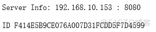
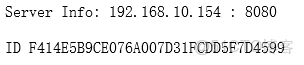

> **About this post**
>
> A setup that uses nginx as a reverse proxy in front of two Tomcat instances and implements session replication through Tomcat's own Tribes cluster: configure SimpleTcpCluster/DeltaManager/McastService/NioReceiver in server.xml, add `<distributable/>` to web.xml, and finally use an nginx upstream for load balancing to verify that sessions are synchronized between the two Tomcat instances.

> **Technical notes**
>
> Tomcat's built-in multicast session replication suits small clusters; with many nodes the network overhead becomes significant. Nowadays it is more common to externalize sessions to Redis (e.g. spring-session, tomcat-redis-session-manager) or simply go stateless with JWT. The nginx load-balancing parameters are still applicable today; the Tomcat 9 Cluster configuration remains compatible in Tomcat 10, but note that Tomcat 10 migrated its package names to jakarta.

---

```shell
* tomcat1   192.168.10.153

* tomcat2   192.168.10.154
```

Tomcat must be running in NIO mode.

```html
## Add the following,         note to change   address="192.168.10.154"  to the local IP
vim /usr/local/tomcat/conf/server.xml

<Cluster className="org.apache.catalina.ha.tcp.SimpleTcpCluster"
                 channelSendOptions="8">

          <Manager className="org.apache.catalina.ha.session.DeltaManager"
                   expireSessionsOnShutdown="false"
                   notifyListenersOnReplication="true"/>

          <Channel className="org.apache.catalina.tribes.group.GroupChannel">
            <Membership className="org.apache.catalina.tribes.membership.McastService"
                        address="228.0.0.4"
                        port="45564"
                        frequency="500"
                        dropTime="3000"/>
            <Receiver className="org.apache.catalina.tribes.transport.nio.NioReceiver"
                      address="192.168.10.154"
                      port="4000"
                      autoBind="100"
                      selectorTimeout="5000"
                      maxThreads="6"/>

            <Sender className="org.apache.catalina.tribes.transport.ReplicationTransmitter">
              <Transport className="org.apache.catalina.tribes.transport.nio.PooledParallelSender"/>
            </Sender>
            <Interceptor className="org.apache.catalina.tribes.group.interceptors.TcpFailureDetector"/>
            <Interceptor className="org.apache.catalina.tribes.group.interceptors.MessageDispatchInterceptor"/>
          </Channel>

          <Valve className="org.apache.catalina.ha.tcp.ReplicationValve"
                 filter=""/>
          <Valve className="org.apache.catalina.ha.session.JvmRouteBinderValve"/>

          <Deployer className="org.apache.catalina.ha.deploy.FarmWarDeployer"
                    tempDir="/tmp/war-temp/"
                    deployDir="/tmp/war-deploy/"
                    watchDir="/tmp/war-listen/"
                    watchEnabled="false"/>

          <ClusterListener className="org.apache.catalina.ha.session.ClusterSessionListener"/>
        </Cluster>
```

```html
##  Edit the web file, add one line above </web-app>
vim /usr/local/tomcat/webapps/ROOT/WEB-INF/web.xml

<distributable/>
vim      index.jsp
<%@ page contentType="text/html; charset=GBK" %>
<%@ page import="java.util.*" %>
<html>
    <head>
        <title>Cluster App Test</title>
    </head>
    <body>
    Server Info: <%  out.println(request.getLocalAddr() + " : " + request.getLocalPort()+"<br/>");%>
    <%
    out.println("<br/> ID " + session.getId()+"<br/>");   // if a new session attribute is set
    String dataName = request.getParameter("dataName");
        if (dataName != null && dataName.length() > 0) {
            String dataValue = request.getParameter("dataValue");
            session.setAttribute(dataName, dataValue);
        }
     %>
     </body>
</html>
```

```shell
## Configure nginx load balancing and test

        upstream tomcatserver {

        server 192.168.10.153:8080 weight=5;
        server  192.168.10.154:8080  weight=5;

        }

        location    / {

            proxy_pass http://tomcatserver;  #JSP requests are handed to Tomcat
        }
```




