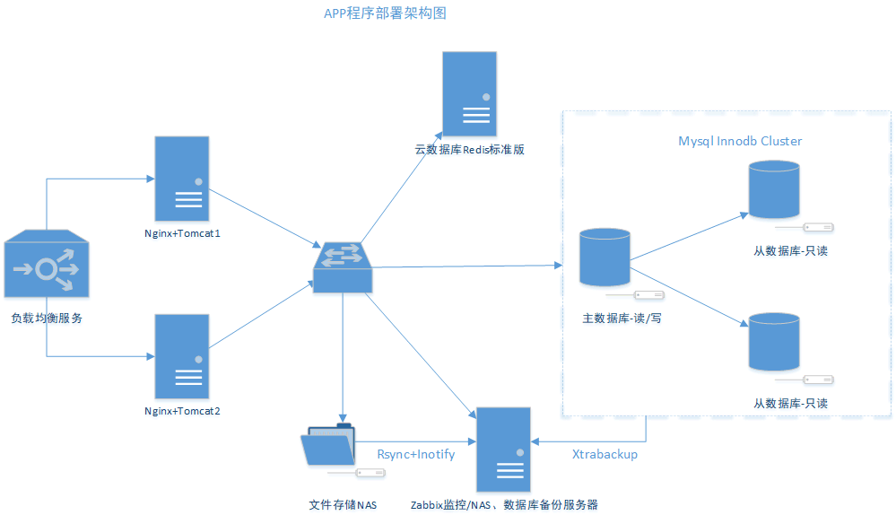

> **About this post**
>
> An illustrative architecture diagram of an APP going live, showing the complete path from user access to backend services: the CDN/SLB entry point, an Nginx reverse proxy, a Tomcat application cluster, a Redis cache, a MySQL master-slave database, and where the monitoring and backup components fit in.

> **Technical notes**
>
> The diagram is for reference only, yet the component choices (Nginx/Tomcat/Redis with MySQL master-slave) remain a common combination today. When implementing it, consider adding HTTPS certificates, a WAF, log collection (ELK/Loki), and an alerting pipeline; in cloud-native scenarios, Ingress + Service can replace a traditional Nginx setup.

---

For reference only
