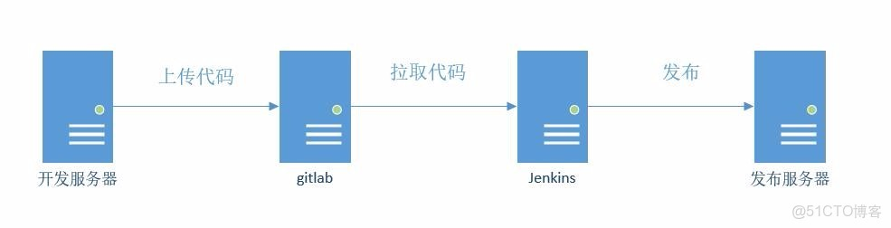
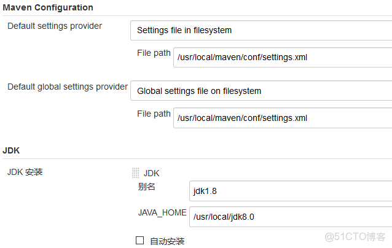
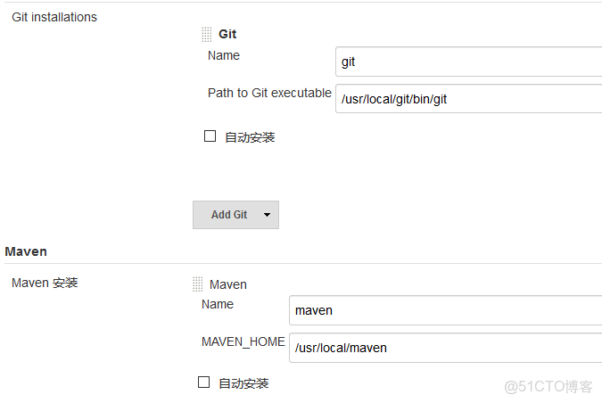
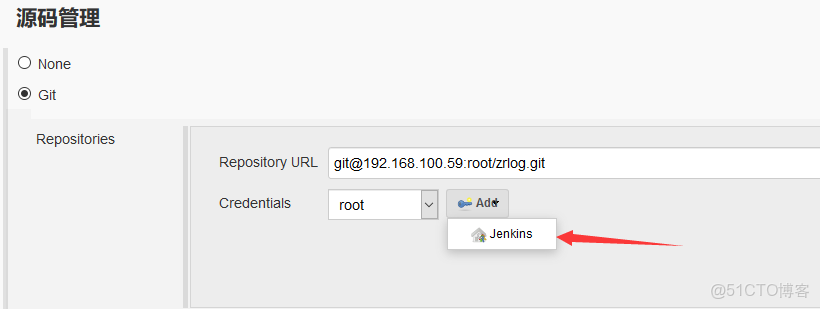
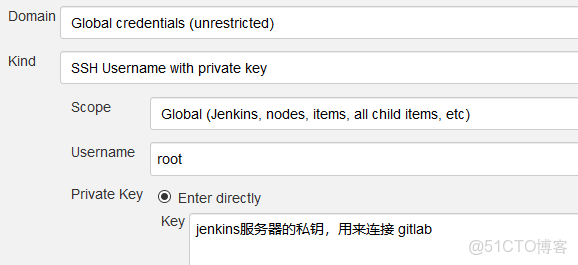
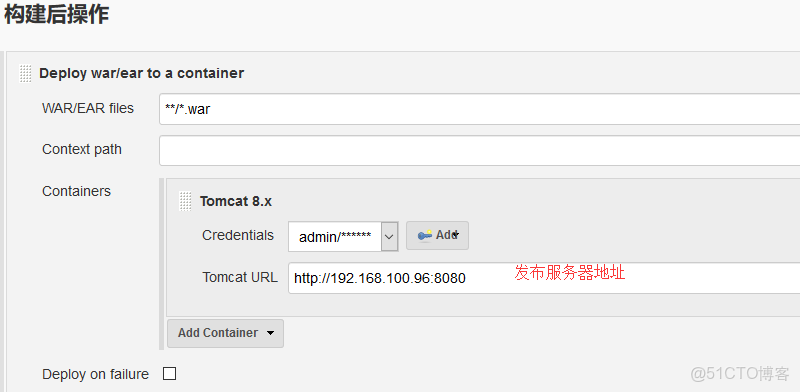
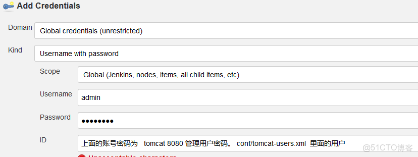

> **About this post**
>
> A continuous deployment workflow for Java projects based on Jenkins 2.89.4: drop jenkins.war into Tomcat to run it, build and install Git 2.9.5 and Maven 3.5.2 from source, manage the code with GitLab (using the zrlog project as an example), install the Git / Maven Integration / Deploy to container plugins, create a Maven project job, and after a successful build automatically deploy the war package to a remote Tomcat 8.

> **Technical notes**
>
> Jenkins 2.89.4 is an LTS release from 2018 that has long been out of support, and the official update site now enforces HTTPS (update-center.json must use https://updates.jenkins.io/update-center.json). For new installations, use the current LTS (which requires JDK 17/21). The "Deploy to container" plugin approach has been superseded by the more common Pipeline + SSH / container image approach; for Git and Maven, installing directly with the distribution's package manager is recommended instead of building from source.

---

### Architecture diagram



### Deploy the Tomcat and JDK environments

```shell
http://blog.51cto.com/hequan/1984005

cd /usr/local/tomcat/webapps/
wget  http://mirrors.jenkins.io/war-stable/latest/jenkins.war
```

#### Log in and initialize

#### Installing Git

```shell
yum install curl-devel expat-devel gettext-devel openssl-devel zlib-devel gcc-c++ perl-ExtUtils-MakeMaker wget autoconf -y
wget https://www.kernel.org/pub/software/scm/git/git-2.9.5.tar.gz
tar xf git-2.9.5.tar.gz
cd git-2.9.5
make configure
./configure --prefix=/usr/local/git
make
make install
echo "export PATH=$PATH:/usr/local/git/bin" > /etc/profile.d/git.sh
source /etc/profile.d/git.sh
```

#### Installing Maven

```shell
cd /usr/local/ &&  wget https://archive.apache.org/dist/maven/maven-3/3.5.2/binaries/apache-maven-3.5.2-bin.tar.gz    && \
tar -zxf apache-maven-3.5.2-bin.tar.gz && mv apache-maven-3.5.2 maven && mv apache-maven-3.5.2-bin.tar.gz   /usr/local/src \
&&  echo "export PATH=$PATH:/usr/local/maven/bin" > /etc/profile.d/maven.sh   &&
source /etc/profile.d/maven.sh
mvn --version
```

---

### Configure GitLab

`http://blog.51cto.com/hequan/2072267`

#### Log in | Settings -- SSH Keys

Copy the public key of the development server into the list above, then create the project.

```shell
ssh-keygen -t rsa -C "root"  -b 4096
cat  .ssh/id_rsa.pub
```

#### Configure the user and commit code

```shell
This example uses https://github.com/94fzb/zrlog.git as the test code

git config --global user.name "root"
git config --global user.email  "root@example.com"

git clone  git@192.168.100.59:root/zrlog.git
cd  zrlog
git  add  .
git commit -m "first"
git push -u origin master
```

---

### Settings

#### Manage Plugins -- Advanced -- Update Site

`URL http://updates.jenkins.io/update-center.json`

#### Install plugins

```shell
Git plugin
Maven Integration plugin
Deploy to container
```

#### Manage Jenkins -- Global Tool Configuration




---

### Start building

#### New item -- Build a Maven project






---

### Click Build Now

#### Log

```shell
channel stopped
Deploying /home/tomcat/.jenkins/workspace/zrlog/target/zrlog-1.9.0.war to container Tomcat 8.x Remote with context
  [/home/tomcat/.jenkins/workspace/zrlog/target/zrlog-1.9.0.war] is not deployed. Doing a fresh deployment.
  Deploying [/home/tomcat/.jenkins/workspace/zrlog/target/zrlog-1.9.0.war]
Finished: SUCCESS
```
