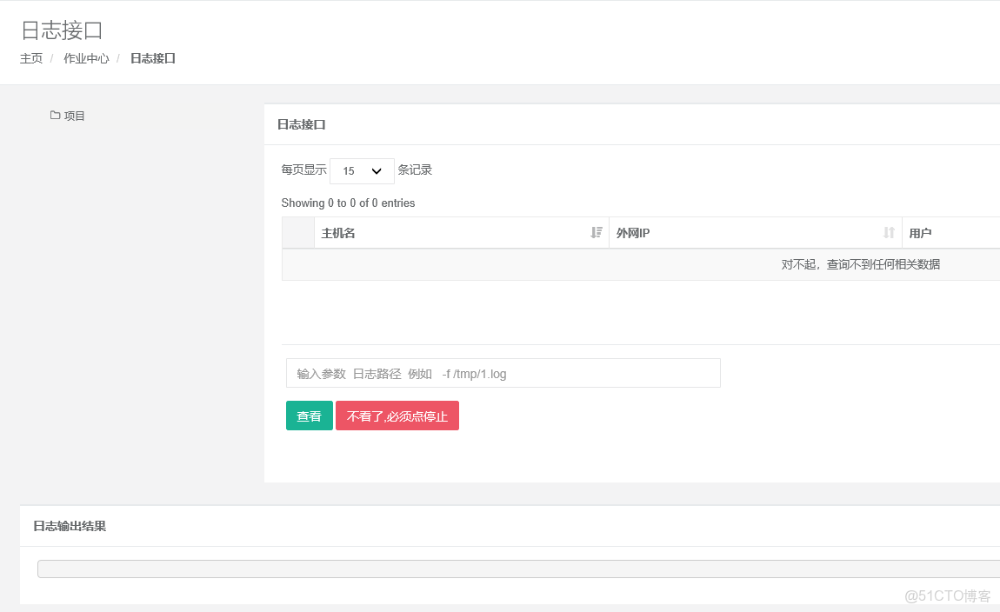

> **About this post**
>
> This post shows how to implement asynchronous, real-time viewing of remote server logs in a Django automation ops platform (the chain project) using channels 2.0.2 +
> WebSocket + channels_redis: the frontend tail page POSTs the host and the log path, the backend runs tail -f via paramiko and reads line by line,
> then pushes messages with group_send through the channel layer, grouped by the logged-in username; the browser opens a
> ws connection to consume them and prepends each line to the output area; clicking "Stop" sets an environment variable so the loop exits.
> The post gives the settings/asgi/routing/consumers configuration, the frontend buttons and the jQuery
> AJAX/WebSocket scripts, key urls and views code, plus the steps for manually compiling and installing Twisted 18.4.0
> and screenshots of the page effect.

> **Technical notes**
>
> 1. CentOS 7 reached end of maintenance (EOL) on June 30, 2024; migrating to Rocky Linux 9 / AlmaLinux 9 or the domestic openEuler is recommended.
> 2. channels 2.0.2 / asgi-redis and other versions of that era are very outdated; current channels 4.x
>    must be deployed with Daphne/Uvicorn. The `CHANNEL_LAYERS` syntax is basically unchanged, but
>    the dependency becomes channels-redis 4.x, and the interfaces differ on upgrade.
> 3. Corrections to the original: the project link had its domain stripped and has been restored to github.com; in views.py
>    the braces in the os.environ key "".format(user) were stripped and have been restored to "{}".format(user).

---

## 1. Project Example and Module Installation

For a working example, you can look at this project I wrote:

```text
https://github.com/hequan2017/chain
```

### The following modules need to be installed

After installation there will be a version-number error; it does not affect anything:

```shell
channels ==2.0.2
channels-redis==2.1.0
amqp==1.4.9
anyjson==0.3.3
asgi-redis==1.4.3
asgiref==2.3.0
async-timeout==2.0.0
attrs==17.4.0
```

Twisted 18.4.0 needs to be compiled and installed manually:

```shell
cd /tmp/
wget https://files.pythonhosted.org/packages/12/2a/e9e4fb2e6b2f7a75577e0614926819a472934b0b85f205ba5d5d2add54d0/Twisted-18.4.0.tar.bz2
tar xf Twisted-18.4.0.tar.bz2
cd Twisted-18.4.0
python3 setup.py install
```

After the installation is done, start redis.

## 2. How It Works

Clicking the view-log page starts a websocket connection and executes the command.

Based on the **logged-in username**, messages generated by the backend are returned, and the frontend is responsible for consuming them.

## 3. Directory Structure

```text
chain /
		chain/
				 settings.py
				 asgi.py
				 consumers.py
				 routing.py
		templates/
			   tasks/
				    tail.html
```

## 4. Django Configuration

settings.py:

```python
INSTALLED_APPS = [
    'channels',
]

# django-channels configuration
CHANNEL_LAYERS = {
    "default": {
        "BACKEND": "channels_redis.core.RedisChannelLayer",
        "CONFIG": {
            "hosts": [("127.0.0.1", 6379)],
        },
    },
}

# ASGI configuration
ASGI_APPLICATION = "chain.routing.application"
```

asgi.py:

```python
import os
import django
from channels.routing import get_default_application

os.environ.setdefault("DJANGO_SETTINGS_MODULE", "chain.settings")
django.setup()
application = get_default_application()
```

routing.py:

```python
from channels.auth import AuthMiddlewareStack
from channels.routing import URLRouter, ProtocolTypeRouter
from django.urls import path

from .consumers import EchoConsumer

application = ProtocolTypeRouter({
    "websocket": AuthMiddlewareStack(
        URLRouter([
            path(r"ws/", EchoConsumer),
            # path(r"stats/", StatsConsumer),
        ])
    )
})
```

## 5. consumers.py

```python
from asgiref.sync import async_to_sync
from channels.generic.websocket import WebsocketConsumer

from channels.layers import get_channel_layer

channel_layer = get_channel_layer()

class EchoConsumer(WebsocketConsumer):
    def connect(self):
        # Create a channels group named after the username and write it to redis via channel_layer
        async_to_sync(self.channel_layer.group_add)(self.scope['user'].username, self.channel_name)

        # Handed back to the receive method for processing
        self.accept()

    def receive(self, text_data):
        async_to_sync(self.channel_layer.group_send)(
            self.scope['user'].username,
            {
                "type": "user.message",
                "text": text_data,
            },
        )

    def user_message(self, event):
        # Consume
        self.send(text_data=event["text"])

    def disconnect(self, close_code):
        async_to_sync(self.channel_layer.group_discard)(self.scope['user'].username, self.channel_name)
```

## 6. Web Page Setup

### Logic



1. The tail page POSTs the host information and the log path to view to the backend;
2. The backend uses paramiko to execute the command and keeps reading this interface; it first returns the existing content once, and whenever new logs are generated, it returns them to the frontend again;
3. Clicking Stop modifies an environment variable; once the paramiko code above detects that this variable is false, it stops executing the command.

The buttons and output container in tail.html:

```html
<a id="tail" class="btn btn-primary"  type="submit">View</a>
<a id="tail_stop" class="btn btn-danger"  type="submit">Done watching, you must click Stop</a>

 <div class="ibox-content" >
         <pre id="output_append" ></pre>
 </div>
```

JS part: clicking "View"/"Stop" POSTs to the corresponding endpoint respectively; a WebSocket connection is established as soon as the page loads to consume backend pushes:

```javascript
$(function () {

            $(document).on('click','#tail',function () {

                    $.ajax({
                        url: "",
                        timeout : 5000, // timeout in milliseconds
                        type: 'POST',
                        data: $('.cmd_from').serialize(),
                        success: function (data) {
                            var obj = JSON.parse(data);
                                if (obj.status) {
                                    toastr.success("Executed successfully!")
                            } else {
                                 toastr.error(obj.error)
                            }

                        }
                    })
                });

              $(document).on('click','#tail_stop',function () {

                    $.ajax({
                        url: "",
                        timeout : 5000, // timeout in milliseconds
                        type: 'POST',
                        data: {"status":"stop"},
                        success: function (data) {
                            var obj = JSON.parse(data);
                                if (obj.status) {
                                    toastr.success("Stopped successfully!")
                            } else {
                                 toastr.success("Failed to stop!")
                            }

                        }
                    })
                });
            });

 $(document).ready(function () {
    CreateWebSocket();
});

function CreateWebSocket() {
    var socket = new WebSocket('ws://' + window.location.host + '/ws/');
    socket.onmessage = function (message) {
        var result = JSON.parse(message.data);
        var status = result.status;
        var data = result.data;
        var output_html = '';
        if (status === 0) {
{#            $('#output_append').empty();#}
            output_html = data;
        }
        else if (status === 1) {
            $('#output_append').empty();
            output_html = data;
        }
        $("#output_append").prepend(output_html);
    }
}
```

## 7. urls.py and views.py

urls.py:

```python
path('tail.html', views.TasksTail.as_view(), name='tail'),
    path('tailperform.html', views.taskstailperform, name='tail_perform'),
    path('tailperform-stop.html', views.taskstailstopperform, name='tail_perform_stop'),
```

views.py:

```python
from asgiref.sync import async_to_sync
from channels.layers import get_channel_layer
import json
import paramiko

def taillog(request, hostname, port, username, password, private, tail):
    """
    Execute the tail log interface
    """
    channel_layer = get_channel_layer()
    user = request.user.username
    os.environ["{}".format(user)] = "true"
    ssh = paramiko.SSHClient()
    ssh.set_missing_host_key_policy(paramiko.AutoAddPolicy())
    if password:
        ssh.connect(hostname=hostname, port=port, username=username, password=decrypt_p(password))
    else:
        pkey = paramiko.RSAKey.from_private_key_file(private)
        ssh.connect(hostname=hostname, port=port, username=username, pkey=pkey)
    cmd = "tail " + tail
    stdin, stdout, stderr = ssh.exec_command(cmd, get_pty=True)
    for line in iter(stdout.readline, ""):
        if os.environ.get("{}".format(user)) == 'false':
            break
        result = {"status": 0, 'data': line}
        result_all = json.dumps(result)
        async_to_sync(channel_layer.group_send)(user, {"type": "user.message", 'text': result_all})

def taskstailperform(request):
    """
    Execute the tail_log command
    """
    if request.method == "POST":
        ret = {'status': True, 'error': None, }
        name = Names.objects.get(username=request.user)
        ids = request.POST.get('id')
        tail = request.POST.get('tail', None)

        if not ids or not tail:
            ret['status'] = False
            ret['error'] = "Please select a server and enter the parameters and the log path."
            return HttpResponse(json.dumps(ret))

        obj = AssetInfo.objects.get(id=ids)

        try:
            taillog(request, obj.network_ip, obj.port, obj.user.username, obj.user.password, obj.user.private_key, tail)
        except Exception as e:
            ret['status'] = False
            ret['error'] = "Error {0}".format(e)
            logger.error(e)
        return HttpResponse(json.dumps(ret))

def taskstailstopperform(request):
    """
    Execute the tail_log command
    """
    if request.method == "POST":
        ret = {'status': True, 'error': None, }
        name = request.user.username
        os.environ["{}".format(name)] = "false"
        return HttpResponse(json.dumps(ret))
```
