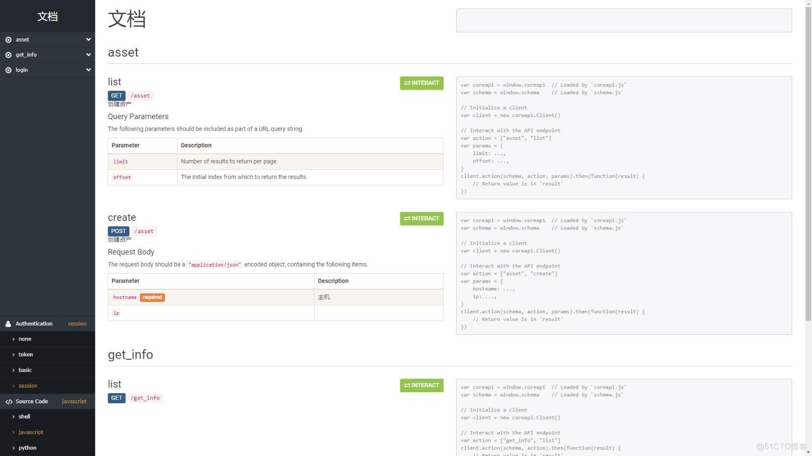

> **About this post**
>
> This post demonstrates how to use the `include_docs_urls` that ships with Django REST framework to auto-generate API documentation: after mounting the `docs/` route in urls.py, DRF combines the `help_text` of serializer fields with view docstrings to render a documentation page that includes parameter descriptions and interactive online debugging. Using a simple Asset model as an example, it shows the matching code for models, serializers, and views.

> **Technical notes**
>
> The built-in `include_docs_urls` in DRF depends on coreapi; this approach was deprecated as of DRF 3.10 and removed in DRF 3.16. The officially recommended solution today is the OpenAPI-based drf-spectacular (or the older drf-yasg) for generating Swagger/Redoc API documentation.

---

### Auto-Generating API Documentation

#### Installation

```shell
pip install djangorestframework
```

#### urls.py

```python
from rest_framework.documentation import include_docs_urls

    path('docs/', include_docs_urls(title='Docs')),

```

#### models.py

```python
from django.db import models

# Create your models here.

class Asset(models.Model):

    hostname = models.CharField(max_length=64, verbose_name='hostname', unique=True)
    ip = models.CharField(max_length=30, verbose_name='ip', blank=True, null=True, )

    class Meta:
        db_table = "asset"
        verbose_name = "asset"
        verbose_name_plural = verbose_name

    def __str__(self):
        return self.hostname
```

#### serializers.py

```python
from rest_framework import serializers
from .models import Asset

class AssetSerializer(serializers.ModelSerializer):
    hostname = serializers.CharField(help_text='host')

    class Meta:
        model = Asset
        fields = '__all__'
```

#### views.py

```python
import json
from django.shortcuts import HttpResponse
from rest_framework import permissions
from rest_framework import generics
from rest_framework.views import APIView
from .serializers import AssetSerializer
from .models import Asset

class AssetInfo(generics.ListCreateAPIView):
    """
    Asset
    """
    queryset = Asset.objects.get_queryset().order_by('id')
    serializer_class = AssetSerializer
    permission_classes = (permissions.IsAdminUser,)
```

#### Docs


