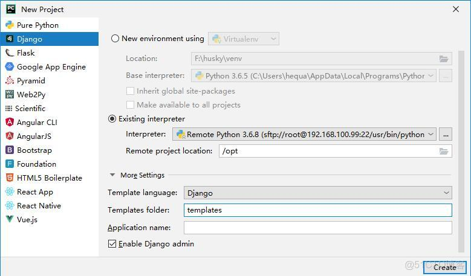

> **About this post**
>
> The first post in the "Getting Started with Django: A CMDB System" series. The goal is to go from zero
> to writing a simple CMDB system on your own; the series follows the MVC pattern (Django renders the HTML).
> This post builds the base environment: it covers the advantages of the Django framework, lists the
> environment (CentOS 7.6, Python 3.6, Django 2.2, MySQL 5.7, PyCharm remote development), and walks
> through installing Python 3.6 and Django on the remote host, configuring an SSH interpreter in PyCharm,
> deploying MySQL with Docker, configuring the database in settings and running migrations to create the
> tables, and finally getting runserver up and logging into admin.

> **Technical notes**
>
> 1. CentOS 7 reached end of maintenance (EOL) on June 30, 2024; migrating to Rocky Linux 9 / AlmaLinux 9 or the domestic openEuler is recommended.
> 2. Python 3.6 (December 2021), Django 2.2 LTS (April 2022), and MySQL 5.7 (October 2023) have all reached end of support; the environment in this post is only suitable for reproducing legacy projects.
> 3. The IUS third-party repository used here (centos7.iuscommunity.org) is no longer maintained and its URL is dead; to install Python 3 today, EPEL or building from source is recommended. The Docker registry mirror in daemon.json is the author's personal mirror address and must be replaced with one that works for you.
> 4. Manually commenting out the mysqlclient version check in the django/db/backends/mysql source only applies to early Django 2.x; newer Django versions need no such change (and package source should not be modified).
> 5. Corrections to the original text: the GitHub link, QQ group number, and Docker mirror address in the preface were truncated/garbled during scraping and have been restored from doc/1.md in the author's repository hequan2017/husky; two code fences that had been split apart have been merged, and "pip 3" has been corrected to "pip3".

---

## 1. Preface

> Author: He Quan, GitHub: https://github.com/hequan2017  QQ group: 620176501

> With this tutorial you can get started from zero and learn to write a simple CMDB system on your own.

> There are currently two mainstream development approaches: MVC and MVVC. This tutorial uses MVC,
> i.e. Django renders the HTML. A getting-started tutorial for MVVC (front-end/back-end separation) will follow later.

> Tutorial project: https://github.com/hequan2017/husky/

> Tutorial docs: https://github.com/hequan2017/husky/tree/master/doc


## 2. Overview

> A framework is a reusable design of the whole or part of a system, expressed as a set of abstract
> components and the ways component instances interact with each other; another definition sees a
> framework as an application skeleton that application developers can customize.

> Django is a well-known web framework for Python.

- Django advantages
  - Ships with many batteries included for rapid development, e.g. Auth, Cache, templates
  - Native MVC design pattern
  - A practical admin backend
  - Built-in core components: ORM, Template, Form, Auth
  - Clean URL design
  - A rich plugin ecosystem

## 3. Technical Prerequisites

> You need basic Python coding ability, some HTML/JS fundamentals, and a rough idea of what Django is.

## 4. Environment

- MVC pattern
- CentOS 7.6
- Python 3.6
- Django 2.2
- MySQL 5.7
- PyCharm 2019.2 (remote development on CentOS from Windows)
- VMware Workstation 15.5.0
- Project name: husky
- CBV programming style

## 5. Remote Environment Setup

- Install the CentOS 7.6 OS
- Install Python 3.6

```shell
yum install epel-release -y

yum -y install sqlite  sqlite-devel
yum install  python-devel mysql-devel  python36-devel.x86_64  -y

sudo yum -y install https://centos7.iuscommunity.org/ius-release.rpm

yum install python36  python36-setuptools  -y
easy_install-3.6 pip
python3.6  -m  pip  install   --upgrade  pip

mv   /usr/bin/python  /tmp/
ln -s /usr/bin/python3.6    /usr/bin/python

sed  -i    's/\#\!\/usr\/bin\/python/\#\!\/usr\/bin\/python2/'   /usr/bin/yum
sed  -i    's/\#\! \/usr\/bin\/python/\#\! \/usr\/bin\/python2/'   /usr/libexec/urlgrabber-ext-down

mkdir -p  /root/.pip/

cat >  /root/.pip/pip.conf   <<EOF
[global]
trusted-host=mirrors.aliyun.com
index-url=http://mirrors.aliyun.com/pypi/simple/
EOF

python -V
```

- Install Django

> pip3 install django==2.2.6

## 6. Local Development Configuration

- Configure PyCharm

> file-->settings-->project interpreter--> add --> ssh interpreter: set up the remote Python environment

> Set the interpreter to /usr/bin/python3.6   and select the directory `<Project root>`→/opt

> file--> new project --> django



## 7. Deploying the Database

- For speed, deploy it with Docker.

```shell
mkdir -p  /data/docker
mkdir -p /data/mysql5722

sudo yum install -y yum-utils device-mapper-persistent-data lvm2

sudo yum-config-manager --add-repo http://mirrors.aliyun.com/docker-ce/linux/centos/docker-ce.repo

sudo yum makecache fast
sudo yum -y install docker-ce

docker version
systemctl enable docker.service
systemctl start docker.service

sudo mkdir -p /etc/docker
sudo tee /etc/docker/daemon.json <<-'EOF'
{"registry-mirrors": ["https://890km4uy.mirror.aliyuncs.com"],"graph": "/data/docker"}
EOF
sudo systemctl daemon-reload

sudo systemctl restart docker
```

```shell
mkdir -p /data/mysql5722
mkdir -p /data/mysql5722-cnf

docker run -itd \
--name mysql \
-p 3306:3306 \
--mount type=bind,src=/data/mysql5722,dst=/var/lib/mysql \
--mount type=bind,src=/data/mysql5722-cnf,dst=/etc/mysql \
-e MYSQL_ROOT_PASSWORD=123456  \
mysql:5.7.22 --character-set-server=utf8

yum remove mariadb  -y
yum install  mariadb    -y
mysql -uroot  -p123456 -h 192.168.100.99
create database  husky;
```

## 8. Configuring the Django Database

> husky --> settings

```python
ALLOWED_HOSTS = ['*']   ## allow access from all hosts

DATABASES = {
    'default': {
        'ENGINE': 'django.db.backends.mysql',
        'HOST': '192.168.100.99',
        'PORT': '3306',
        'NAME': 'husky',
        'USER': 'root',
        'PASSWORD': '123456',
    }
}

# DATABASES = {
#     'default': {
#         'ENGINE': 'django.db.backends.sqlite3',
#         'NAME': os.path.join(BASE_DIR, 'db.sqlite3'),
#     }
# }
```

- Modify the Python source files

```text
vim /usr/local/lib64/python3.6/site-packages/django/db/backends/mysql/base.py

35 #if version < (1, 3, 13):   comment out these two lines
36 #    raise ImproperlyConfigured('mysqlclient 1.3.13 or newer is required; you have %s.' % Database.__version__)

vim /usr/local/lib64/python3.6/site-packages/django/db/backends/mysql/operations.py

145         if query is not None:
146             query = query.encode(errors='replace')   ## modify this line
```

- Run the database initialization

> PyCharm: menu bar Tools --> choose Run manage.py task

> makemigrations    generates the migration data files

> migrate           creates the table structure from those files

> createsuperuser

---

> Set the PyCharm project run address to 192.168.100.99

> Start the Django project from PyCharm (not from the command line)

```text
# PyCharm console output
ssh://root@192.168.100.99:22/usr/bin/python3.6 -u /opt/manage.py runserver 192.168.100.99:8000
Watching for file changes with StatReloader
Performing system checks...

System check identified no issues (0 silenced).
October 31, 2019 - 09:33:33
Django version 2.2.6, using settings 'husky.settings'
Starting development server at http://192.168.100.99:8000/
Quit the server with CONTROL-C.
```

## 9. Miscellaneous

> Test the login at http://192.168.100.99:8000/admin and enter the username and password.

> Create a requirements.txt file

```shell
pip3 freeze > requirements.txt
```

```shell
pip3 install -r  requirements.txt    ## install all modules; when new modules are added, add them here
```
