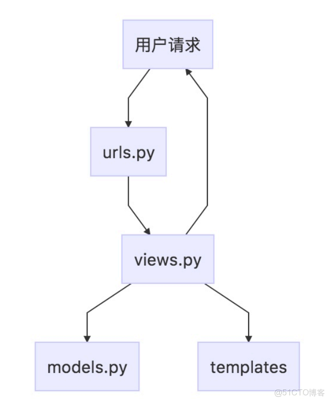

> **About this post**
>
> This is the third post in the "Getting Started with Django: CMDB System" series. Building on the basic environment
> and front-end templates from the previous two posts, it completes the user system for the project:
> subclassing AbstractUser to redefine the user table and configuring AUTH_USER_MODEL,
> writing a custom authentication backend so users can log in with username or email, and implementing the login and
> logout views with their routes one by one;
> then implementing password change based on a Django Form and the UpdateView class-based view, and finally
> registering the Admin site to manage users.

> **Technical notes**
>
> The code in this post is based on Django 2.x from 2019. The 2.x series (including 2.2 LTS) all reached EOL in
> April 2022; as of 2026 the mainline is Django 5.x/6.x (the author's husky repository has since been upgraded to
> Django 5.2).
> `AbstractUser` + `AUTH_USER_MODEL`, a custom `ModelBackend`, `LoginRequiredMixin`/`UpdateView`,
> `authenticate(request, ...)` are still the officially recommended approaches and remain usable; however,
> `django.conf.urls.include` should be imported from `django.urls` instead; `USE_L10N` was deprecated in Django 4.0
> and removed in 5.0, so that setting must be deleted;
> `AUTH_USER_MODEL` should be decided before the first migrate, and the "drop and recreate the database" step in this
> post only applies to early-stage development.
> As for dependencies, django-pure-pagination and django-bootstrap3 are both long-established third-party packages;
> verify compatibility before upgrading.
> Using PyMySQL as the MySQL driver still works, but Django officially recommends mysqlclient.

---

## 1. Preface

> Author: He Quan, GitHub: https://github.com/hequan2017   QQ group: 620176501

> With this tutorial you can get started from scratch and independently build a simple CMDB system.

> Currently mainstream development approaches fall into two categories: MVC and MVVC. This tutorial follows the MVC
> approach, i.e., Django renders the HTML. A getting-started tutorial on MVVC (front-end and back-end separation)
> will come later.

> Tutorial project: https://github.com/hequan2017/husky/

> Tutorial documentation: https://github.com/hequan2017/husky/tree/master/doc


## 2. Home Page

> PyCharm: menu bar Tools --> choose Run manage.py Task

> manage.py@husky > startapp system    # Create an APP for managing the system

> See the actual pages for the details; below only the key code is shown.



- husky/urls.py

```python
from django.contrib import admin
from django.urls import path
from system.views import index
from django.conf.urls import include

urlpatterns = [
    path('admin/', admin.site.urls),
    path('', index),
    path('index', index, name="index"),
    path('system/', include('system.urls', namespace='system')),  ## Include the urls file of system
]
```

- system/__init__.py    create a new empty file
- system/views.py       handles the logic

```python
def index(request):
    """
    Home page
    :param request:
    :return:
    """
    return render(request, 'system/index.html',{})  #render combines a given template with a given context dictionary and returns a rendered HttpResponse object.
```

## 3. Login

- system/models.py     table structure

> Inherit the user table structure and rebuild the user table

> A Python class that describes a data table is called a model. With this class, you can create, retrieve, update,
> and delete records in the database with simple Python code, without writing one SQL statement after another. This
> is the legendary ORM (Object Relation Mapping).

```python
from django.db import models
from django.contrib.auth.models import AbstractUser

class Users(AbstractUser):  # AbstractUser  inherit this table to redefine user
    """
    Adds fields on top of the Django table; use this table wherever the user is needed
    """
    position = models.CharField(max_length=64, verbose_name='Position', blank=True, null=True)
    avatar = models.CharField(max_length=256, verbose_name='Avatar', blank=True, null=True)
    mobile = models.CharField(max_length=11, verbose_name='Mobile', blank=True, null=True)

    class Meta:
        db_table = 'users'
        verbose_name = 'User info'
        verbose_name_plural = verbose_name

    def __str__(self):
        return self.username
```

> Because the default user table was changed, you need to drop the database first and then rebuild it.

```shell
drop database husky;
create database husky;
```

> PyCharm: menu bar Tools --> choose Run manage.py Task

> makemigrations    generate the migration files

> migrate           execute the files to create the table structures

> createsuperuser

- settings.py    add system configuration

```python
import sys
INSTALLED_APPS = [   # Fill in the apps you created; a project can contain multiple apps
    "system",
    'bootstrap3'
]

AUTH_USER_MODEL = 'system.users'
AUTHENTICATION_BACKENDS = ('system.views.CustomBackend',)  ## Custom login authentication, so the email can also be used to log in

SESSION_ENGINE = 'django.contrib.sessions.backends.db'
SESSION_COOKIE_SAMESITE = 'Lax'
CSRF_COOKIE_SAMESITE = 'Lax'
SESSION_COOKIE_AGE = 432000
LOGIN_URL = '/auth/login'
LANGUAGE_CODE = 'zh-Hans'

TIME_ZONE = 'Asia/Shanghai'

USE_I18N = True
USE_L10N = False
USE_TZ = True
DATETIME_FORMAT = 'Y-m-d H:i:s'
DATE_FORMAT = 'Y-m-d'

# logging
LOGGING = {
    'version': 1,
    'disable_existing_loggers': False,
    'formatters': {
        'verbose': {
            'format': '[argus] %(levelname)s %(asctime)s %(module)s %(message)s'
        }
    },
    'handlers': {
        'console': {
            'level': 'DEBUG',
            'class': 'logging.StreamHandler',
            'stream': sys.stdout,
            'formatter': 'verbose'
        },
    },
    'loggers': {
        'tasks': {
            'handlers': ['console'],
            'level': 'DEBUG',
            'propagate': True,
        },
        'asset': {
            'handlers': ['console'],
            'level': 'DEBUG',
            'propagate': True,
        },
    },
}

# table
PAGINATION_SETTINGS = {
    'PAGE_RANGE_DISPLAYED': 3,
    'MARGIN_PAGES_DISPLAYED': 2,
    'SHOW_FIRST_PAGE_WHEN_INVALID': True,
}

# data displayed per table page
DISPLAY_PER_PAGE = 15
```

- system/views.py

> A view contains the business logic of the project; that is what we call a view, and it is what we mainly write
> during development.

```python
def login_view(request):
    """
    Login
    :param request: username,password
    :return:
    """

    error_msg = "Wrong username or password, or the account is disabled. Please try again"

    if request.method == "GET":
        return render(request, 'system/login.html', {'error_msg': error_msg, })

    if request.method == "POST":
        u = request.POST.get("username")
        p = request.POST.get("password")
        user = authenticate(request, username=u, password=p)
        if user is not None:
            if user.is_active:
                login(request, user)
                request.session['is_login'] = True
                login_ip = request.META['REMOTE_ADDR']
                return redirect('/index')  ## Redirect to a specific URL
            else:
                return render(request, 'system/login.html', {'error_msg': error_msg, })
        else:
            return render(request, 'system/login.html', {'error_msg': error_msg, })

class CustomBackend(ModelBackend):
    """
    Log in with username or email
    :param request:
    :return:
    """
    def authenticate(self, request, username=None, password=None, **kwargs):
        try:
            user = Users.objects.get(Q(username=username) | Q(email=username))
            if user.check_password(password):
                return user
        except Exception as e:
            logger.error(e)
            return None
```

- system/urls.py   routes

> It specifies which URL invokes which view. In this example, the /latest/ URL invokes the latest_books()
> function. In other words, if your domain is example.com, anyone visiting http://example.com/latest/ will
> trigger the latest_books() function, which returns the result to the user.

```python
from django.urls import path
from system.views import login_view

app_name = "system"

urlpatterns = [
    path('login', login_view, name="login")
]
```

- templates/system/login.html

> Put simply, it is an HTML template that describes the interface structure of the project. The template engine also
> ships with some built-in tags.

> The login page does not extend base.html; it is a standalone page.

```html
<h3>Welcome, please log in to the system</h3>
        <form class="m-t" role="form" action="" method="POST">
            
            <div class="form-group">
                <input type="text" name="username" class="form-control" placeholder="Username" required="">
            </div>
            <div class="form-group">
                <input type="password" name="password" class="form-control" placeholder="Password" required="">
            </div>
            <button type="submit" class="btn btn-primary block full-width m-b">Login</button>

            <a rel="nofollow" href="#">
                <span style="color: red;"> {{ error_msg }}</span><br>
              IE/360 browsers (compatibility mode) are not recommended for browsing!<br />

            </a>
            </form>
```

## 4. Logout

- system/views.py

```python
def logout_view(request):
    """
    Logout
    :param request:
    :return:
    """
    logout(request)
    return redirect('system:login')
```

- system/urls.py

```python
path('logout', logout_view, name="logout"),
```

- templates/base/_navbar-static-top.html

```html
<li>
        <a rel="nofollow" href="">
                    <i class="fa fa-sign-out"></i> Logout
                </a>
            </li>
```

## 5. Change Password

- system/form.py

> Forms are a basic feature of the web side, and the comprehensive Django framework naturally ships with ready-made
> base form objects. This section explains in detail how to use the form classes in Python's Django framework.

- Features of Django forms
  - Automatically generates HTML form elements
  - Validates the form data
  - If validation fails, redisplays the form (the data is not reset)
  - Converts data types (string data is converted to the corresponding Python types)

```python
from django import forms

class UserPasswordForm(forms.Form):
    old_password = forms.CharField(max_length=128, widget=forms.PasswordInput, label='Old password')
    new_password = forms.CharField(min_length=8, max_length=128, widget=forms.PasswordInput, label='New password',
                                   help_text="* Your password must contain at least 8 characters, cannot be a commonly used password, and cannot be all digits")
    confirm_password = forms.CharField(min_length=8, max_length=128, widget=forms.PasswordInput, label='Confirm password',
                                       help_text="* Must match the password above")

    def __init__(self, *args, **kwargs):
        self.instance = kwargs.pop('instance')
        super().__init__(*args, **kwargs)

    def clean_old_password(self):
        old_password = self.cleaned_data['old_password']
        if not self.instance.check_password(old_password):
            raise forms.ValidationError('Wrong old password')
        return old_password

    def clean_confirm_password(self):
        new_password = self.cleaned_data['new_password']
        confirm_password = self.cleaned_data['confirm_password']

        if new_password != confirm_password:
            raise forms.ValidationError('The new password and the confirmation password do not match')
        return confirm_password

    def save(self):
        password = self.cleaned_data['new_password']
        self.instance.set_password(password)
        self.instance.save()
        return self.instance
```

- system/views.py

```python
class UserPasswordUpdateView(LoginRequiredMixin, UpdateView):
    """
    Change password
    :param request:
    :return:
    """
    template_name = 'system/password.html'
    model = Users
    form_class = UserPasswordForm
    success_url = reverse_lazy('system:logout')

    def get_object(self, queryset=None):
        return self.request.user

    def get_context_data(self, **kwargs):
        return super().get_context_data(**kwargs)

    def get_success_url(self):
        return super().get_success_url()
```

- system/urls.py

```python
path('password_update', UserPasswordUpdateView.as_view(), name="password_update"),
```

- templates/system/password.html

```html
<div class="wrapper wrapper-content animated fadeInRight">
    <form method="post" class="form-horizontal" action="" enctype="multipart/form-data">
        

        
            <div class="alert alert-danger" style="margin: 20px auto 0px">
                {{ form.non_field_errors }}
            </div>
        
        <div class="form-group">
            <div class="col-sm-10 col-sm-offset-0"> {{ msg }}
                
                
                </div>
        </div>

        <div class="form-group">
            <div class="col-sm-4 col-sm-offset-3">

                <button id="submit_button" class="btn btn-primary" type="submit">Submit</button>
                <button class="btn btn-white" type="reset">Reset</button>
            </div>
        </div>
    </form>
</div>
```

## 6. Admin Backend

- system/admin.py

> Configuration file for the admin interface; each app can create one.

```python
from django.contrib import admin
from system.models import Users
from django.contrib.auth.admin import UserAdmin

class UsersAdmin(UserAdmin):
    fieldsets = (
        (None, {'fields': ('username', 'password')}),
        ('Basic info', {'fields': ('first_name', 'last_name', 'email')}),
        ('Permissions', {'fields': ('is_active', 'is_staff', 'is_superuser', 'groups', 'user_permissions')}),
        ('Login times', {'fields': ('last_login', 'date_joined')}),
        ('Other info', {'fields': (
            'position', 'avatar', 'mobile',)}),
    )

    @classmethod
    def show_group(self, obj):
        return [i.name for i in obj.groups.all()]

    @classmethod
    def show_user_permissions(self, obj):
        return [i.name for i in obj.user_permissions.all()]

    list_display = ('username', 'show_group', 'show_user_permissions')
    list_display_links = ('username',)
    search_fields = ('username',)
    filter_horizontal = ('groups', 'user_permissions')

admin.site.register(Users, UsersAdmin)
admin.site.site_header = 'Admin backend'
admin.site.site_title = admin.site.site_header
```

## 7. Miscellaneous

- The migrations directory stores the table-structure files auto-generated by Django; the system creates the database
  tables based on these generated files. To regenerate the database, delete the generated files inside it.
