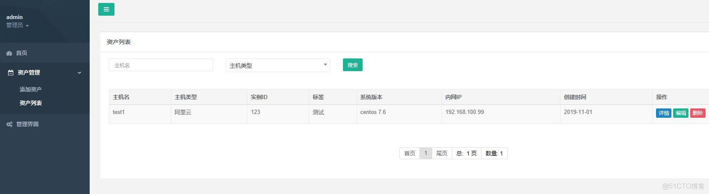

> **About this post**
>
> This is Part 4 of the Getting Started with Django: A CMDB System series, focusing on CRUD
> operations for asset data. Basic setup: create the asset app, write the Ecs model and a
> ModelForm, and register the admin plus a custom filter. Create and update share one form
> page, built on CreateView/UpdateView, with __next__ recording the return URL. The list page
> uses a get_list decorator to assemble search conditions, Paginator for pagination, and
> DataTables for sorting and export. Deletion goes through AJAX with a sweetalert
> confirmation, the detail page uses DetailView, and permission checks run throughout.

> **Technical notes**
>
> This post was written in 2019 and reflects Django 2.x conventions; Django 2.2 LTS ended
> official support in April 2022 and the entire 2.x line is EOL. For new projects, prefer a
> still-maintained LTS (4.2 / 5.2) and migrate per the official guidance.
> The  template tag was removed in Django 3.0 and must be rewritten as
> . The ecs_list.pages, page.querystring and Paginator(request=...) used here
> are not built into Django; they rely on a third-party pagination library such as
> django-pure-pagination (itself long unmaintained). The front-end sweetalert is the legacy
> v1 API, and the DataTables oLanguage configuration is also old-style.

---

## 1. Preface

> Author: He Quan, GitHub: https://github.com/hequan2017   QQ group: 620176501
>
> With this tutorial you can go from zero to being able to write a simple CMDB system on your own.
>
> There are two mainstream development approaches: MVC and MVVM. This tutorial uses the MVC
> approach, i.e., Django renders the HTML. A getting-started tutorial on MVVM
> (front-end/back-end separation) will follow later.
>
> Tutorial project: https://github.com/hequan2017/husky/
>
> Tutorial docs: https://github.com/hequan2017/husky/tree/master/doc



## 2. Notes: CBV and FBV

- cbv  handle requests with a class in the view  (the approach used below; a bit more abstract, but more concise)
- fbv  handle requests with a function in the view

## 3. Basic Setup

> PyCharm: menu bar Tools --> select  Run  manage.py Task
>
> manage.py@husky > startapp  asset    ## create the asset app
>
> See the actual pages for the full content; below only the key code is shown.

- settings.py    add the system configuration

```python
import sys
INSTALLED_APPS = [
    "asset",
]
```

- asset/models.py

```python
from django.db import models

class Ecs(models.Model):
    TYPE_CHOICES = (
        ('Alibaba Cloud', 'Alibaba Cloud'),
        ('Tencent Cloud', 'Tencent Cloud'),
        ('Huawei Cloud', 'Huawei Cloud'),
        ('Amazon', 'Amazon'),
        ('Other', 'Other'),
        (None,None),
    )
    hostname = models.CharField(max_length=96, verbose_name='Hostname', blank=True, null=True, )
    type = models.CharField(choices=TYPE_CHOICES, max_length=16, verbose_name='Host type', blank=True, null=True, )
    instance_id = models.CharField(max_length=64, verbose_name='Instance ID', unique=True)
    instance_name = models.CharField(max_length=96, verbose_name='Tag', blank=True, null=True, )
    os_name = models.CharField(max_length=64, verbose_name='OS version', blank=True, null=True, )
    cpu = models.IntegerField(verbose_name='CPU', blank=True, null=True)
    memory = models.IntegerField(verbose_name='Memory', blank=True, null=True)
    private_ip = models.GenericIPAddressField(verbose_name='Private IP', blank=True, null=True)
    public_ip = models.GenericIPAddressField(verbose_name='Public IP', blank=True, null=True)

    c_time = models.DateTimeField(auto_now_add=True, null=True, verbose_name='Created time', blank=True)
    u_time = models.DateTimeField(auto_now=True, null=True, verbose_name='Updated time', blank=True)

    class Meta:
        db_table = "ecs"
        verbose_name = "Host"
        verbose_name_plural = verbose_name

    def __str__(self):
        return self.hostname
```

> PyCharm: menu bar Tools --> select  Run  manage.py Task
>
> makemigrations    generate the migration files
>
> migrate           run the files to create the table structures

- asset/form.py

```python
from django import forms
from asset.models import Ecs

class EcsForm(forms.ModelForm):
    class Meta:
        model = Ecs
        fields = '__all__'

        widgets = {
            'type': forms.Select(
                attrs={'class': 'select2',
                       'data-placeholder': '----Please select an environment----'}),
        }

        help_texts = {
            'type': '* Please select the platform the asset belongs to.',

        }

    def clean_type(self):
        """
        Custom validation
        :return:
        """
        type = self.cleaned_data['type']
        return type
```

- asset/admin.py

```python
from django.contrib import admin
from asset.models import Ecs

admin.site.register(Ecs)
```

- Custom template filter
  - asset/templatetags/asset_filter.py

```python
from django import template
from django.apps import apps
from asset.models import Ecs
register = template.Library()

@register.filter(name='ecs_model_choices')
def ecs_model_choices(model_name, choice_name):
    asset_app = apps.get_app_config('assets')
    return getattr(asset_app.get_model(model_name), choice_name)

@register.filter(name='ecs_type_choices')
def ecs_type_choices(value):
    return Ecs.TYPE_CHOICES
```

## 4. Create

- asset/views.py

```python
class EcsCreateView(LoginRequiredMixin, PermissionRequiredMixin, CreateView):
    """
    Ecs creation
    """
    permission_required = ('asset.add_ecs',)
    model = Ecs
    form_class = EcsForm
    template_name = 'asset/ecs-create.html'
    success_url = reverse_lazy('asset:ecs-list')

    def get_context_data(self, **kwargs):
        context = {}
        if '__next__' in self.request.POST:  # capture the page visited before this one
            context['i__next__'] = self.request.POST['__next__']
        else:
            try:
                context['i__next__'] = self.request.META['HTTP_REFERER']
            except Exception as e:
                logger.error(e)
        kwargs.update(context)
        return super().get_context_data(**kwargs)

    def get_success_url(self):
        return self.request.POST['__next__']

    def form_valid(self, form):  #  save the result; you can modify it manually before saving
        obj = form.save(commit=False)
        obj.save()
        return super().form_valid(form)

    def form_invalid(self, form):
        print(form.errors)
        """If the form is invalid, render the invalid form."""
        return self.render_to_response(self.get_context_data(form=form))
```

- asset/urls.py

```python
from django.urls import path
from asset import views

app_name = "asset"

urlpatterns = [
    path('ecs-create', views.EcsCreateView.as_view(), name='ecs-create')
]
```

- templates/base/_js.html

```html
<script type="text/JavaScript">
    $.ajaxSetup({headers: {"X-CSRFToken": '{{ csrf_token }}'}});
</script>

<script>

    $(document).ready(function () {
        $('.dataTables-example').DataTable({

            "oLanguage": {
                "sLengthMenu": "Show _MENU_ records per page",
                "sZeroRecords": "Sorry, no matching records found",
                "sInfo": "Showing _START_ to _END_ of _TOTAL_ records",
                "sInfoEmtpy": "No matching data found",
                "sInfoFiltered": " of _MAX_ total records in the table",
                "sProcessing": "Loading...",
                "sSearch": "Search",
                "oPaginate": {
                    "sFirst": "First page",
                    "sPrevious": " Previous ",
                    "sNext": " Next ",
                    "sLast": " Last page "
                }
            },
             dom: '<"html5buttons"B>lTfgitp',
            buttons: [ 'copy', 'csv', 'excel' ]
        });

        $('.dataTables-code').DataTable({

            "oLanguage": {
                "sLengthMenu": "Show _MENU_ records per page",
                "sZeroRecords": "Sorry, no matching records found",
                "sInfo": "Showing _START_ to _END_ of _TOTAL_ records",
                "sInfoEmtpy": "No matching data found",
                "sInfoFiltered": " of _MAX_ total records in the table",
                "sProcessing": "Loading...",
                "sSearch": "Search",
                "oPaginate": {
                    "sFirst": "First page",
                    "sPrevious": " Previous ",
                    "sNext": " Next ",
                    "sLast": " Last page "
                }
            },
            bFilter: false,
            "order": [[1, 'desc']],
            "info": false,// whether to show the footer info
            destroy: true,
            "ordering": false,
            dom: '<"html5buttons"B>lTfgitp',
            buttons: [],
            lengthMenu: [[-1], ["All"]],
            "paging": false, // disable paging
        });

    });

    $(function () {
        $(".select2").select2();
    });

</script>
```

- templates/base/_nav.html

```html
<ul class="nav nav-second-level">
                       permission check
                        <li class="ecs-create">
                            <a rel="nofollow" href="">Add Asset</a>    ## navigate to the page
                        </li>
                    
                       
                        <li class="ecs-list">
                            <a rel="nofollow" href="">Asset List</a>
                        </li>
                    
                </ul>
```

- templates/asset/ecs-create.html

```html
<form enctype="multipart/form-data" method="post" class="form-horizontal" action="">
                        
                        
                            <div class="alert alert-danger" style="margin: 20px auto 0px">
                                {{ form.non_field_errors }}
                            </div>
                        

                        <div class="form-group">
                            <div class="col-sm-10 col-sm-offset-0">
                                <h3>Basic</h3>
                                
                                
                                
                                
                                
                                
                                
                                
                                
                            </div>
                        </div>

                        <input type="hidden" name="__next__" value="{{ i__next__ }}">
                        <div class="form-group">
                            <div class="col-sm-4 col-sm-offset-3">

                                

                                <a rel="nofollow" class="btn btn-white" href="{{ i__next__ }}">Cancel</a>

                            </div>
                        </div>

                    </form>

    

        <script>         expand the left-side navigation
            window.onload = function () {
                $(".asset").addClass("active");
                $(".ecs-create").addClass("active");
            }
        </script>

    
```

## 5. List: Search and Pagination

- asset/views.py

```python
def get_list(function):
    """
    List page  assemble the search
    :param function: self.model
    :return:
    """

    @wraps(function)
    def wrapped(self):
        # user = self.request.user
        # groups = [x['name'] for x in self.request.user.groups.values()]
        # request_type = self.request.method
        # model = str(self.model._meta).split(".")[1]

        filter_dict = {}
        not_list = ['page', 'order_by', 'csrfmiddlewaretoken']
        for k, v in dict(self.request.GET).items():
            if [i for i in v if i != ''] and (k not in not_list):
                if '__in' in k:
                    filter_dict[k] = v
                else:
                    filter_dict[k] = v[0]

        self.filter_dict = filter_dict
        self.queryset = self.model.objects.filter(**filter_dict).order_by('-id')
        order_by_val = self.request.GET.get('order_by', '')
        if order_by_val:
            self.queryset = self.queryset.order_by(order_by_val) if self.queryset else self.queryset
        result = function(self)
        return result

    return wrapped

class EcsListView(LoginRequiredMixin, PermissionRequiredMixin, ListView):
    permission_required = ('asset.view_ecs',)
    template_name = 'asset/ecs-list.html'
    model = Ecs
    queryset = Ecs.objects.get_queryset().order_by('-id')

    @get_list  ## handles the query
    def get_context_data(self, **kwargs):
        try:
            page = self.request.GET.get('page', 1)
        except PageNotAnInteger as e:
            page = 1
        p = Paginator(self.queryset, getattr(settings, 'DISPLAY_PER_PAGE'), request=self.request)
        ecs_list = p.page(page)

        context = {
            "ecs_list": ecs_list,
            "filter_dict": self.filter_dict  # pass the filter conditions back to the front end
        }

        kwargs.update(context)
        return super().get_context_data(**kwargs)
```

- asset/urls.py

```python
path ('ecs-list', views.EcsListView.as_view(), name='ecs-list'),
```

- templates/asset/ecs-list.html

```html
<div class="table-responsive">

        <form class="form-horizontal  "
              method="post">
            
            <table class="table table-striped table-bordered table-hover dataTables-code">
                <thead>
                <tr>

                    <th>Hostname</th>
                    <th>Host Type</th>

                    <th>Instance ID</th>
                    <th>Tag</th>
                    <th>OS Version</th>
                    <th>Private IP</th>

                    <th  
                        class="sort_asc_png" onclick="window.location.href='?order_by=c_time'"
                    
                        class="sort_desc_png"
                        onclick="window.location.href='?order_by=-c_time'"
                    
                        class="sort_both_png" onclick="window.location.href='?order_by=c_time'"
                    >Created Time
                    </th>
                    <th>Actions</th>
                </tr>
                </thead>
                <tbody>
                

                    <tr class="gradeA" id="{{ row.id }}" name="{{ row.hostname }}">

                        <td class="center">
                            <div class="">{{ row.hostname }}</div>
                        </td>
                        <td class="center">
                            <div class="">{{ row.get_type_display }}</div>
                        </td>
                        <td class="center">
                            <div class="">{{ row.instance_id }}</div>
                        </td>
                        <td class="center">
                            <div class="">{{ row.instance_name }}</div>
                        </td>
                        <td class="center">
                            <div class="">{{ row.os_name }}</div>
                        </td>
                        <td class="center">
                            <div class="">{{ row.private_ip }}</div>
                        </td>
                        <td class="center">
                            <div class="">{{ row.c_time |  date:'Y-m-d' }}</div>
                        </td>
                        <td>
                      
                                <a rel="nofollow" class="btn btn-success  btn-xs "
                                   href="">Detail</a>
                            
                            
                                <a rel="nofollow" class="btn btn-primary  btn-xs "
                                   href="">Edit</a>
                            
                            
                                <a rel="nofollow" class="btn btn-danger  btn-xs ecs-delete"
                                   href="#">Delete</a>
                            
                        </td>
                    </tr>
                
                </tbody>

            </table>

                         <div style="text-align:center;">

                <nav class="pagination">
                    <li><a rel="nofollow" href="?page=1">First </a></li>

                    
                        <li class="long"><a
                                href="?{{ ecs_list.previous_page_number.querystring }}">Previous</a>
                        </li>
                    

                    
                        
                            
                                <li class="active"  ><a rel="nofollow" style="background-color: #E0E0E0" href="?{{ page.querystring }}">{{ page }}</a>
                                </li>
                            
                                <li><a rel="nofollow" href="?{{ page.querystring }}" class="page">{{ page }}</a>
                                </li>
                            
                        
                            <li class="none"><a rel="nofollow" href="">...</a></li>
                        
                    
                    
                        <li class="long"><a
                                href="?{{ ecs_list.next_page_number.querystring }}">Next</a>
                        </li>
                    
                    <li>
                        <a rel="nofollow" href="?page={{ ecs_list.paginator.num_pages }}">Last </a>
                    </li>
                    <li><span
                            style="color: #0a0a0a">Total:  {{ ecs_list.paginator.num_pages }} pages</span>
                    </li>
                    <li><span
                            style="color: #0a0a0a"> Count: {{ ecs_list.paginator.count  }}</span>
                    </li>
                </nav>
            </div>

        </form>

                        </div>

 

        <script>
            window.onload = function () {   // pin the left-side navigation
                $(".asset").addClass("active");
                $(".ecs-list").addClass("active");
            };

            var filter_dict = {{ filter_dict | safe}};   // keep the search terms after a search
            $("#hostname").val(filter_dict['hostname__icontains']);
            $("#type").val(filter_dict['type']);

        </script>
```

## 6. Update

- asset/views.py

```python
class EcsUpdateView(LoginRequiredMixin, PermissionRequiredMixin, UpdateView):

    permission_required = ('asset.change_ecs',)
    model = Ecs
    form_class = EcsForm
    template_name = 'asset/ecs-create.html'
    success_url = reverse_lazy('asset:ecs-list')

    def get_context_data(self, **kwargs):
        context = {}
        if '__next__' in self.request.POST:  # capture the page visited before this one
            context['i__next__'] = self.request.POST['__next__']
        else:
            try:
                context['i__next__'] = self.request.META['HTTP_REFERER']
            except Exception as e:
                logger.error(e)
        kwargs.update(context)
        return super().get_context_data(**kwargs)

    def get_success_url(self):
        return self.request.POST['__next__']
```

- asset/urls.py

```python
path('ecs-update-<int:pk>', views.EcsUpdateView.as_view(), name='ecs-update'),
```

- templates/asset/ecs-create.html   the create page also serves as the update page

```html

        <a rel="nofollow" class="btn btn-primary  btn-xs "
           href="">Edit</a>
    
```

## 7. Delete

- asset/views.py

```python
class EcsDeleteView(LoginRequiredMixin, PermissionRequiredMixin, View):

    permission_required = ('asset.delete_ecs',)
    model = Ecs

    def post(self, request):
        ret = {'status': True, 'error': None, }
        nid = self.request.POST.get('nid', None)
        self.model.objects.get(id=nid).delete()
        return HttpResponse(json.dumps(ret))
```

- asset/urls.py

```python
path('ecs-delete', views.EcsDeleteView.as_view(), name='ecs-delete'),
```

- templates/asset/ecs-list.html

```html

 <a rel="nofollow" class="btn btn-danger  btn-xs ecs-delete"  href="#">Delete</a>
  
```

```javascript
$(function () {

                $(document).on('click', '.ecs-delete', function () {
                    var id = $(this).parent().parent().attr('id');
                    var name = $(this).parent().parent().attr('name');
                    swal({
                        title: "Are you sure you want to delete",
                        text: name,
                        type: "warning",
                        showCancelButton: true,
                        confirmButtonColor: "#DD6B55",
                        confirmButtonText: "Confirm",
                        cancelButtonText: "Cancel",
                        closeOnConfirm: false
                    }, function () {
                        $.ajax({
                            url: "",
                            type: 'POST',
                            data: {'nid': id},
                            success: function (data) {
                                var obj = JSON.parse(data);
                                if (obj.status) {
                                    swal({title: "Deleted", text: "Successfully deleted", type: "success"}, function () {
                                        window.location.reload();
                                    })
                                } else {
                                    swal("Error", "Delete" + "[ " + obj.error + " ]" + "encountered an error", "error");
                                }
                            }
                        });
                    });

                });

            });
```

## 8. Detail

- asset/views.py

```python
class EcsDetailView(LoginRequiredMixin, PermissionRequiredMixin, DetailView):
    permission_required = ('asset.view_ecs',)
    model = Ecs
    form_class = EcsForm
    template_name = 'asset/ecs-detail.html'
    def get_context_data(self, **kwargs):
        pk = self.kwargs.get(self.pk_url_kwarg, None)
        context = {
            "ecs": self.model.objects.get(id=pk),
            "nid": pk
        }
        kwargs.update(context)
        return super().get_context_data(**kwargs)
```

- asset/urls.py

```python
path('ecs-detail-<int:pk>', views.EcsDetailView.as_view(), name='ecs-detail'),
```

- templates/asset/ecs-detail.html

```html
<table class="table">
        <tbody>
        <tr>
            <td style=" border-top: none !important;" width="20%">Host Type:</td>
            <td style=" border-top: none !important;"><b>{{ ecs.get_type_display }}</b>
            </td>
        </tr>
        <tr>
            <td width="20%">Instance ID:</td>
            <td><b>{{ ecs.instance_id }}</b>
            </td>
        </tr>
        <tr>
            <td width="20%">Tag:</td>
            <td><b>{{ ecs.instance_name }}</b>
            </td>
        </tr>

        <tr>
            <td width="20%">OS Version:</td>
            <td><b>{{ ecs.os_name }}</b>
            </td>
        </tr>

        <tr>
            <td width="20%">CPU:</td>
            <td><b>{{ ecs.cpu }}</b>
            </td>
        </tr>

        <tr>
            <td width="20%">Memory:</td>
            <td><b>{{ ecs.memory }}</b>
            </td>
        </tr>
        <tr>
            <td width="20%">Private IP:</td>
            <td><b>{{ ecs.private_ip }}</b>
            </td>
        </tr>
        <tr>
            <td width="20%">Public IP:</td>
            <td><b>{{ ecs.public_ip }}</b>
            </td>
        </tr>
        <tr>
            <td width="20%">Created Time:</td>
            <td><b>{{ ecs.c_time }}</b>
            </td>
        </tr>
        <tr>
            <td width="20%">Updated Time:</td>
            <td><b>{{ ecs.u_time }}</b>
            </td>
        </tr>

        </tbody>
    </table>
```
