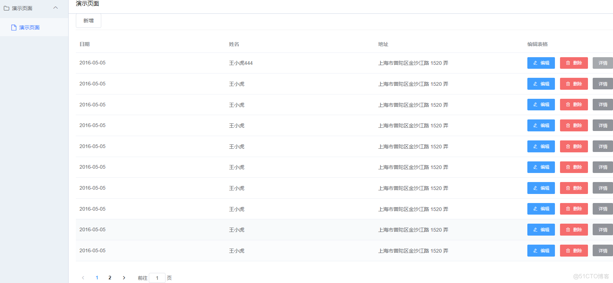

> **About this post**
>
> Part 5 of the "Getting Started with Django: A CMDB System" series turns to the front
> end of a front-end/back-end separation (MVVC) setup: it picks vue + d2Admin (based on
> element-ui) as the template, first explains the reasoning behind the choices, and fully
> lists the directory tree of the d2-admin-start-kit base template along with each
> directory's role; it then walks through the login flow (token acquisition, the axios
> request interceptor, storing user info in vuex and reading it on pages), and finally
> uses a d2-crud table as an example to give the API and page code for
> create/read/update/delete plus pagination and search.

> **Technical notes**
>
> 1. The front end in this post is Vue 2 + d2Admin (based on element-ui): Vue 2 reached end of maintenance (EOL) on December 31, 2023, and element-ui stopped updating along with it (its Vue 3 successor is Element Plus); the template is based on vue-cli 3 / webpack 4, and on Node 17+ `npm run dev` fails with an OpenSSL error, so you need to set NODE_OPTIONS=--openssl-legacy-provider or downgrade Node.
> 2. The open-source iview was renamed view-design in 2019, and the author separately offers a paid iView Pro (the mention in this post that it "turned paid" refers to this); in the Vue 3 era it evolved into View UI Plus; the vue-element-admin and d2-admin repositories are still accessible today, but neither has been actively updated for years, so they are no longer a suitable starting point for new projects — the layering ideas are still worth referencing.
> 3. The axios interceptor carries the token as `Authorization: token ${token}`, a custom convention matching the backend's DRF TokenAuthentication, not the standard HTTP authentication header format; the login state is stored both in the cookie's token and in vuex's user module — be careful to distinguish them while reading.
> 4. Corrections to the original: the 5 truncated https:/// links in the preface and framework docs have been completed per the author's documentation (pandaAdmin/doc/5.md) (github.com/hequan2017, github.com/hequan2017/panda, github.com/hequan2017/pandaAdmin, github.com/d2-projects/d2-admin-start-kit, fairyever.com/d2-admin/doc/zh/); .postcssrc.js and README.zh.md in the directory tree (masked by the source site) and the missing variables in the code (resinfo.name, info.name, row.id, res.name, etc.) have been restored per that document; the account.js path is corrected to src/store/modules/d2admin/modules/account.js, the demo page to src/views/asset/index.vue, and routers.js to routes.js, moved under the "routes" entry; the d2-admin directory tree is now labeled text, and the page example is labeled vue.

---

## 1. Preface

> Author: He Quan, GitHub: https://github.com/hequan2017   QQ group: 620176501

> Through this tutorial you can get started from zero and independently build a simple CMDB system.

> Current mainstream development approaches fall into two types: MVC and MVVC. This tutorial is a beginner's tutorial for MVVC (front-end/back-end separation).

> Tutorial project: https://github.com/hequan2017/panda/

> Tutorial documentation: https://github.com/hequan2017/pandaAdmin

## 2. Notes

- Framework choices
  - vue (easy to get started with; you can learn from the examples on the official site)
  - d2Admin (based on element; good-looking styles and plenty of examples)

- Development tool
  - vs code

> Compared with react, vue is easier to get started with. Being based on template syntax, it suits moving step by step from the MVC approach to the MVVC approach.

> The template chosen is one based on element. iview has now turned to a paid model, which is not really suitable for individual developers to practice with. The vue version of antd has no suitable admin template, so it was dropped.

> vue-element-admin and d2admin are about the same; both have very complete materials and documentation. It comes down to personal choice.

## 3. Demo



## 4. Framework Documentation

- vue
  - https://cn.vuejs.org/v2/guide/
  - axios     sends ajax requests to fetch information
  - store     saves the fetched information
  - router    route navigation

- https://fairyever.com/d2-admin/doc/zh/   # for full template details, see this documentation, very detailed
- Download the base template

> git clone  https://github.com/d2-projects/d2-admin-start-kit

```text
├─.DS_Store
├─.browserslistrc ------------------- // 目标浏览器配置
├─.env ------------------------------ // 基础环境变量配置
├─.env.development ------------------ // 开发模式下的环境变量配置
├─.env.netlify ---------------------- // Netlify 构建时的环境变量
├─.env.nomock ----------------------- // 无 mock 数据构建模式下的环境变量
├─.env.travis ----------------------- // Travis 构建时的环境变量
├─.eslintignore --------------------- // ESLint 的忽略目录配置
├─.eslintrc.js ---------------------- // ESLint 的配置文件
├─.github --------------------------- // Github 配置
│ └─ISSUE_TEMPLATE ------------------ // GitHub issue 模板
├─.gitignore ------------------------ // git 的忽略配置
├─.postcssrc.js --------------------- // postcss 插件设置
├─.travis.yml ----------------------- // Travis 配置文件
├─LICENSE --------------------------- // 开源协议
├─README.md ------------------------- // 介绍
├─README.zh.md ---------------------- // 中文介绍 在码云仓库下自动加载这个文件
├─babel.config.js ------------------- // babel 设置
├─cdnrefresh-dirs.txt --------------- // 自动构建后在七牛 CDN 上刷新的目录
├─d2-admin.babel -------------------- // 多国语设置软件 BabelEdit 的项目文件
├─doc ------------------------------- // 文档素材
│ └─image
├─jest.config.js -------------------- // 单元测试配置
├─jsconfig.json --------------------- // 指定根文件和 JavaScript 语言服务提供的功能选项
├─package-lock.json ----------------- // 锁定依赖版本
├─package.json ---------------------- // 项目信息和依赖
├─public ---------------------------- // 静态资源文件夹，不经过 webpack 处理
│ ├─html ---------------------------- // 用于演示加载静态页面的资源
│ ├─icon.ico ------------------------ // 网站图标
│ ├─image
│ │ ├─baidu-pan-logo.png
│ │ ├─loading ----------------------- // index.html 使用的加载图标
│ │ └─theme ------------------------- // 主题图片资源
│ │   ├─d2
│ │   ├─line
│ │   ├─star
│ │   ├─tomorrow-night-blue
│ │   └─violet
│ ├─index.html ---------------------- // 网站的基础页面模板
│ ├─lib ----------------------------- // 静态依赖
│ │ └─UEditor ----------------------- // 编辑器
│ └─markdown ------------------------ // 用于展示 Markdown 远程加载资源的文件
├─qiniu-config ---------------------- // 用于构建展示网站的七牛设置
├─qshell ---------------------------- // 七牛 SDK
├─src ------------------------------- // 主要的代码目录
│ ├─App.vue ------------------------- // 项目根组件
│ ├─api ----------------------------- // 请求接口
│ ├─assets -------------------------- // 资源文件夹
│ │ ├─style ------------------------- // 样式资源
│ │ │ ├─animate --------------------- // 页面过渡动画
│ │ │ ├─fixed ----------------------- // 覆盖一些组件库的默认样式
│ │ │ ├─public-class.scss ----------- // 导出可以直接使用的 class
│ │ │ ├─public.scss ----------------- // 导出所有公用的 scss 资源
│ │ │ ├─theme ----------------------- // 主题样式相关
│ │ │ │ ├─d2
│ │ │ │ ├─line
│ │ │ │ ├─register.scss ------------- // 注册所有主题样式
│ │ │ │ ├─star
│ │ │ │ ├─theme-base.scss ----------- // 每个主题共用的样式
│ │ │ │ ├─theme.scss ---------------- // 每个主题特有的设置
│ │ │ │ ├─tomorrow-night-blue
│ │ │ │ └─violet
│ │ │ └─unit ------------------------ // scss 的基础变量
│ │ └─svg-icons --------------------- // svg 图标
│ │   ├─icons ----------------------- // 用来存放图标的文件夹
│ │   └─index.js -------------------- // 自动导入所有符合条件的图标
│ ├─components ---------------------- // 组件
│ │ ├─d2-container
│ │ ├─d2-container-frame
│ │ ├─d2-count-up
│ │ ├─d2-highlight
│ │ ├─d2-icon
│ │ ├─d2-icon-select
│ │ ├─d2-icon-svg
│ │ ├─d2-icon-svg-select
│ │ ├─d2-link-btn
│ │ ├─d2-markdown
│ │ ├─d2-mde
│ │ ├─d2-module-index-banner
│ │ ├─d2-module-index-menu
│ │ ├─d2-quill
│ │ ├─d2-ueditor
│ │ ├─highlight-styles -------------- // 代码高亮样式
│ │ └─index.js ---------------------- // 组件注册
│ ├─i18n.js ------------------------- // 国际化配置
│ ├─layout -------------------------- // 布局
│ │ └─header-aside ------------------ // 具有顶栏加侧边栏的布局
│ ├─libs ---------------------------- // 一些通用的方法
│ │ ├─util.cookies.js
│ │ ├─util.db.js
│ │ ├─util.import.development.js ---- // 开发环境下使用的页面导入方法
│ │ ├─util.import.production.js ----- // 开发环境下使用的页面导入方法
│ │ ├─util.js
│ │ └─util.log.js
│ ├─locales ------------------------- // 国际化语言配置
│ │ ├─en.json
│ │ ├─ja.json
│ │ ├─zh-chs.json
│ │ └─zh-cht.json
│ ├─main.js ------------------------- // 程序主入口
│ ├─menu ---------------------------- // 静态的菜单数据
│ │ ├─index.js
│ │ └─modules
│ │   ├─demo-business.js
│ │   ├─demo-charts.js
│ │   ├─demo-components.js
│ │   ├─demo-d2-crud.js
│ │   ├─demo-element.js
│ │   ├─demo-frame.js
│ │   ├─demo-playground.js
│ │   └─demo-plugins.js
│ ├─mock
│ │ ├─api --------------------------- // 需要注册的接口
│ │ ├─d2-mock ----------------------- // 简化接口注册的工具
│ │ └─index.js ---------------------- // mock 数据自动注册
│ ├─plugin -------------------------- // 插件
│ │ ├─axios ------------------------- // 网络请求
│ │ ├─d2admin ----------------------- // 统一注册系统必须的资源
│ │ ├─error ------------------------- // 错误拦截
│ │ ├─log --------------------------- // 日志
│ │ └─open -------------------------- // 新窗口打开
│ ├─router -------------------------- // 路由
│ │ ├─index.js ---------------------- // 注册路由以及设置拦截规则
│ │ ├─modules ----------------------- // 预先设置好的静态路由
│ │ │ ├─business.js
│ │ │ ├─charts.js
│ │ │ ├─components.js
│ │ │ ├─d2-crud.js
│ │ │ ├─element.js
│ │ │ ├─frame.js
│ │ │ ├─playground.js
│ │ │ └─plugins.js
│ │ └─routes.js --------------------- // 导入所有路由
│ ├─setting.js ---------------------- // 全局设置
│ ├─store --------------------------- // vuex
│ │ ├─index.js ---------------------- // vuex 注册主入口
│ │ └─modules ----------------------- // 模块目录
│ │   └─d2admin --------------------- // 系统自带模块，业务模块建议在同级新建
│ │     ├─index.js ------------------ // 模块主入口
│ │     └─modules ------------------- // 子模块
│ │       ├─account.js -------------- // 用户身份
│ │       ├─color.js ---------------- // 主题颜色
│ │       ├─db.js ------------------- // 本地数据库
│ │       ├─fullscreen.js ----------- // 全屏
│ │       ├─gray.js ----------------- // 灰度模式
│ │       ├─log.js ------------------ // 日志
│ │       ├─menu.js ----------------- // 菜单
│ │       ├─page.js ----------------- // 多页面控制
│ │       ├─releases.js ------------- // 版本
│ │       ├─search.js --------------- // 全局搜索
│ │       ├─size.js ----------------- // 全局尺寸
│ │       ├─theme.js ---------------- // 主题
│ │       ├─transition.js ----------- // 过渡效果
│ │       ├─ua.js ------------------- // 浏览器信息
│ │       └─user.js ----------------- // 用户信息
│ └─views --------------------------- // 页面视图
│   ├─demo -------------------------- // 演示页面
│   │ ├─business -------------------- // 业务页面演示
│   │ │ ├─index
│   │ │ ├─issues
│   │ │ └─table
│   │ ├─charts ---------------------- // 图表
│   │ │ ├─index
│   │ │ └─list
│   │ │   ├─_data
│   │ │   ├─_mixin
│   │ │   ├─bar
│   │ │   ├─candle
│   │ │   ├─funnel
│   │ │   ├─gauge
│   │ │   ├─heatmap
│   │ │   ├─histogram
│   │ │   ├─line
│   │ │   ├─map
│   │ │   ├─pie
│   │ │   ├─radar
│   │ │   ├─ring
│   │ │   ├─sankey
│   │ │   ├─scatter
│   │ │   ├─tree
│   │ │   └─waterfall
│   │ ├─components ------------------ // 内置组件演示
│   │ │ ├─container
│   │ │ ├─contextmenu
│   │ │ ├─countup
│   │ │ ├─editor-quill
│   │ │ ├─editor-simpleMDE
│   │ │ ├─editor-ueditor
│   │ │ ├─highlight
│   │ │ ├─icon
│   │ │ ├─index
│   │ │ ├─json-tree
│   │ │ ├─layout
│   │ │ └─markdown
│   │ ├─d2-crud --------------------- // D2CRUD 表格封装演示
│   │ ├─element --------------------- // Element UI 组件
│   │ ├─frame ----------------------- // 嵌套第三方页面演示
│   │ ├─playground ------------------ // 试验台
│   │ │ ├─add-routes ---------------- // 动态添加路由
│   │ │ ├─db ------------------------ // 数据持久化
│   │ │ ├─env ----------------------- // 环境变量
│   │ │ ├─index
│   │ │ ├─locales ------------------- // 多国语
│   │ │ ├─log ----------------------- // 日志
│   │ │ ├─page-argu ----------------- // 页面参数
│   │ │ ├─page-cache ---------------- // 页面缓存
│   │ │ └─store --------------------- // 全局状态控制
│   │ │   ├─fullscreen
│   │ │   ├─gray
│   │ │   ├─menu
│   │ │   ├─page
│   │ │   ├─size
│   │ │   ├─theme
│   │ │   ├─transition
│   │ │   └─ua
│   │ └─plugins --------------------- // 插件演示
│   │   ├─better-scroll
│   │   ├─clipboard-polyfill
│   │   ├─day
│   │   ├─export
│   │   ├─import
│   │   ├─index
│   │   ├─js-cookie
│   │   └─mock
│   └─system ------------------------ // 系统页面
│     ├─error
│     ├─function
│     │ ├─redirect ------------------ // 重定向
│     │ └─refresh ------------------- // 刷新
│     ├─index
│     ├─log
│     └─login
├─tests ----------------------------- // 单元测试
├─tools
│ └─vue-filename-injector ----------- // 用于对每个组件注入源代码位置的插件
└─vue.config.js --------------------- // vue-cli3 的项目配置文件
```

## 5. Login

- src/store/modules/d2admin/modules/account.js  # mainly the saving and reading of the front-end login info state

```js
try {
  AccountLoginInfo(res.token)
    .then(resinfo => {
      const data = resinfo.data    /* get user info from the backend */
      console.log(resinfo)
      dispatch(
        'd2admin/user/set',
        {
          name: resinfo.name
        },
        { root: true }
      )
      resolve(data)
    })
    .catch(err => {
      reject(err)
    })
} catch (error) {
  reject(error)
}
```

- src/api/sys.login.js  # sets up fetching the token and info

```js
import request from '@/plugin/axios'

export function AccountLogin (data) {
  return request({
    url: '/api/token',
    method: 'post',
    data
  })
}
export const AccountLoginInfo = token => {
  return request({
    url: '/system/api/user_info',
    data: {
      token
    },
    method: 'post'
  })
}
```

- Login token interceptor setup  src/plugin/axios/index.js

```js
// Request interceptor
service.interceptors.request.use(
  config => {
    // Do some processing before the request is sent
    const token = util.cookies.get('token')
    // Attach the token to every request -- ['X-Token'] is a custom key, adjust it to your situation
    // config.headers[''] = token
    if (token) {
      config.headers['Authorization'] = `token ${token}`
    }
    return config
  },
  error => {
    // Send failed
    console.log(error)
    return Promise.reject(error)
  }
)
```

- Example of using the user info

```js
import { mapState, mapActions } from 'vuex'
export default {
  computed: {
    ...mapState('d2admin/user', [
      'info'
    ])
  },

/* info is the info saved above; it can be read directly once the user is logged in */
{{info.name ? `Hello ${info.name}` : 'Not logged in'}}
```

## 6. CRUD Example

- Routes: src/router/routes.js

```js
const frameIn = [
  {
    path: '/',
    redirect: { name: 'index' },
    component: layoutHeaderAside,
    children: [
      // Home page
      {
        path: 'index',
        name: 'index',
        meta: {
          auth: true
        },
        component: _import('system/index')
      },
      // Demo page
      {
        path: 'asset',
        name: 'asset',
        meta: {
          title: 'Demo page',
          auth: true
        },
        component: _import('asset/index')
      },
      {
        path: 'log',
        name: 'log',
        meta: {
          title: 'Front-end logs',
          auth: true
        },
        component: _import('system/log')
      },
      // Refresh page, must be kept
      {
        path: 'refresh',
        name: 'refresh',
        hidden: true,
        component: _import('system/function/refresh')
      },
      // Page redirect, must be kept
      {
        path: 'redirect/:route*',
        name: 'redirect',
        hidden: true,
        component: _import('system/function/redirect')
      }
    ]
  }
]
```

- src/api/sys.login.js

```js
import request from '@/plugin/axios'

export const TestGetList = parameter => {
  return request({
    url: `/system/test?${parameter}`,
    method: 'get'
  })
}

export const TestCreate = data => {
  return request({
    url: '/system/test',
    data: data,
    method: 'post'
  })
}

export const TestGetInfo = id => {
  return request({
    url: `/system/test/${id}`,
    method: 'get'
  })
}

export const TestUpdate = (id, data) => {
  return request({
    url: `/system/test/${id}`,
    data: data,
    method: 'PUT'
  })
}

export const TestDelete = id => {
  return request({
    url: `/system/test/${id}`,
    method: 'delete'
  })
}
```

- src/views/asset/index.vue

```vue
<template>
  <d2-container>
    <template slot="header">Demo page</template>
    <el-input v-model="input"
              placeholder="Please enter a name"
              style="width:200px;"
              prefix-icon="el-icon-search"
              clearable></el-input>
    <el-button type="primary"
               icon="el-icon-search"
               @click="search">Search</el-button>
    <br /><br />
    <d2-crud ref="d2Crud"
             :columns="columns"
             :data="data"
             add-title="Asset management"
             :add-template="addTemplate"
             :form-options="formOptions"
             :add-rules="addRules"
             :edit-rules="addRules"
             :edit-template="editTemplate"
             :rowHandle="rowHandle"
             @row-add="handleRowAdd"
             @row-edit="handleRowEdit"
             @row-remove="handleRowRemove"
             :pagination="pagination"
             @dialog-cancel="handleDialogCancel"
             @el-icon-more="handleInfo"
             @pagination-current-change="paginationCurrentChange">
      <el-button slot="header"
                 style="margin-bottom: 5px"
                 @click="addRow">Add</el-button>
    </d2-crud>
  </d2-container>
</template>

<script>

import { TestGetList, TestCreate, TestUpdate, TestDelete, TestGetInfo } from '@api/sys.login'
export default {
  data () {
    return {
      columns: [
        {
          title: 'Date',
          key: 'date'
        },
        {
          title: 'Name',
          key: 'name'
        },
        {
          title: 'Address',
          key: 'address'
        }
      ],
      data: [
      ],
      input: '',
      addTemplate: {
        date: {
          title: 'Date',
          value: '2016-05-05'
        },
        name: {
          title: 'Name',
          value: 'Xiaohu Wang'
        },
        address: {
          title: 'Address',
          value: 'No. 1520, Jinshajiang Road, Putuo District, Shanghai'
        }
      },
      formOptions: {
        labelWidth: '80px',
        labelPosition: 'left',
        saveLoading: false
      },
      pagination: {
        currentPage: 1,
        pageSize: 10,
        total: 0
      },
      addRules: {
        date: [{ required: true, message: 'Please enter a date', trigger: 'blur' }],
        name: [{ required: true, message: 'Please enter a name', trigger: 'blur' }],
        address: [{ required: true, message: 'Please enter an address', trigger: 'blur' }]
      },
      rowHandle: {
        columnHeader: 'Edit table',
        edit: {
          icon: 'el-icon-edit',
          type: 'primary',
          text: 'Edit',
          size: 'small',
          show (index, row) {
            return true
          },
          disabled (index, row) {
            return false
          }
        },
        custom: [
          {
            text: 'Details',
            type: 'info',
            size: 'small',
            fixed: 'right',
            emit: 'el-icon-more'
          }
        ],
        remove: {
          icon: 'el-icon-delete',
          size: 'small',
          fixed: 'right',
          confirm: true,
          show (index, row) {
            return true
          },
          disabled (index, row) {
            return false
          }
        }
      },
      editTemplate: {
        date: {
          title: 'Date',
          value: ''
        },
        name: {
          title: 'Name',
          value: ''
        },
        address: {
          title: 'Address',
          value: ''
        },
        forbidEdit: {
          title: 'Disable button',
          value: false,
          component: {
            show: false
          }
        },
        showEditButton: {
          title: 'Show button',
          value: true,
          component: {
            show: false
          }
        }
      }
    }
  },
  created () {
    this.test_get_list()
  },
  methods: {
    handleInfo ({ index, row }) {
      TestGetInfo(row.id).then(res => {
        this.$alert(`${res.date} ${res.address}`, `${res.name}`, {
          confirmButtonText: 'OK'
        }).catch(err => {
          console.log(`Failed to get info ${err}`)
        })
      })
    },
    test_get_list (parameter) {
      TestGetList(parameter).then(res => {
        console.log(res)
        this.data = res.results
        this.pagination.total = res.count
      }).catch(err => {
        console.log(`Failed to get info ${err}`)
      })
    },
    paginationCurrentChange (currentPage) {
      TestGetList(`page=${currentPage}`).then(res => {
        console.log(res)
        this.data = res.results
        this.pagination.total = res.count
      }).catch(err => {
        console.log(`Failed to get info ${err}`)
      })
      this.pagination.currentPage = currentPage
      // this.fetchData()
    },
    addRow () {
      this.$refs.d2Crud.showDialog({
        mode: 'add'
      })
    },
    search () {
      this.test_get_list(`name=${this.input}`)
    },
    handleRowAdd (row, done) {
      this.formOptions.saveLoading = true
      TestCreate(row).then(res => {
      }).catch(err => {
        console.log(err)
      })
      setTimeout(() => {
        this.$message({
          message: 'Saved successfully',
          type: 'success'
        })
        done()
        this.formOptions.saveLoading = false
        this.test_get_list()
      }, 300)
    },
    handleDialogCancel (done) {
      this.$message({
        message: 'Cancelled',
        type: 'warning'
      })
      done()
    },
    handleRowEdit ({ index, row }, done) {
      this.formOptions.saveLoading = true
      this.addTemplate.data = row.data
      this.addTemplate.name = row.name
      this.addTemplate.address = row.address
      TestUpdate(row.id, row).then(res => {
      }).catch(err => {
        console.log(err)
      })
      setTimeout(() => {
        this.$message({
          message: 'Edited successfully',
          type: 'success'
        })
        done()
        this.formOptions.saveLoading = false
        this.test_get_list()
      }, 300)
    },
    handleRowRemove ({ index, row }, done) {
      TestDelete(row.id).then(res => {
      }).catch(err => {
        console.log(err)
      })
      setTimeout(() => {
        console.log(index)
        console.log(row)
        this.$message({
          message: 'Deleted successfully',
          type: 'success'
        })
        done()
        this.test_get_list()
      }, 300)
    }
  }
}
</script>
```

## 7. Deployment

> npm install

> npm run dev
